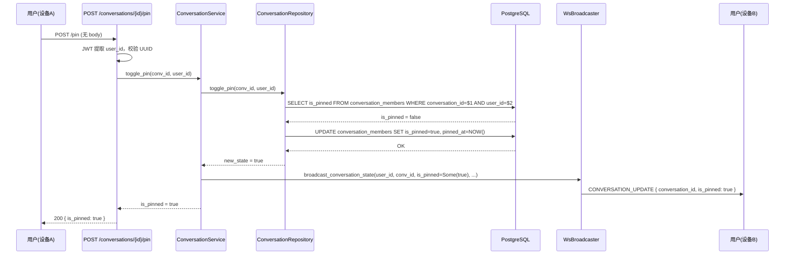
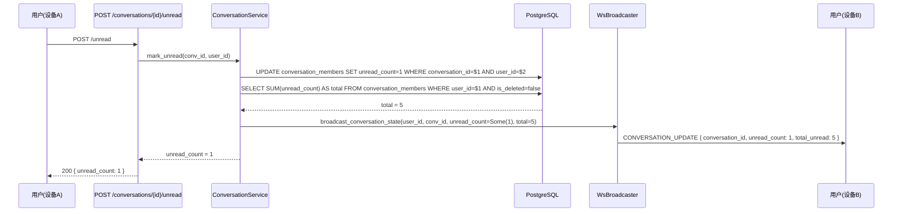
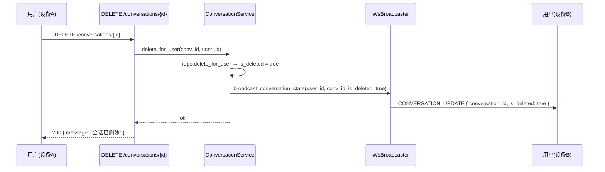

# 会话列表操作 — 服务端设计报告

> 关联设计：[功能分析](../analysis.md)

## 1. 目标

- 新增 3 个 toggle API：`POST /conversations/{id}/pin`、`/mute`、`/unread`
- 扩展 proto `ConversationUpdate`，支持 pin/mute/unread/delete 状态推送
- 新增 `conversation_members.pinned_at` 字段，支持置顶排序
- WS 推送覆盖置顶、免打扰、标记未读、删除四种操作，同一用户多设备同步

## 2. 现状分析

### 已有能力

- `mark_read`：`POST /conversations/{id}/read` 已实现，清零 unread_count
- `delete_for_user`：`DELETE /conversations/{id}` 已实现，软删除
- `list_by_user`：已有 is_pinned、is_muted 字段查询，但无 toggle 入口
- `MessageBroadcaster` trait：已有 `broadcast_conversation_update`、`broadcast_pin_changed` 等方法
- `CONVERSATION_UPDATE`（WsFrameType=6）：已定义，客户端已有处理逻辑
- `conversation_members` 表：已有 is_pinned、is_muted 字段（bool，默认 false）

### 缺失

- 没有 pin/mute toggle 的 HTTP 端点
- 没有 mark_unread 的 HTTP 端点
- `ConversationUpdate` proto 不含 is_pinned / is_muted / is_deleted 字段
- `conversation_members` 没有 `pinned_at` 时间戳，无法对置顶会话排序
- `ConversationService` 不持有 broadcaster 引用，无法推送状态变更
- `MessageBroadcaster` trait 没有「状态变更」专用方法（现有方法是消息场景的）

## 3. 数据模型与接口

### 3.1 数据库变更

**新增迁移文件**：`server/migrations/20260703_019_conversation_pinned_at.sql`

```sql
-- 新增 pinned_at 字段，用于置顶排序（线上无历史数据，无需回填）
ALTER TABLE conversation_members ADD COLUMN pinned_at TIMESTAMPTZ;

COMMENT ON COLUMN conversation_members.pinned_at IS '置顶时间，NULL 表示未置顶';
```

| 决策 | 理由 |
|------|------|
| 加 `pinned_at` 而非用 `updated_at` | `updated_at` 被多种操作更新，无法纯粹表达「何时置顶」 |
| NULL 表示未置顶 | 排序时 `ORDER BY is_pinned DESC, pinned_at DESC NULLS LAST` 清晰无歧义 |
| 不加 `muted_at` | 免打扰不需要排序，bool 足够 |

### 3.2 Proto 扩展

**扩展 `ConversationUpdate`**（`proto/message.proto`）：

```protobuf
message ConversationUpdate {
  string conversation_id = 1;
  string last_message_preview = 2;
  int64 last_message_at = 3;
  int32 unread_count = 4;
  int32 total_unread = 5;
  string last_message_extra = 6;
  // ↓ 新增字段（optional，仅会话操作变更时设置）
  optional bool is_pinned = 7;
  optional bool is_muted = 8;
  optional bool is_deleted = 9;
}
```

| 决策 | 理由 |
|------|------|
| 扩展现有 `ConversationUpdate` 而非新建消息类型 | 复用客户端已有的 CONVERSATION_UPDATE 处理链路，无需新增 WsFrameType |
| 字段全部 optional | 消息场景只设 preview/timestamp/unread，会话操作只设 is_pinned 等，互不干扰 |
| `is_deleted` 放入同一条消息 | 删除也是「会话状态更新」，用同一帧类型减少客户端分支 |

> 不需要新增 `WsFrameType`，复用 `CONVERSATION_UPDATE = 6`。

### 3.3 接口契约

#### API 速览

| 方法 | 路径 | 功能 | 状态 |
|------|------|------|------|
| POST | `/conversations/{id}/pin` | toggle 置顶 | **新增** |
| POST | `/conversations/{id}/mute` | toggle 免打扰 | **新增** |
| POST | `/conversations/{id}/unread` | 标记未读 | **新增** |

---

**Toggle 置顶**

```
POST /conversations/{id}/pin
Authorization: Bearer {token}
```

请求体：无

响应（200）：

```json
{
  "is_pinned": true
}
```

说明：每次调用翻转 `is_pinned` 状态。设为 `true` 时同步写入 `pinned_at = NOW()`，设为 `false` 时清空 `pinned_at`。

错误响应：

| 状态码 | 场景 |
|--------|------|
| 400 | conversation_id 无效（非法 UUID） |
| 401 | 未认证 |
| 403 | 非会话成员 |
| 404 | 会话不存在 |

---

**Toggle 免打扰**

```
POST /conversations/{id}/mute
Authorization: Bearer {token}
```

请求体：无

响应（200）：

```json
{
  "is_muted": true
}
```

---

**标记未读**

```
POST /conversations/{id}/unread
Authorization: Bearer {token}
```

请求体：无

响应（200）：

```json
{
  "unread_count": 1
}
```

说明：固定设为 `unread_count = 1`，不关心之前有无未读。

---

#### WS 推送格式

所有会话操作变更通过 WS `CONVERSATION_UPDATE` 帧推送给**当前用户的全部在线设备**（不含其他成员）：

| 操作 | 推送内容 |
|------|---------|
| 置顶 toggle | `{ conversation_id, is_pinned: bool }` |
| 免打扰 toggle | `{ conversation_id, is_muted: bool }` |
| 标记未读 | `{ conversation_id, unread_count: 1, total_unread: N }` |
| 删除会话 | `{ conversation_id, is_deleted: true }` |

推送范围：仅推给操作者本人（`send_to_user`），用于设备间同步。其他成员不需要感知。

## 4. 核心流程

### 4.1 置顶/取消置顶



**异常路径**：
- 非成员（403）：`is_member()` 返回 false → 不执行 toggle，直接返回 403
- 无效 UUID（400）：`Uuid::parse_str` 失败 → 返回 400
- DB 错误（500）：任一 SQL 查询失败 → 返回 500

### 4.2 免打扰 toggle

流程与置顶对称，SQL 为 `UPDATE conversation_members SET is_muted = NOT is_muted`，无 `pinned_at` 操作。

### 4.3 标记未读



### 4.4 删除会话（WS 推送补齐）

已有 `DELETE /conversations/{id}` API，本次补齐 WS 推送：



## 5. 项目结构与技术决策

### 5.1 文件结构

```
server/modules/im-conversation/src/
├── models.rs          # 修改：新增 ToggleResponse 结构体
├── repository.rs      # 修改：新增 toggle_pin、toggle_mute、mark_unread
├── service.rs         # 修改：新增 3 个 service 方法（含 WS 推送）
├── routes.rs          # 修改：注册 3 个新路由
└── lib.rs             # 不变

server/modules/im-message/src/
└── broadcast.rs       # 修改：MessageBroadcaster trait 新增方法

server/modules/im-ws/src/
└── broadcaster.rs     # 修改：实现新 broadcaster 方法

proto/
├── message.proto      # 修改：ConversationUpdate 加 optional 字段
├── ws.proto           # 不变（无需新 WsFrameType）
└── src/*.rs           # 自动重新生成

server/migrations/
└── 20260703_019_conversation_pinned_at.sql  # 新建
```

### 5.2 职责划分

```
routes.rs  → 提取 user_id、校验 UUID、调用 service、返回 JSON
service.rs → 业务逻辑：调 repo 执行操作 + 调 broadcaster 推送 WS
repository.rs → 数据库操作：toggle SQL、mark_unread SQL
broadcaster.rs → WS 推送：构造 ConversationUpdate protobuf、send_to_user
```

`ConversationService` 需要新增 broadcaster 依赖。当前构造函数签名：

```rust
// 当前
pub fn new(db: PgPool) -> Self

// 新
pub fn new(db: PgPool, broadcaster: Arc<dyn MessageBroadcaster>) -> Self
```

`AppState` 需提供 broadcaster。routes 中通过 `state` 传入。

### 5.3 Broadcaster trait 扩展

```rust
// broadcast.rs（im-message）
#[async_trait]
pub trait MessageBroadcaster: Send + Sync {
    // ... 已有方法 ...

    /// 广播会话状态变更给指定用户的所有设备
    async fn broadcast_conversation_state_update(
        &self,
        user_id: i64,
        conversation_id: Uuid,
        is_pinned: Option<bool>,
        is_muted: Option<bool>,
        is_deleted: bool,
        unread_count: Option<i32>,
        total_unread: Option<i32>,
    );
}
```

`WsBroadcaster` 实现：用 `ConversationUpdate` proto 按需填充字段 → `send_to_user(user_id)`。

`NoopBroadcaster` 实现：空方法体。

### 5.4 技术决策

| 决策 | 方案 | 理由 |
|------|------|------|
| toggle 端点设计 | `POST /conversations/{id}/pin`，无 body，返回新状态 | 无需客户端传当前状态，服务端原子翻转，避免竞态 |
| 免打扰 UI 级屏蔽 | 本次不做通知过滤，只做标记 | 通知系统改造量大，本次聚焦会话列表操作 |
| pin/mute/unread 推送范围 | 仅操作者本人（非全体成员） | is_pinned 和 is_muted 是 per-user 状态，其他成员无需/不应感知 |
| 删除 WS 推送 | 复用 CONVERSATION_UPDATE + is_deleted 字段 | 不走新帧类型，复用客户端处理逻辑 |
| proto 向后兼容 | 用 optional 字段，无新 frame type | 旧客户端忽略未知字段，不崩溃 |
| 排序扩展 | 置顶会话按 `pinned_at DESC` 排序 | 在 `list_by_user` SQL 中 `ORDER BY cm.is_pinned DESC, cm.pinned_at DESC NULLS LAST, c.last_message_at DESC` |

## 6. 验收标准

| 验收条件 | 验收方式 |
|----------|----------|
| `POST /conversations/{id}/pin` 翻转置顶状态 | curl 两次，确认 is_pinned 交替变化 |
| 置顶后 `pinned_at` 写入非空时间戳 | 查 DB 确认 |
| 取消置顶后 `pinned_at` 为 NULL | 查 DB 确认 |
| `POST /conversations/{id}/mute` 翻转免打扰 | curl 两次，确认 is_muted 交替 |
| `POST /conversations/{id}/unread` 设 unread_count=1 | curl 后查 DB 确认 |
| 非成员操作返回 403 | curl 其他用户的会话 |
| 无效 UUID 返回 400 | curl with "not-a-uuid" |
| WS CONVERSATION_UPDATE 推送到同一用户其他设备 | 两设备登录，一端 toggle，另一端收到 WS 帧 |
| 删除会话后 WS 推送 is_deleted | 两设备登录，一端删除，另一端收到 WS 帧 |
| `cargo build` 编译通过 | `cargo build` |

## 7. 暂不实现

| 功能 | 理由 |
|------|------|
| 免打扰的消息通知过滤 | 通知系统改造量大，本次只做标记开关 |
| 置顶数量上限 | 不做限制，用户自行管理 |
| 清空聊天记录的后端 API | 采用客户端本地 SharedPrefs 方案，不需要服务端参与 |
