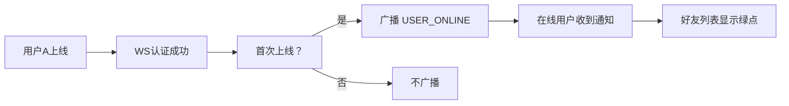
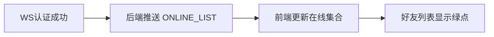

# 在线状态与已读回执 — 功能分析

## 概述

闪讯目前能聊天、能建群、能管群，但有两个"感知盲区"：不知道对方在不在线，不知道消息有没有被看到。这一版补上这两个能力——在线状态让用户看到"人在不在"，已读回执让用户看到"消息看没看"。

两个功能看起来不相关，但技术上高度共享：都依赖 WS 实时推送，都需要在 ChatPage 展示状态标记，都涉及 WsState 的扩展。放在一起做，基础设施只改一次。

核心挑战：
- 在线状态的广播范围——上线时通知谁？所有在线用户还是只通知好友？
- 已读回执的上报时机——进入聊天页就算已读，还是滚动到消息才算？
- 群聊已读的展示方式——单聊显示"已读"就够了，群聊要不要显示"N人已读"？

---

## 一、交互链

### 场景 1：好友上线/下线

**用户故事**：作为用户，我想知道好友是否在线，以便决定是否发消息。

用户 A 打开闪讯并完成 WS 认证。后端检测到 A 是首次上线（之前没有连接），查询 A 的好友列表，向其中在线的好友广播 USER_ONLINE 帧。B 是 A 的好友且在线，B 的好友列表中 A 的头像旁出现绿色在线标记。A 关闭闪讯，后端检测到 A 的最后一个连接断开，向在线好友广播 USER_OFFLINE 帧，B 的绿点消失。

### 场景 2：登录后获取在线列表

**用户故事**：作为刚登录的用户，我想立刻看到哪些好友在线。

用户 A 完成 WS 认证后，后端主动推送 ONLINE_LIST 帧，包含当前在线好友的 ID 列表。前端收到后更新本地在线状态集合，好友列表立即显示正确的在线标记。

### 场景 3：聊天页显示对方在线状态

**用户故事**：作为正在聊天的用户，我想在聊天页看到对方是否在线。

单聊 ChatPage 的 AppBar 副标题区域显示对方的在线状态："在线"（绿色）或"离线"。状态通过 WS 实时更新——对方上线时变为"在线"，下线时变为"离线"。

### 场景 4：单聊已读回执

**用户故事**：作为消息发送者，我想知道对方有没有看到我的消息。

用户 A 给 B 发了一条消息（seq=42）。B 打开聊天页，前端自动上报已读位置（readSeq=42）。后端收到后更新 B 的 `last_read_seq`，并通过 WS 推送 READ_RECEIPT 帧给 A。A 的 ChatPage 收到后，所有 seq ≤ 42 的消息标记为"已读"。

### 场景 5：群聊已读回执

**用户故事**：作为群消息发送者，我想知道多少人看了我的消息，以及具体是谁看了。

群聊的已读回执比单聊复杂——每个成员有自己的 `last_read_seq`。A 在群里发了一条消息（seq=100），群里有 5 个人。B 和 C 打开了聊天页，上报了 readSeq=100。A 的 ChatPage 显示"2人已读"，点击可查看已读/未读成员列表（BottomSheet，两个 Tab）。

---

## 二、逻辑树

### 事件流：用户上线

| 时刻 | 事件 | 处理 | 产生的新事件 |
|------|------|------|-------------|
| T1 | WS 连接建立 + 认证成功 | handler 调 `ws_state.add(user_id, sender)` | — |
| T2 | 判断是否首次上线 | `add` 返回 `is_first`（之前无连接） | — |
| T3 | 首次上线 | 查好友列表，广播 USER_ONLINE 帧给在线好友 | 在线好友收到通知 |
| T4 | 推送在线列表 | 发送 ONLINE_LIST 帧给当前用户（在线好友列表） | 当前用户收到在线好友列表 |

### 事件流：用户下线

| 时刻 | 事件 | 处理 | 产生的新事件 |
|------|------|------|-------------|
| T1 | WS 连接断开 | handler 调 `ws_state.remove(user_id)` | — |
| T2 | 判断是否完全下线 | `remove` 返回 `is_last`（无剩余连接） | — |
| T3 | 完全下线 | 查好友列表，广播 USER_OFFLINE 帧给在线好友 | 在线好友收到通知 |

### 事件流：已读回执上报

| 时刻 | 事件 | 处理 | 产生的新事件 |
|------|------|------|-------------|
| T1 | 用户打开聊天页 / 收到新消息 | 前端计算当前可见消息的最大 seq | — |
| T2 | 防抖 1 秒后上报 | 前端发送 READ_RECEIPT 帧（conversationId + readSeq） | WS 帧 |
| T3 | 后端处理 | UPDATE conversation_members SET last_read_seq = GREATEST(last_read_seq, readSeq)，重新计算 unread_count | 数据库更新 |
| T4 | 通知对方 | 向会话中其他在线成员推送 READ_RECEIPT 帧 | 对方收到已读通知 |
| T5 | 前端更新 | 对方 ChatPage 收到后更新消息的已读状态 | UI 刷新 |

### 状态流转

| 实体 | 触发事件 | 前状态 | 后状态 |
|------|---------|--------|--------|
| WsState 连接表 | 用户上线 | 无该用户 | 有该用户的 sender |
| WsState 连接表 | 用户下线 | 有该用户的 sender | 无该用户 |
| conversation_members.last_read_seq | 已读上报 | 旧 seq | GREATEST(旧 seq, 新 seq) |
| conversation_members.unread_count | 已读上报 | N | 重新计算（总消息数 - last_read_seq） |
| 前端在线集合 | USER_ONLINE | 不含该用户 | 含该用户 |
| 前端在线集合 | USER_OFFLINE | 含该用户 | 不含该用户 |
| 前端在线集合 | ONLINE_LIST | 空 | 初始化为在线用户集合 |
| 消息已读标记 | READ_RECEIPT | 未读 | 已读（单聊）/ N人已读（群聊） |

### 设计决策

| 决策 | 方案 | 理由 |
|------|------|------|
| 在线状态广播范围 | 只广播给在线的好友 | 非好友不需要知道你在不在线，减少无效推送 |
| 多端连接支持 | WsState 改为 `HashMap<i64, Vec<(conn_id, sender)>>`，首次上线/最后下线才广播 | 避免同一用户多端登录时重复广播 |
| 已读上报时机 | 进入聊天页 + 收到新消息时自动上报，1 秒防抖 | 不需要用户手动操作，防抖避免频繁请求 |
| 已读 seq 单调递增 | `GREATEST(last_read_seq, readSeq)` | 防止乱序上报导致已读位置回退 |
| 群聊已读展示 | 显示已读人数，点击查看已读/未读成员列表 | 完整实现 |
| 已读回执走 WS 而非 HTTP | WS 帧双向传输（上报 + 通知） | 实时性要求高，HTTP 轮询不合适 |
| 群聊已读详情接口 | GET /conversations/{id}/messages/{mid}/read-status | 返回已读/未读成员列表 |

---

## 三、功能编号与网络定位

### 本次新增节点

| 编号 | 功能节点 | 层级 | 简介 |
|------|---------|------|------|
| D-31 | 在线状态广播 | 领域 | 首次上线广播 USER_ONLINE，最后下线广播 USER_OFFLINE |
| D-32 | 在线列表推送 | 领域 | 认证成功后推送 ONLINE_LIST 给当前用户 |
| D-33 | 已读回执处理 | 领域 | 接收 READ_RECEIPT 帧，更新 last_read_seq，通知对方 |
| F-12 | 在线状态 WS 帧分发 | 前端基础 | WsClient 新增 userStatusStream + onlineListStream |
| F-13 | 已读回执 WS 帧分发 | 前端基础 | WsClient 新增 readReceiptStream |
| P-41 | 在线状态展示 | 前端业务 | 好友列表绿点 + ChatPage 在线/离线状态 |
| P-42 | 已读回执展示 | 前端业务 | 单聊已读标记 + 群聊已读人数 + 群聊已读详情弹窗 |
| P-43 | 已读回执上报 | 前端业务 | ChatPage 自动上报 readSeq（1 秒防抖） |
| D-34 | 已读详情查询 | 领域 | GET /conversations/{id}/messages/{mid}/read-status，返回已读/未读成员列表 |

### 扩展节点

| 编号 | 扩展内容 |
|------|---------|
| I-08 | WsState 改为多端连接支持（Vec<ConnectionInfo>），新增 is_online / get_online_users 方法 |
| I-09 | 帧分发器新增 USER_ONLINE / USER_OFFLINE / ONLINE_LIST / READ_RECEIPT 帧处理 |
| F-06 | WsClient 帧分发新增 userStatusStream / onlineListStream / readReceiptStream |

### 前置依赖

| 依赖节点 | 依赖方式 | 是否已有 |
|----------|---------|---------|
| I-05 WS 连接管理 | 扩展（多端连接） | ✅ 需扩展 |
| I-08 在线用户管理 | 扩展（首次上线/最后下线判断） | ✅ 需扩展 |
| I-09 帧分发器 | 扩展（新增帧类型处理） | ✅ 需扩展 |
| D-06 消息存储 | 共享数据（messages 表的 seq） | ✅ 已有 |
| D-04 未读数管理 | 扩展（已读上报后重新计算 unread_count） | ✅ 需扩展 |

### 边界接口

| 接口/协议 | 定义方 | 消费方 | 说明 |
|-----------|--------|--------|------|
| USER_ONLINE proto 帧 | D-31 | F-12 → P-41 | 用户上线通知 |
| USER_OFFLINE proto 帧 | D-31 | F-12 → P-41 | 用户下线通知 |
| ONLINE_LIST proto 帧 | D-32 | F-12 → P-41 | 认证后推送在线用户列表 |
| READ_RECEIPT proto 帧（上报） | P-43 | D-33 | 客户端上报已读位置 |
| READ_RECEIPT proto 帧（通知） | D-33 | F-13 → P-42 | 服务端通知对方已读 |

---

## 四、结论

- **开发顺序**：Proto 定义（新增帧类型 + 消息结构）→ WsState 多端连接改造 → 在线状态广播（handler + dispatcher）→ 已读回执处理（handler + dispatcher + conversation_members 更新）→ 前端 WsClient 扩展 → 在线状态展示（好友列表 + ChatPage）→ 已读回执上报 + 展示
- **复杂度集中点**：
  - WsState 多端连接改造：从 `HashMap<i64, WsSender>` 改为 `HashMap<i64, Vec<ConnectionInfo>>`，需要处理首次上线/最后下线的判断逻辑
  - 已读回执的上报防抖：前端需要在"进入聊天页"和"收到新消息"两个时机上报，用 Timer 防抖避免频繁发送
  - 群聊已读人数计算：需要查询会话所有成员的 last_read_seq，统计 >= 某条消息 seq 的人数
- **和已有架构的关系**：在线状态扩展 WsState 和 handler，已读回执扩展 conversation_members 表（last_read_seq 字段已存在）。不新建 crate，所有后端逻辑在 im-ws 中完成
