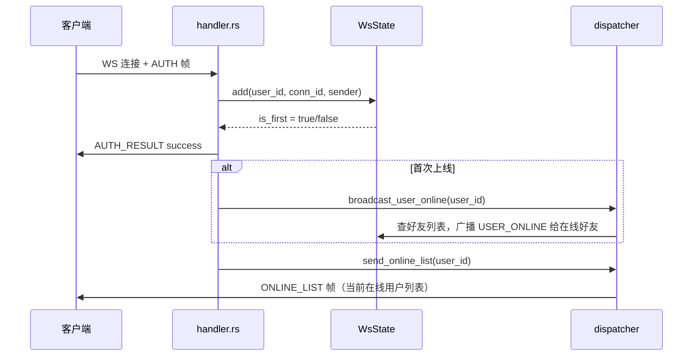
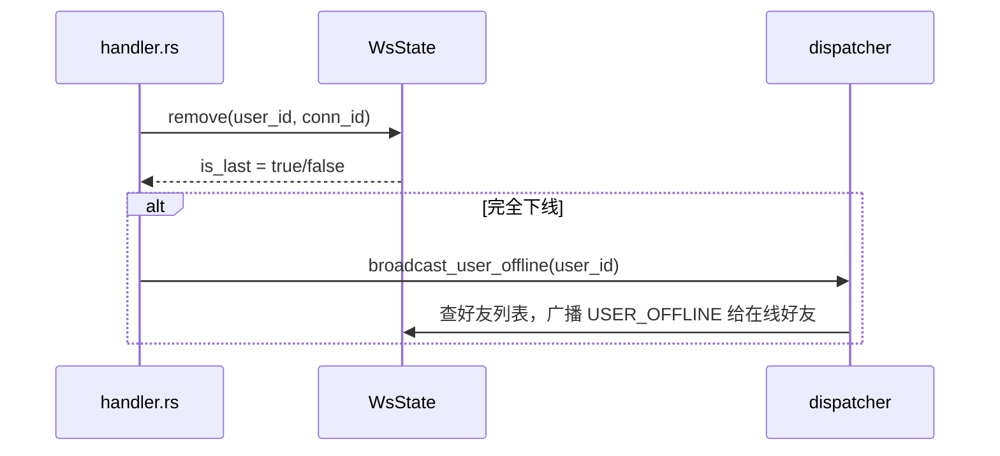
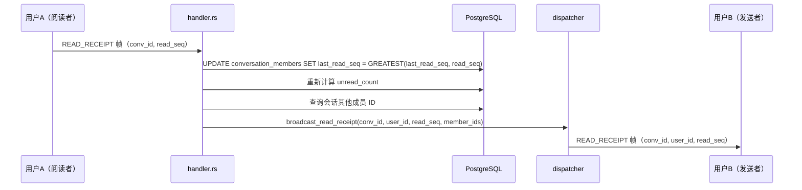

# 在线状态与已读回执 — 服务端设计报告

> 关联设计：[功能分析](../analysis.md)

## 1. 目标

- WsState 改造：从单连接（`HashMap<i64, WsSender>`）改为多端连接（`HashMap<i64, Vec<ConnectionInfo>>`），支持首次上线/最后下线判断
- 新增 USER_ONLINE / USER_OFFLINE / ONLINE_LIST 三种 WS 帧类型
- handler.rs 扩展：认证成功后广播上线 + 推送在线列表，断连后广播下线
- 新增 READ_RECEIPT WS 帧类型（双向：客户端上报 + 服务端通知）
- handler.rs 扩展：接收 READ_RECEIPT 帧，更新 last_read_seq，通知对方
- dispatcher.rs 扩展：broadcast_user_online / broadcast_user_offline / send_online_list / broadcast_read_receipt
- 扩展 GET /groups/{id}/detail：群成员列表返回 last_read_seq 字段（前端群聊已读标记需要）
- 新增 GET /conversations/{id}/messages/{mid}/read-status：返回已读/未读成员列表（群聊已读详情弹窗用）

## 2. 现状分析

### 已有能力

- `WsState`：管理在线用户连接，支持 `send_to_user` / `send_to_users`
- `conversation_members.last_read_seq`：字段已存在（DEFAULT 0），但从未被使用
- `conversation_members.unread_count`：消息发送时 +1，进入聊天页时清零（HTTP `POST /conversations/{id}/read`）
- `MessageDispatcher`：已有完整的帧推送模式（friend / group / group_info_update）

### 缺失

- WsState 不支持多端连接（同一用户只能有一个 sender）
- 无上线/下线广播
- 无在线列表推送
- 无已读回执处理（last_read_seq 从未被更新）
- handler.rs 只处理 PING 和 CHAT_MESSAGE 两种帧

## 3. 数据模型

### 无新增表

已有 `conversation_members.last_read_seq` 字段，直接复用。

### WsState 内存模型变更

```rust
// 旧：单连接
connections: RwLock<HashMap<i64, WsSender>>

// 新：多端连接
connections: RwLock<HashMap<i64, Vec<ConnectionInfo>>>

struct ConnectionInfo {
    id: String,       // 连接 ID（UUID）
    sender: WsSender,
}
```

### Proto 新增

```protobuf
// ---> proto/ws.proto 新增帧类型
enum WsFrameType {
    // ... 已有 0~11
    USER_ONLINE = 12;
    USER_OFFLINE = 13;
    ONLINE_LIST = 14;
    READ_RECEIPT = 15;
}

// ---> proto/message.proto 新增消息
message UserStatusNotification {
    string user_id = 1;
}

message OnlineListNotification {
    repeated string user_ids = 1;
}

message ReadReceiptRequest {
    string conversation_id = 1;
    int64 read_seq = 2;
}

message ReadReceiptNotification {
    string conversation_id = 1;
    string user_id = 2;
    int64 read_seq = 3;
}
```

### 设计决策

| 决策 | 理由 |
|------|------|
| WsState 改为 Vec<ConnectionInfo> | 支持多端登录，首次上线/最后下线才广播，避免重复通知 |
| 连接 ID 用 UUID | 唯一标识每个 WS 连接，移除时精确匹配 |
| USER_ONLINE/OFFLINE 只广播给在线好友 | 查 friend_relations 取好友列表，和在线集合取交集，非好友不需要知道你在不在线 |
| ONLINE_LIST 只返回在线好友 | 和广播范围一致，认证后推送在线好友列表 |
| READ_RECEIPT 走 WS 而非 HTTP | 上报和通知都需要实时性，WS 双向通信最合适 |
| last_read_seq 用 GREATEST 更新 | 防止乱序上报导致已读位置回退 |
| 已读上报后重新计算 unread_count | 保持 unread_count 和 last_read_seq 一致 |

## 4. 核心流程

### 用户上线



### 用户下线



### 已读回执



## 5. 项目结构与技术决策

### 变更范围

```
server/modules/
├── im-ws/src/
│   ├── state.rs          # 重构：多端连接支持
│   ├── handler.rs        # 扩展：上线广播 + 在线列表 + 下线广播 + READ_RECEIPT 处理
│   └── dispatcher.rs     # 扩展：broadcast_user_online/offline（只通知好友）+ send_online_list（只返回好友）+ broadcast_read_receipt + 新增 PgPool 依赖
├── im-message/src/
│   └── routes.rs         # 新增：GET /read-seq + GET /read-status
proto/
├── ws.proto              # 扩展：USER_ONLINE/OFFLINE/ONLINE_LIST/READ_RECEIPT
└── message.proto         # 扩展：UserStatusNotification/OnlineListNotification/ReadReceiptRequest/ReadReceiptNotification
```

### 技术决策

| 决策 | 方案 | 理由 |
|------|------|------|
| 在线状态不持久化 | 纯内存（WsState），重启后丢失 | 在线状态是瞬时的，持久化没有意义 |
| 已读回执在 handler 中直接处理 | 不经过 MessageService，handler 直接操作数据库 | 已读回执不是"消息"，不需要走消息链路 |
| handler 需要数据库连接 | WsHandlerState 新增 PgPool | 已读回执需要更新 conversation_members |
| 广播上线/下线只给在线好友 | 查 friend_relations 取好友列表，和在线集合取交集 | 非好友不需要知道你在不在线，减少无效推送 |
| unread_count 重新计算方式 | `SELECT COUNT(*) FROM messages WHERE seq > last_read_seq` | 精确计算，不依赖增量 +1/-1 |

## 6. 新增 HTTP 接口

### GET /conversations/{id}/read-seq

进入聊天页时调一次，返回会话成员的已读位置（排除自己）。单聊和群聊通用。

成功响应 200：
```json
{
  "members_read_seq": {
    "2": 42,
    "3": 38
  }
}
```

逻辑：`SELECT user_id, last_read_seq FROM conversation_members WHERE conversation_id = $1 AND is_deleted = false AND user_id != $2`

### GET /conversations/{id}/messages/{mid}/read-status

返回指定消息的已读/未读成员列表。根据消息的 seq 和每个成员的 last_read_seq 比较。

成功响应 200：
```json
{
  "read_members": [
    { "user_id": 2, "nickname": "橘橙", "avatar": "identicon:橘橙:f97d1c" }
  ],
  "unread_members": [
    { "user_id": 3, "nickname": "藤黄", "avatar": "identicon:藤黄:ffd111" }
  ]
}
```

逻辑：
1. 查消息的 seq（`SELECT seq FROM messages WHERE id = $1`）
2. 查会话所有活跃成员的 last_read_seq（`SELECT user_id, last_read_seq FROM conversation_members WHERE conversation_id = $1 AND is_deleted = false`）
3. 排除消息发送者自己
4. `last_read_seq >= msg.seq` 的归入 read_members，否则归入 unread_members
5. 关联 user_profiles 查昵称和头像

放在 im-conversation 或 im-message crate 中（因为涉及 messages 表和 conversation_members 表）。

## 7. 验收标准

| 验收条件 | 验收方式 |
|----------|----------|
| 编译通过 | `cargo build` |
| 多端连接：同一用户两个连接，只广播一次上线 | 两个 WS 客户端连接同一用户 |
| 多端连接：断开一个连接不广播下线，断开最后一个才广播 | 逐个断开观察 |
| 在线列表：新用户认证后收到 ONLINE_LIST | 观察 WS 帧 |
| 上线广播：其他在线用户收到 USER_ONLINE | 观察 WS 帧 |
| 下线广播：其他在线用户收到 USER_OFFLINE | 观察 WS 帧 |
| 已读回执：上报后 last_read_seq 更新 | 查数据库 |
| 已读回执：上报后 unread_count 重新计算 | 查数据库 |
| 已读回执：对方收到 READ_RECEIPT 通知 | 观察 WS 帧 |
| 已读回执：乱序上报不回退 | 先上报 seq=10，再上报 seq=5，last_read_seq 仍为 10 |
| 已读详情：GET /conversations/{id}/messages/{mid}/read-status 返回正确的已读/未读列表 | HTTP 请求 |

## 8. 暂不实现

| 功能 | 理由 |
|------|------|
| 最后在线时间 | 需要持久化，本版不做 |
| 已读回执 HTTP 上报接口 | 上报走 WS，不提供 HTTP 上报接口 |
