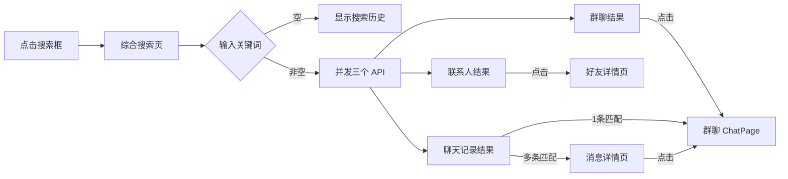
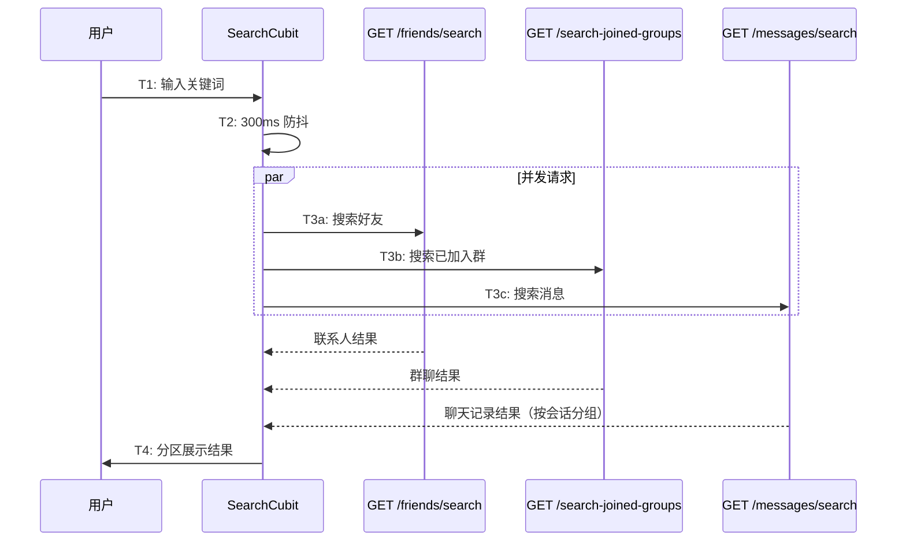
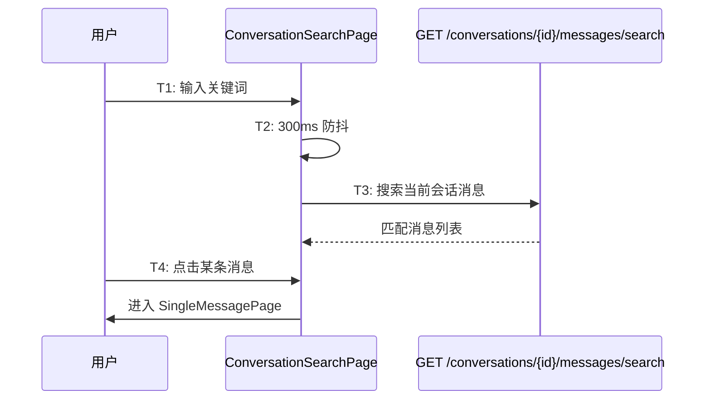

# 综合搜索 — 功能分析

## 概述

闪讯现在能聊天、能建群、能感知在线和已读，但想找一个人、一条消息、一个群，还得靠记忆和手动翻找。这一版做综合搜索，让信息主动浮现。

两个入口：主界面综合搜索（搜联系人、搜群聊、搜聊天记录，结果分区展示）和会话内搜索（在当前会话内搜索消息内容，从聊天详情页进入）。

核心挑战：
- 消息搜索的结果怎么组织？逐条列出太散，按会话分组更合理
- 三个搜索 API 并发调用，部分失败怎么处理？
- 会话内搜索的结果点击后怎么展示？跳转消息详情页查看完整信息

---

## 一、交互链

### 场景 1：主界面综合搜索

**用户故事**：作为用户，我想在一个地方搜到联系人、群聊和聊天记录。

消息 Tab 顶部点击搜索框，进入综合搜索页。输入关键词后，结果分三个区域展示：联系人（好友）、群聊（已加入的群）、聊天记录（跨所有会话的消息内容）。每个区域默认展示前 3 条，点击"查看更多"展开全部。

- 点击联系人 → 跳转好友详情页
- 点击群聊 → 跳转群聊 ChatPage
- 点击聊天记录 → 如果该会话只有 1 条匹配，直接跳转 ChatPage；如果有多条匹配，先进入消息详情页（列出该会话所有匹配消息），再点击跳转

未输入关键词时，显示搜索历史（本地存储，最多 20 条）。

### 场景 2：会话内搜索

**用户故事**：作为用户，我想在当前聊天中查找某条消息。

单聊详情页或群聊详情页中，点击"查找聊天内容"，进入会话内搜索页。输入关键词后，列出当前会话中所有匹配的消息（发送者头像 + 昵称 + 消息内容 + 时间）。点击某条消息，进入消息详情页查看完整信息。

---

## 二、逻辑树

### 事件流：综合搜索

| 时刻 | 事件 | 处理 | 产生的新事件 |
|------|------|------|-------------|
| T1 | 用户输入关键词 | 前端 300ms 防抖 | — |
| T2 | 防抖结束 | 并发调用三个搜索 API | 三个 HTTP 请求 |
| T3 | 后端处理 | 好友：friend_relations + user_profiles ILIKE；群聊：conversations + conversation_members WHERE type=1 ILIKE；消息：messages ILIKE + 按会话分组 | 三个响应 |
| T4 | 前端收到响应 | 各自独立处理（部分失败不影响其他分区） | UI 刷新 |
| T5 | 用户点击结果 | 跳转对应页面 | 页面导航 |

### 事件流：会话内搜索

| 时刻 | 事件 | 处理 | 产生的新事件 |
|------|------|------|-------------|
| T1 | 用户输入关键词 | 前端 300ms 防抖 | — |
| T2 | 防抖结束 | 调用 `GET /conversations/{id}/messages/search?keyword=xxx` | HTTP 请求 |
| T3 | 后端处理 | messages WHERE conversation_id = $1 AND content ILIKE $2 | 响应 |
| T4 | 用户点击某条消息 | 进入消息详情页查看完整信息 | 页面导航 |

### 设计决策

| 决策 | 方案 | 理由 |
|------|------|------|
| 搜索好友而非搜索所有用户 | 综合搜索只搜好友（friend_relations），不搜陌生人 | 综合搜索是"找我相关的东西"，陌生人搜索已有独立入口（添加好友页） |
| 搜索已加入的群而非所有群 | 综合搜索只搜已加入的群（conversation_members），不搜公开群 | 同上，公开群搜索已有独立入口（搜索加群页） |
| 消息搜索按会话分组 | 后端返回 `List<MessageSearchGroup>`，每组含会话信息 + 匹配消息列表 | 逐条列出太散，按会话分组让用户快速定位"在哪个聊天里" |
| 三个 API 并发 + 部分失败容忍 | SearchCubit 用 Future.wait 并发，各自独立 try-catch | 好友搜索失败不应该阻塞群聊和消息搜索的展示 |
| 搜索历史本地存储 | SharedPreferences，最多 20 条，去重置顶 | 不需要同步到服务端 |
| 会话内搜索独立接口 | `GET /conversations/{id}/messages/search`，不复用综合搜索的消息接口 | 综合搜索是跨会话的（按会话分组），会话内搜索是单会话的（直接返回消息列表） |
| 关键词高亮 | 前端 HighlightText 组件，匹配部分用主题色标记 | 让用户快速看到匹配位置 |
| 消息搜索过滤系统消息 | SQL 加 `sender_id != 0` | 系统消息（创建群聊、入群通知等）搜索无意义 |
| 会话内搜索点击 → 消息详情页 | SingleMessagePage 展示完整消息信息 | 本来就在会话里，不需要跳 ChatPage |
| 搜索入口 | 消息 Tab + 通讯录 Tab 顶部都有搜索栏 | 两个 Tab 共用同一个 SearchPage |

---

## 三、功能编号与网络定位

### 本次新增节点

| 编号 | 功能节点 | 层级 | 简介 |
|------|---------|------|------|
| D-35 | 好友搜索 | 领域 | GET /api/friends/search，搜索当前用户的好友 |
| D-36 | 已加入群搜索 | 领域 | GET /api/conversations/search-joined-groups，搜索已加入的群聊 |
| D-37 | 消息搜索 | 领域 | GET /api/messages/search，跨会话搜索消息内容，按会话分组返回 |
| D-38 | 会话内消息搜索 | 领域 | GET /conversations/{id}/messages/search，单会话内搜索消息 |
| F-14 | 搜索模块 | 前端基础 | flash_im_search 模块：SearchRepository + SearchCubit |
| P-44 | 综合搜索页 | 前端业务 | SearchPage：搜索历史 + 分区结果（联系人/群聊/聊天记录） |
| P-45 | 消息搜索详情页 | 前端业务 | MessageDetailPage：某会话的匹配消息列表 |
| P-46 | 会话内搜索页 | 前端业务 | ConversationSearchPage：单会话内搜索 + 点击进入消息详情 |
| P-47 | 单条消息详情页 | 前端业务 | SingleMessagePage：展示消息完整信息（发送者 + 内容高亮 + 时间） |

### 扩展节点

| 编号 | 扩展内容 |
|------|---------|
| P-31 | 单聊详情页新增"查找聊天内容"入口 |
| P-38 | 群聊详情页新增"查找聊天内容"入口 |

### 前置依赖

| 依赖节点 | 依赖方式 | 是否已有 |
|----------|---------|---------|
| D-15 好友关系管理 | 查询好友列表（friend_relations） | ✅ 已有 |
| D-01 会话创建 | 查询已加入的群（conversations + conversation_members） | ✅ 已有 |
| D-06 消息存储 | 搜索消息内容（messages 表） | ✅ 已有 |
| F-07 共享头像组件 | 搜索结果展示头像 | ✅ 已有 |

### 边界接口

| 接口/协议 | 定义方 | 消费方 | 说明 |
|-----------|--------|--------|------|
| GET /api/friends/search | D-35 | F-14 → P-44 | 搜索好友 |
| GET /api/conversations/search-joined-groups | D-36 | F-14 → P-44 | 搜索已加入的群 |
| GET /api/messages/search | D-37 | F-14 → P-44 | 跨会话消息搜索 |
| GET /conversations/{id}/messages/search | D-38 | P-46 | 会话内消息搜索 |

---

## 四、结论

- **开发顺序**：后端新增搜索接口（好友搜索、已加入群搜索、消息搜索、会话内消息搜索）→ 前端 flash_im_search 模块（SearchRepository + SearchCubit + SearchPage + MessageDetailPage）→ 会话内搜索页 → 详情页集成"查找聊天内容"入口
- **复杂度集中点**：
  - 消息搜索的 SQL：跨会话搜索需要 JOIN conversations + user_profiles，按会话分组，每组取最近匹配的消息，同时返回会话信息和匹配总数
  - 搜索结果点击后的导航：综合搜索的消息结果可能跳转 ChatPage 或 MessageDetailPage，会话内搜索需要定位到具体消息
  - 三个 API 并发 + 部分失败处理：SearchCubit 需要区分全部成功和部分成功两种状态
- **和已有架构的关系**：好友搜索和群搜索复用已有的数据表（friend_relations、conversations、conversation_members），消息搜索复用 messages 表。不新建数据库表，只新增查询接口。前端新建 flash_im_search 模块，不修改已有模块的内部逻辑
