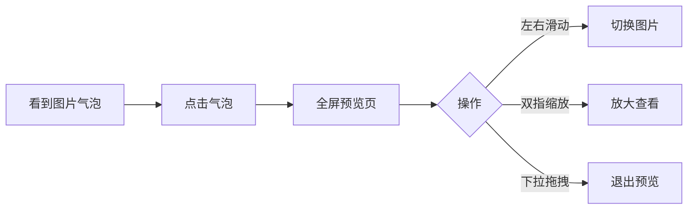
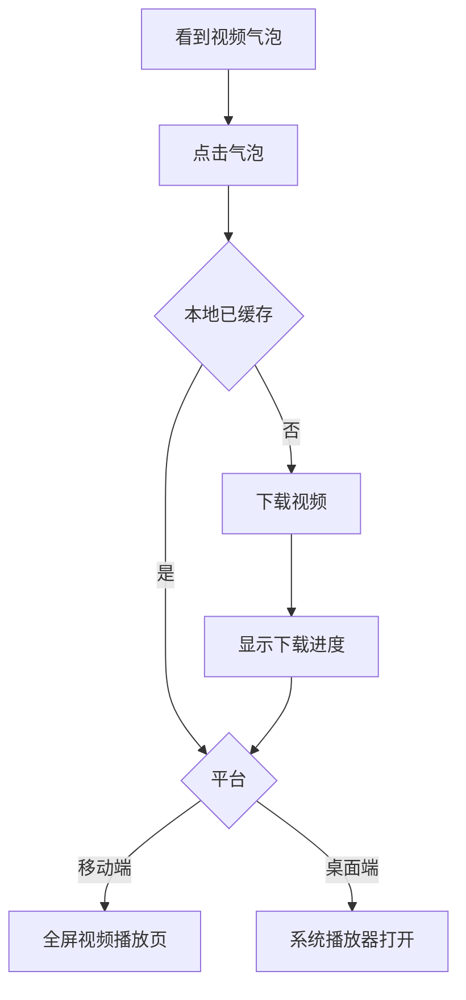
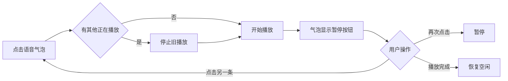
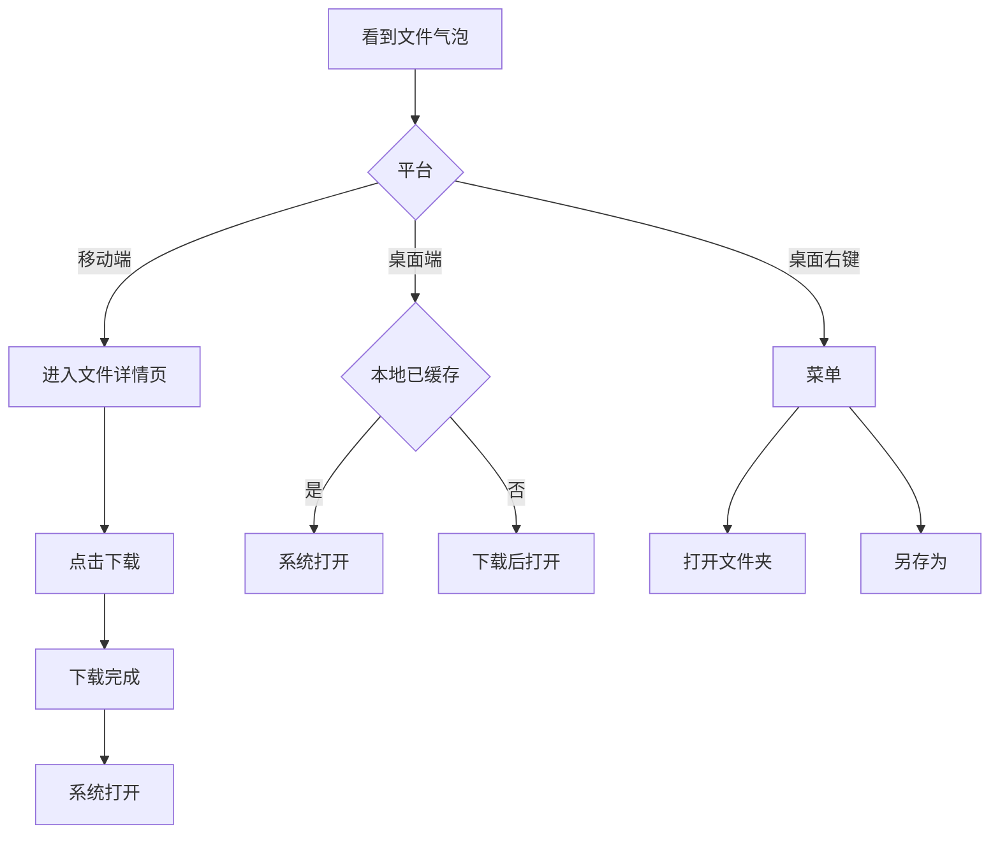
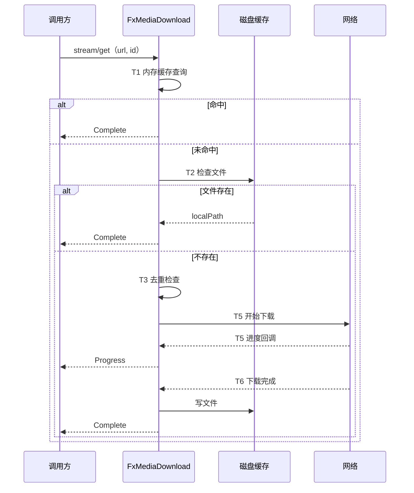

# fx_media 统一媒体管理 — 功能分析

## 概述

将闪讯项目中散落在多个模块的媒体播放/预览/下载/缓存能力，收敛为一个**项目无关**的通用包 `fx_media`（位于 `packages/fx_media/`）。统一接口风格，一套 API 覆盖下载/缓存/播放/预览/打开，消除重复实现和碎片化问题。

当前痛点：
- 两套下载缓存（FileCacheManagerImpl + CloudDownloadManager），核心逻辑（队列/并发/去重/路径管理）重复
- 三层图片缓存（PersistentCacheManager + FileCacheManager + CloudDownloadManager），同一文件可能缓存多份
- 音频无全局管理（每个 AudioBubble 各自创建 AudioPlayer，无"播新停旧"）
- 预览能力绑死 flash_im_chat，云空间等场景无法复用
- VideoPlayerPage 只支持网络 URL，不支持本地文件

本次是**纯前端重构**，后端无需改动。

---

## 一、交互链

### 场景 1：聊天中查看图片

**用户故事**：作为聊天用户，我想点击聊天中的图片查看大图，以便看清图片细节。

用户在聊天页看到图片消息气泡，点击气泡进入全屏预览页。预览页支持左右滑动浏览同一会话内的所有图片，支持双指缩放，向下拖拽退出。图片从网络加载时显示缩略图占位，加载完成后回调本地缓存路径更新消息 localData。

### 场景 2：聊天中播放视频

**用户故事**：作为聊天用户，我想点击视频消息播放视频，以便观看视频内容。

用户在聊天页看到视频消息气泡（缩略图 + 播放按钮）。如果视频已缓存本地，按钮显示播放图标；否则显示下载图标。点击后：移动端进入全屏视频播放页，桌面端用系统播放器打开。未缓存时先下载再播放。

### 场景 3：聊天中播放语音

**用户故事**：作为聊天用户，我想点击语音消息播放语音，以便听取语音内容。

用户点击语音气泡，全局音频播放器开始播放。如果当前有另一条语音正在播放，自动停止旧的、开始播放新的（播新停旧）。播放中气泡显示暂停图标，再次点击暂停。播放完成后恢复空闲状态。

### 场景 4：聊天中操作文件

**用户故事**：作为聊天用户，我想对收到的文件进行打开、另存为、查看所在文件夹等操作，以便使用或管理文件。

移动端：点击文件气泡进入文件详情页，下载后可用系统应用打开。桌面端：点击直接下载并用系统默认程序打开；右键菜单提供"打开文件夹"和"另存为"。

### 场景 5：云空间下载文件

**用户故事**：作为用户，我想在云空间中下载文件到本地，以便离线使用。

用户在云空间文件列表点击下载按钮，全局下载管理器开始下载并显示进度。下载完成后按钮变为"打开"。多个页面可同时监听同一文件的下载状态。

---

## 二、逻辑树

### 事件流：统一下载管理

| 时刻 | 事件 | 处理 | 产生的新事件 |
|------|------|------|-------------|
| T1 | 调用 FxMedia.download.stream/get | 检查内存缓存（id → localPath） | 命中则直接返回 Complete 事件 |
| T2 | 缓存未命中 | 检查磁盘文件是否存在（按 id 查路径） | 存在则返回 Complete |
| T3 | 磁盘未命中 | 检查是否有相同 id 的下载任务正在进行 | 有则复用现有 Stream |
| T4 | 无重复任务 | 检查并发数是否达上限 | 未达上限→启动下载；达上限→入队列等待 |
| T5 | 开始下载 | dio 执行网络下载，onReceiveProgress 回调 | 发射 Progress 事件 |
| T6 | 下载完成 | 文件落盘，记录 id → localPath 映射 | 发射 Complete 事件 |
| T7 | 下载失败 | 记录错误，标记失败 | 发射 Error 事件 |
| T8 | 任务结束（成功或失败） | 从活跃列表移除，检查队列 | 队列非空→取下一个启动 |

### 事件流：全局音频播放

| 时刻 | 事件 | 处理 | 产生的新事件 |
|------|------|------|-------------|
| T1 | 调用 FxMedia.audio.play(url) | 检查 currentUrl 是否相同 | 相同→恢复播放；不同→停止旧的 |
| T2 | 停止旧播放 | AudioPlayer.stop() | stateStream 发射 idle |
| T3 | 设置新源 | AudioPlayer.setUrl/setFilePath | - |
| T4 | 开始播放 | AudioPlayer.play() | stateStream 发射 playing |
| T5 | 播放完成 | 自动回调 completed | stateStream 发射 completed |
| T6 | 调用 pause | AudioPlayer.pause() | stateStream 发射 paused |
| T7 | 播放出错 | 捕获异常 | stateStream 发射 error |

### 事件流：图片缓存回调

| 时刻 | 事件 | 处理 | 产生的新事件 |
|------|------|------|-------------|
| T1 | FxMedia.image.widget 渲染 | CachedNetworkImage 开始加载 | 显示 shimmer/缩略图 |
| T2 | 图片加载完成 | flutter_cache_manager 写入磁盘 | - |
| T3 | 获取本地路径 | 从 CacheManager 查询 fileInfo | 触发 onCached 回调 |
| T4 | 业务层收到回调 | 更新消息 localData（JSON 存 path） | - |

### 状态流转

| 实体 | 触发事件 | 前状态 | 后状态 |
|------|---------|--------|--------|
| 下载任务 | 调用 download.stream | 不存在 | queued |
| 下载任务 | 并发槽空闲 | queued | downloading |
| 下载任务 | 下载完成 | downloading | completed |
| 下载任务 | 下载失败 | downloading | error |
| 下载任务 | 调用 cancel | queued/downloading | cancelled |
| 音频播放器 | play(新url) | idle/completed | playing |
| 音频播放器 | play(新url)，旧正在播 | playing | idle→playing |
| 音频播放器 | pause | playing | paused |
| 音频播放器 | play(同url) | paused | playing |
| 音频播放器 | 播放到结尾 | playing | completed |
| 音频播放器 | 出错 | playing | error |

异常回退：
- 下载失败 → 从活跃列表移除，状态变 error，不影响其他任务
- 音频加载失败 → 状态变 error，currentUrl 清空，不阻塞后续播放
- 取消下载 → 关闭 HTTP 连接，删除临时文件，状态变 cancelled

---

## 三、功能编号与网络定位

### 本次新增节点

| 编号 | 功能节点 | 层级 | 简介 |
|------|---------|------|------|
| F-22 | 统一下载管理 | 前端基础层 | fx_media 下载队列 + 并发控制 + 缓存映射 |
| F-23 | 全局音频播放器 | 前端基础层 | fx_media 播新停旧单例音频 |
| F-24 | 图片缓存 Widget | 前端基础层 | fx_media 图片展示 + 缓存路径回调 |
| F-25 | 视频播放页 | 前端基础层 | fx_media 全屏视频播放（网络+本地） |
| F-26 | 文件操作工具 | 前端基础层 | fx_media 系统打开/另存为/打开文件夹 |

### 前置依赖

| 依赖节点 | 依赖方式 | 是否已有 |
|----------|---------|---------|
| flutter_cache_manager（三方库） | 下载/缓存底层引擎 | ✅ 已引入 |
| cached_network_image（三方库） | 图片 Widget 渲染 | ✅ 已引入 |
| just_audio（三方库） | 音频播放引擎 | ✅ 已引入 |
| video_player（三方库） | 视频播放引擎 | ✅ 已引入 |
| tolyui_mediax_core + tolyui_mediax_ui | 图片预览页框架 | ✅ 已引入 |
| dio（三方库） | HTTP 下载 | ✅ 已引入 |
| file_picker（三方库） | 另存为对话框 | ✅ 已引入 |
| open_file（三方库） | 移动端系统打开 | ✅ 已引入 |
| F-18 文件缓存管理器 | 迁移后被 F-22 替代 | ✅ 已有 |
| F-21 全局下载管理器 | 迁移后被 F-22 替代 | ✅ 已有 |

### 边界接口

| 接口/协议 | 定义方 | 消费方 | 说明 |
|-----------|--------|--------|------|
| FxMedia.download.stream/get | fx_media | flash_im_chat, flash_cloud | 统一下载入口 |
| FxMedia.audio.play/pause/stop | fx_media | flash_im_chat（AudioBubble） | 全局音频控制 |
| FxMedia.audio.stateStream | fx_media | flash_im_chat（AudioBubble） | 播放状态监听 |
| FxMedia.image.preview | fx_media | flash_im_chat（ChatMediaHandler） | 全屏图片预览 |
| FxMedia.image.widget | fx_media | flash_im_chat（ImageBubble） | 带缓存回调的图片组件 |
| FxMedia.video.open/openFile | fx_media | flash_im_chat（ChatMediaHandler） | 视频播放 |
| FxMedia.file.open/saveAs/openFolder | fx_media | flash_im_chat（ChatMediaHandler, FilePreviewPage） | 文件操作 |
| onCached 回调 | fx_media（image.widget） | 业务层 | 图片缓存完成后通知路径 |
| FxDownloadEvent Stream | fx_media | flash_cloud（UI 监听进度） | 下载进度事件流 |

---

## 四、结论

### 开发顺序建议

1. **先建 fx_media 包骨架**（pubspec + barrel export + FxMedia 入口类）
2. **下载模块 F-22**（核心，被图片/视频/文件/云空间共同依赖）
3. **音频模块 F-23**（独立，无其他内部依赖）
4. **图片模块 F-24**（依赖 F-22 的缓存路径回调）
5. **视频模块 F-25**（依赖 F-22 的下载能力）
6. **文件模块 F-26**（依赖 F-22 的下载能力）
7. **迁移 flash_im_chat**：ChatMediaHandler + AudioBubble + ImageBubble 改为调用 FxMedia
8. **迁移 flash_cloud**：CloudDownloadManager 替换为 FxMedia.download
9. **清理**：删除 CloudDownloadManager，简化 FileCacheManagerImpl（委托下载给 fx_media）

### 复杂度集中的地方

- **下载模块**：并发控制 + 队列 + id 去重 + 取消 + 错误恢复，是整个包的核心
- **图片缓存路径回调**：需要从 flutter_cache_manager 内部拿到真实磁盘路径，不是所有 API 都直接暴露

### 暂不实现的部分及理由

| 项目 | 理由 |
|------|------|
| 旧缓存数据兼容 | 项目尚未正式发布，无需兼容旧路径，直接替换 |
| 通知栏音频控制 | 当前是聊天语音场景，时长短，不需要后台播放 |
| 视频下载进度 UI（气泡内） | 本次先用跳转后全屏加载方式，后续可迭代 |
| Web 平台适配 | 当前 fx_media 只面向原生平台（iOS/Android/桌面），Web 继续用 NoOp 模式 |
| 断点续传 | flutter_cache_manager 不原生支持，自行实现复杂度高，暂不做 |
