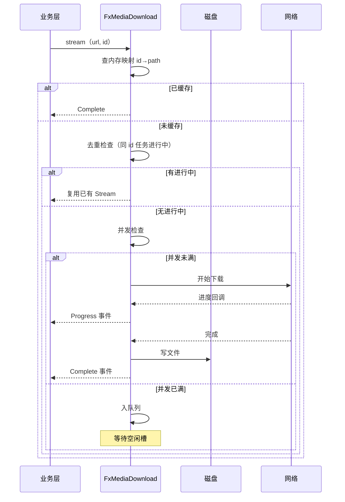
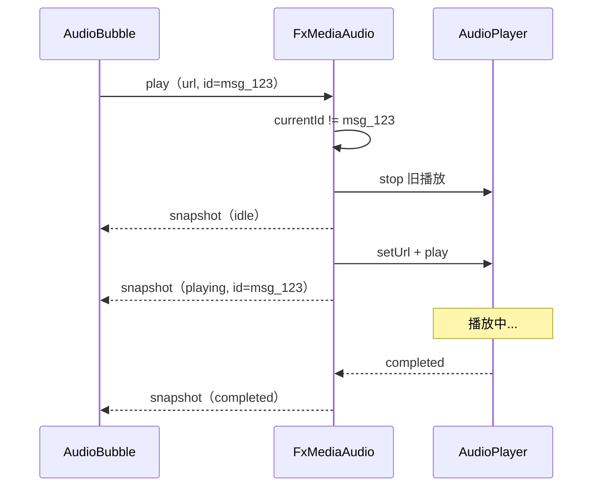
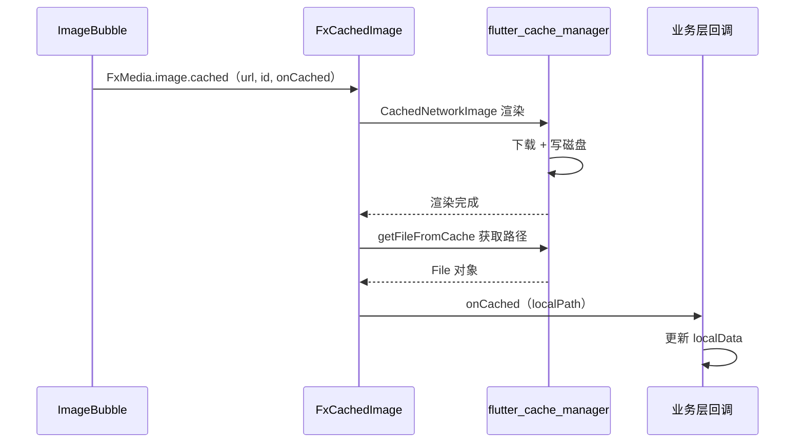
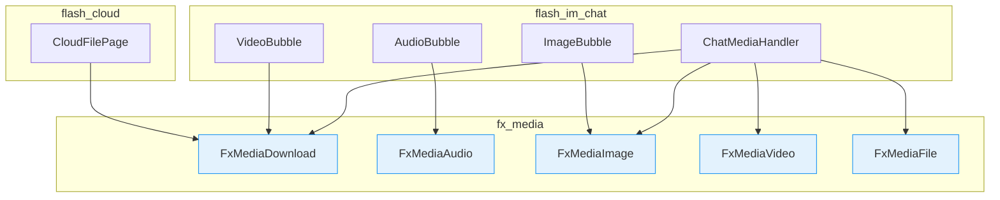

# fx_media — 客户端设计报告

> 关联设计：[media v0.0.1 analysis](../analysis.md) | [cloud v0.0.1 client](../../cloud/v0.0.1/client/design.md)

## 1. 目标

- 新建 `packages/fx_media/` 通用媒体管理包，业务无关
- 实现统一下载管理（队列 + 并发控制 + id 去重 + 进度流）
- 实现全局音频播放器（播新停旧单例）
- 实现图片缓存 Widget（渲染 + 本地路径回调）+ 全屏预览入口
- 实现视频播放页（支持网络 URL 和本地文件）
- 实现文件操作工具（系统打开 / 另存为 / 打开文件夹）
- 迁移 flash_im_chat 和 flash_cloud 的媒体操作到 FxMedia
- 删除 CloudDownloadManager，简化 FileCacheManagerImpl

## 2. 现状分析

### 已有能力

| 模块 | 能力 | 问题 |
|------|------|------|
| FileCacheManagerImpl | 下载队列 + 并发控制 + URL 去重 + localData 持久化 | 绑死 LocalStore（drift），只面向聊天消息 |
| CloudDownloadManager | 下载 + 进度流 + 缓存状态 | 以 fileId（int）为标识，只面向云空间；用 Dio 直连 |
| PersistentCacheManager | flutter_cache_manager 封装，Application Support 持久缓存 | 仅用于图片 Widget，不暴露路径回调 |
| AudioBubble | just_audio 播放 | 每个气泡独立 AudioPlayer，无全局管理 |
| VideoPlayerPage | video_player 全屏播放 | 只支持 networkUrl，不支持本地文件 |
| ChatMediaHandler | 图片预览/视频打开/文件操作编排 | 逻辑正确但绑死在 flash_im_chat，不可复用 |

### 基础设施就绪

- flutter_cache_manager、cached_network_image、just_audio、video_player、tolyui_mediax_ui 均已在 pubspec 中
- dio 已全局可用
- file_picker、open_file 已引入

## 3. 数据模型与接口

### 核心数据类

```dart
/// 下载事件（sealed class）
sealed class FxDownloadEvent {
  final String id;
  final String url;
}

class FxDownloadProgress extends FxDownloadEvent {
  final double progress; // 0.0 ~ 1.0
}

class FxDownloadComplete extends FxDownloadEvent {
  final String localPath;
}

class FxDownloadError extends FxDownloadEvent {
  final Object error;
}

/// 音频状态
enum FxAudioState { idle, loading, playing, paused, completed, error }

/// 音频播放信息快照
class FxAudioSnapshot {
  final FxAudioState state;
  final String? currentId; // 当前正在播放的资源标识
  final Duration position;
  final Duration duration;
}
```

### 设计决策

| 决策 | 方案 | 理由 |
|------|------|------|
| 下载 id 类型 | String | 通用性最强；聊天用 messageId，云空间用 fileId.toString() |
| 下载底层 | dio（外部注入下载函数） | 不让 fx_media 直接依赖 dio，通过 typedef 注入，保持业务无关 |
| 缓存存储 | 自管目录（cacheDir/category/id.ext） | 简单可控，不依赖 flutter_cache_manager 的内部路径规则 |
| 图片缓存 | 复用 flutter_cache_manager + CachedNetworkImage | 成熟方案，和 AppMediaSourceResolver 共享缓存池 |
| 音频标识 | id（String），不传时取 url | 和下载保持一致，便于外部关联状态 |
| 视频播放 | 内置简单播放页 | 不做通用播放器框架，只满足"看视频"场景 |
| 文件打开 | 平台条件编译 + Process | 桌面端 cmd/open，移动端 open_file |

### 公开 API

```dart
class FxMedia {
  /// 初始化（app 启动时调用一次）
  static void init({
    required String cacheDir,
    required FxDownloadFunction downloadFn,
    int maxConcurrent = 5,
  });

  static late final FxMediaDownload download;
  static late final FxMediaAudio audio;
  static late final FxMediaImage image;
  static late final FxMediaVideo video;
  static late final FxMediaFile file;
}

/// 下载函数签名（外部注入，解耦 dio）
typedef FxDownloadFunction = Future<void> Function(
  String url,
  String savePath, {
  void Function(double progress)? onProgress,
});
```

#### FxMediaDownload

```dart
abstract class FxMediaDownload {
  /// 流式下载（带进度事件）
  Stream<FxDownloadEvent> stream({required String url, String? id, String? fileName});

  /// 便捷获取（只等最终路径）
  Future<String> get({required String url, String? id, String? fileName});

  /// 是否已缓存
  bool isCached(String id);

  /// 获取本地路径（未缓存返回 null）
  String? localPath(String id);

  /// 移除缓存（删文件 + 清记录）
  Future<void> remove(String id);

  /// 取消下载
  void cancel(String id);
}
```

#### FxMediaAudio

```dart
abstract class FxMediaAudio {
  /// 播放网络音频（自动停止当前）
  Future<void> play(String url, {String? id});

  /// 播放本地文件
  Future<void> playFile(String localPath, {String? id});

  /// 暂停
  Future<void> pause();

  /// 停止
  Future<void> stop();

  /// 当前播放的 id
  String? get currentId;

  /// 状态流
  Stream<FxAudioSnapshot> get snapshotStream;
}
```

#### FxMediaImage

```dart
abstract class FxMediaImage {
  /// 全屏预览（多图滑动 + Hero 动画）
  void preview(
    BuildContext context, {
    required List<ImageMeta> items,
    int initialIndex = 0,
    VoidCallback? onDismiss,
  });

  /// 带缓存回调的图片 Widget
  Widget cached({
    required String url,
    String? id,
    BoxFit fit = BoxFit.cover,
    double? width,
    double? height,
    void Function(String localPath)? onCached,
  });
}
```

#### FxMediaVideo

```dart
abstract class FxMediaVideo {
  /// 跳转全屏播放页（网络 URL）
  void open(BuildContext context, String url);

  /// 跳转全屏播放页（本地文件）
  void openFile(BuildContext context, String localPath);
}
```

#### FxMediaFile

```dart
abstract class FxMediaFile {
  /// 系统默认程序打开
  Future<void> open(String localPath);

  /// 另存为
  Future<void> saveAs(String localPath, {String? suggestedName});

  /// 打开所在文件夹（桌面端）
  Future<void> openFolder(String localPath);
}
```

## 4. 核心流程

### 下载流程



### 音频播放流程



### 图片缓存回调流程



### 迁移后调用链



## 5. 项目结构与技术决策

### 项目结构

```
packages/fx_media/
├── pubspec.yaml
├── lib/
│   ├── fx_media.dart                        # barrel export + FxMedia 入口
│   └── src/
│       ├── download/
│       │   ├── fx_media_download.dart       # 抽象接口
│       │   ├── fx_media_download_impl.dart  # 实现：队列 + 并发 + 去重
│       │   ├── fx_download_event.dart       # sealed class 事件模型
│       │   └── download_task.dart           # 内部任务模型（不导出）
│       ├── audio/
│       │   ├── fx_media_audio.dart          # 抽象接口
│       │   ├── fx_media_audio_impl.dart     # 实现：just_audio 单例
│       │   └── fx_audio_state.dart          # 枚举 + 快照
│       ├── image/
│       │   ├── fx_media_image.dart          # 抽象接口
│       │   ├── fx_media_image_impl.dart     # 实现：预览跳转 + Widget 工厂
│       │   └── fx_cached_image.dart         # StatefulWidget 带 onCached 回调
│       ├── video/
│       │   ├── fx_media_video.dart          # 抽象接口
│       │   ├── fx_media_video_impl.dart     # 实现：路由跳转
│       │   └── fx_video_player_page.dart    # 全屏播放页（网络+本地）
│       └── file/
│           ├── fx_media_file.dart           # 抽象接口
│           └── fx_media_file_impl.dart      # 实现：平台调用
```

### 变更文件清单

| 文件 | 操作 | 职责变更 |
|------|------|---------|
| `packages/fx_media/` | 新建 | 全部媒体管理能力 |
| `client/pubspec.yaml` | 修改 | 添加 fx_media path 依赖 |
| `client/lib/main.dart` | 修改 | 初始化 FxMedia.init() |
| `client/lib/src/application/media_resolver.dart` | 修改 | PersistentCacheManager 保留给 FxMedia.image 使用 |
| `flash_im_chat/lib/src/logic/handler/chat_media_handler.dart` | 修改 | 改为调用 FxMedia API |
| `flash_im_chat/lib/src/view/bubble/audio_bubble.dart` | 修改 | 去掉内部 AudioPlayer，改用 FxMedia.audio |
| `flash_im_chat/lib/src/view/bubble/image_bubble.dart` | 修改 | 已发送图片改用 FxMedia.image.cached |
| `flash_im_chat/lib/src/view/media/video_player_page.dart` | 删除 | 被 fx_media 内置播放页替代 |
| `flash_cloud/lib/src/data/cloud_download_manager.dart` | 删除 | 被 FxMedia.download 替代 |
| `flash_cloud/` 相关 UI 文件 | 修改 | 下载操作改为调用 FxMedia.download |
| `flash_im_cache/lib/src/file_cache_manager_impl.dart` | 修改 | 内部下载逻辑委托给 FxMedia.download |

### 职责划分

```
业务层（flash_im_chat / flash_cloud）
    │ 调用 FxMedia 静态 API
    ▼
fx_media（packages/fx_media）
    │ 内部使用
    ▼
三方库（just_audio / video_player / flutter_cache_manager / cached_network_image）
```

- **fx_media 不依赖任何闪讯业务模型**（Message、Conversation 等）
- **fx_media 不依赖 dio**：通过 FxDownloadFunction typedef 注入下载实现
- **fx_media 不依赖 LocalStore**：缓存映射自己维护在内存 Map 中，磁盘上靠文件存在性判断
- 业务层负责调用 `FxMedia.download.get()` 后自行更新 localData

### 技术决策

| 决策 | 方案 | 理由 |
|------|------|------|
| 下载函数注入 vs 直接依赖 dio | 注入 typedef | 保持包的业务无关性，调用方自己配 headers/interceptor |
| 缓存路径策略 | `{cacheDir}/{category}/{id}{ext}` | 可预测、易排查、不依赖 flutter_cache_manager 内部结构 |
| 图片 Widget | 封装 CachedNetworkImage + onCached | 复用成熟库，onCached 是唯一需要额外做的事 |
| 音频实现 | 单个 AudioPlayer 实例复用 | 天然保证"播新停旧"，不需要管理多实例 |
| 视频播放页 | 内置简单页面 vs 由业务自己写 | 内置省重复代码，逻辑不多（初始化 + 播放 + 控制条） |
| 文件打开（移动端） | open_file 包 | 跨平台 MIME 推断 + Intent/UIDocumentInteraction |
| 文件打开（桌面端） | Process.start | 原生命令最可靠，无需引入额外包 |

### 第三方依赖

| 依赖 | 用途 | 已有/需新增 |
|------|------|------------|
| flutter_cache_manager | 图片缓存后端 | ✅ 已有 |
| cached_network_image | 图片 Widget | ✅ 已有 |
| just_audio | 音频播放 | ✅ 已有 |
| video_player | 视频播放 | ✅ 已有 |
| tolyui_mediax_core | ImageMeta 模型 | ✅ 已有 |
| tolyui_mediax_ui | MediaPreviewPage | ✅ 已有 |
| file_picker | 另存为对话框 | ✅ 已有 |
| open_file | 移动端系统打开 | ✅ 已有 |
| path | 路径拼接 | ✅ 已有 |
| path_provider | 获取 cacheDir | ✅ 已有 |

无需新增依赖。

## 6. 验收标准

| 验收条件 | 验收方式 |
|----------|----------|
| fx_media 包编译通过 | `flutter analyze` 零错误 |
| 主应用编译通过 | `flutter build apk --debug` 成功 |
| 聊天发图 → 对方收到 → 点击预览正常 | 手动验证 |
| 聊天发视频 → 对方收到 → 点击播放正常（移动端全屏 + 桌面端系统打开） | 手动验证 |
| 聊天发语音 → 点击播放 → 播新停旧 → 播完自动停 | 手动验证 |
| 聊天发文件 → 下载 → 系统打开 / 另存为 / 打开文件夹 | 手动验证 |
| 云空间下载文件 → 进度显示 → 下载完成打开 | 手动验证 |
| CloudDownloadManager 已删除 | 编译通过即证明无残留引用 |
| 旧 VideoPlayerPage 已删除 | 编译通过即证明无残留引用 |

## 7. 暂不实现

| 功能 | 理由 |
|------|------|
| 通知栏音频控制 | 聊天语音时长短，无后台播放需求 |
| 断点续传 | 复杂度高，当前文件尺寸（<100MB）不需要 |
| 视频气泡内下载进度 | 先用跳转后加载方式，后续迭代 |
| Web 平台实现 | 当前只面向原生平台 |
| 图片预览中保存到相册 | 后续版本再加 |
| 视频预加载/边下边播 | 当前用全量下载后播放，够用 |
