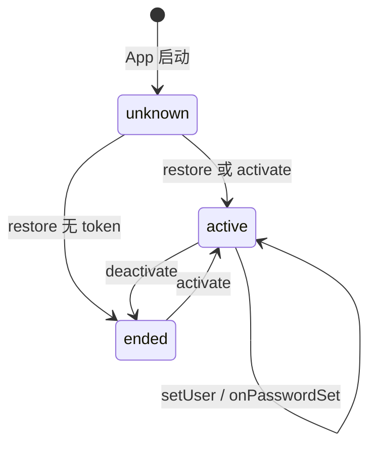
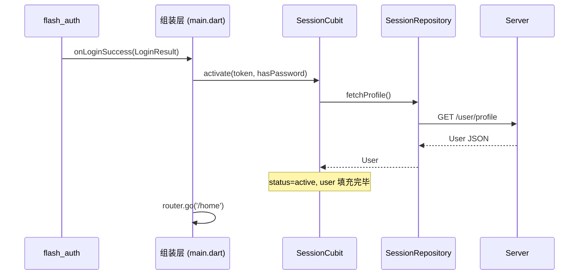
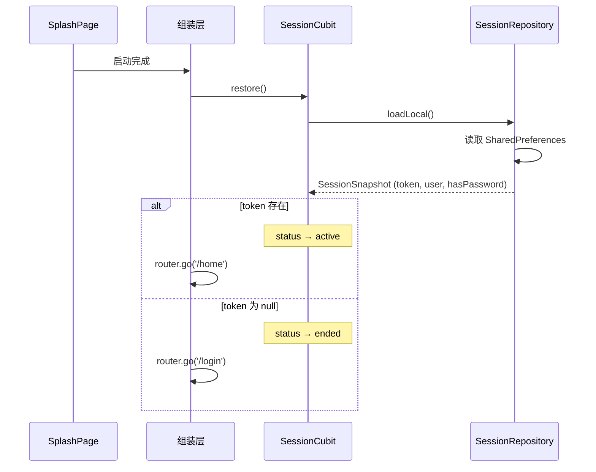

# session — 客户端设计报告

> 关联设计：[auth v0.0.2 客户端](../../../auth/v0.0.2/client/design.md)

## 1. 目标

- 创建 `flash_session` 独立 package，提供全局用户会话管理
- 将 AuthCubit 演进为 SessionCubit，语义从"认证状态"变为"用户会话"
- User 模型从主工程 `domain/model/` 迁移到 flash_session 中
- 为 home、profile、set_password 等页面提供统一的用户数据来源
- 内置 SessionRepository，负责获取用户信息和设置密码等会话期间的用户行为

> 核心设计理念：用户在与应用交互期间的会话周期内的所有表现形态，都属于 session 的职责。Token、用户资料（昵称、头像）、密码状态、未来的偏好设置等，只要是"当前登录用户是什么样的"，就归 session 管。session 不关心"用户怎么来的"（那是 auth 的事），只关心"用户来了之后是什么样的"。

## 2. 现状分析

### 已有能力

| 能力 | 位置 | 说明 |
|------|------|------|
| AuthCubit | `client/lib/src/auth/logic/auth/auth_cubit.dart` | 全局状态，持有 token + user + hasPassword |
| AuthState | `client/lib/src/auth/logic/auth/auth_state.dart` | unknown / authenticated / unauthenticated 三态 |
| User 模型 | `client/lib/src/domain/model/user.dart` | userId, phone, nickname, avatar |
| StartupRepository | `client/lib/src/starter/` | 从 SharedPreferences 恢复 token + user + hasPassword |

### 存在的问题

| 问题 | 说明 |
|------|------|
| AuthCubit 名不副实 | 它管理的是用户会话（token + user + hasPassword），不是认证状态 |
| AuthCubit 放在 auth 目录下 | 但 auth 模块（flash_auth）已独立，不持有全局状态 |
| User 模型放在主工程 domain/ | 多个模块需要 User，应放在共享层 |
| home/profile 直接 import auth 内部 | `import '../../auth/logic/auth/auth_cubit.dart'`，跨模块耦合 |
| hasPassword 语义模糊 | 它是用户属性，不是认证属性，应跟随 User 或 Session |

### 消费方分析

当前谁在用 AuthCubit：

| 消费方 | 用法 |
|--------|------|
| `main.dart` | 创建 AuthCubit，注入 BlocProvider，登录/启动时写入状态 |
| `router.dart` | 不直接用，通过回调间接触发 |
| `home_page.dart` | `context.read<AuthCubit>()` 检查 hasPassword，跳转设置密码 |
| `profile_page.dart` | `BlocBuilder<AuthCubit, AuthState>` 读取 user、hasPassword |
| `set_password_page.dart` | `context.read<AuthCubit>().onPasswordSet()` 更新密码状态 |

## 3. 数据模型与接口

### User 模型（迁入 flash_session）

```dart
class User {
  final int userId;
  final String phone;
  final String nickname;
  final String avatar;
}
```

与现有 User 完全一致，仅迁移位置。保留 `fromJson` / `toJson`。

### SessionState

```dart
enum SessionStatus { unknown, active, ended }

class SessionState extends Equatable {
  final SessionStatus status;
  final String? token;
  final User? user;
  final bool hasPassword;
}
```

| 决策 | 理由 |
|------|------|
| `AuthStatus` → `SessionStatus` | 语义对齐：unknown（启动中）、active（已登录）、ended（已退出） |
| `authenticated` → `active` | "会话活跃"比"已认证"更准确 |
| `unauthenticated` → `ended` | "会话结束"比"未认证"更准确 |
| hasPassword 保留在 SessionState | 它是用户属性，跟随会话存在 |

### SessionRepository

```dart
class SessionRepository {
  final Dio _dio;

  SessionRepository({required Dio dio});

  /// 获取当前用户资料
  Future<User> fetchProfile();

  /// 设置/修改密码
  Future<void> setPassword(String newPassword);

  /// 缓存会话数据到本地（token, user, hasPassword）
  Future<void> saveLocal({required String token, User? user, bool hasPassword = false});

  /// 从本地缓存恢复会话数据
  Future<SessionSnapshot?> loadLocal();

  /// 清除本地缓存（退出登录时）
  Future<void> clearLocal();
}
```

| 决策 | 理由 |
|------|------|
| fetchProfile 放在 session | 用户资料是会话期间的表现形态，获取它是 session 的职责 |
| setPassword 放在 session | 密码状态影响会话（hasPassword），是会话周期内的用户行为 |
| saveLocal / loadLocal / clearLocal | 会话数据的持久化是 session 自己的事，不该让外部代劳 |

### SessionCubit

```dart
class SessionCubit extends Cubit<SessionState> {
  final SessionRepository _repo;

  SessionCubit({required SessionRepository repo});

  /// 应用启动时，从本地缓存恢复会话（内部调 loadLocal）
  Future<void> restore();

  /// 登录成功后，由组装层调用；自动拉取用户资料并缓存
  Future<void> activate({required String token, bool hasPassword = false});

  /// 设置密码
  Future<void> setPassword(String newPassword);

  /// 结束会话（清状态 + 清缓存）
  Future<void> deactivate();

  /// 便捷访问
  String? get token;
}
```

| 决策 | 理由 |
|------|------|
| `activate()` 为 async，内部自动调 `fetchProfile` 并缓存 | 激活会话后获取用户信息 + 持久化都是 session 自己的事 |
| `restore()` 不再接收参数 | 内部调 `loadLocal()` 自己读缓存，外部不需要传数据进来 |
| `setPassword()` 放在 SessionCubit | 密码状态是会话的一部分，设置密码后直接更新 hasPassword |
| `deactivate()` 为 async | 需要调 SessionRepository.clearLocal() 清缓存 |
| 移除 `setUser()` | 不再需要外部手动塞 User，session 自己拉取 |
| 移除 `onPasswordSet()` | 被 `setPassword()` 取代，一步到位 |
| `applyStartupSnapshot` → `restore` | 更简洁，语义更清晰 |
| 新增 `token` getter | HttpClient 的 tokenProvider 需要读取 |

### barrel file 导出

```dart
// flash_session.dart
export 'src/session_cubit.dart' show SessionCubit;
export 'src/session_repository.dart' show SessionRepository;
export 'src/session_state.dart' show SessionState, SessionStatus;
export 'src/model/user.dart' show User;
```

## 4. 核心流程

### 4.1 会话生命周期



### 4.2 登录后的数据流



### 4.3 启动恢复流程



## 5. 项目结构与技术决策

### 项目结构

```
client/modules/flash_session/
├── pubspec.yaml
└── lib/
    ├── flash_session.dart          # barrel file
    └── src/
        ├── model/
        │   └── user.dart           # User 模型（从主工程迁入）
        ├── session_cubit.dart      # SessionCubit (Cubit)
        ├── session_repository.dart # SessionRepository（fetchProfile）
        └── session_state.dart      # SessionState + SessionStatus
```

### 职责划分

```
flash_session 的职责：
  ✅ 持有当前会话数据（token, user, hasPassword）
  ✅ 提供状态变更方法（activate, setPassword, deactivate, restore）
  ✅ 登录后自动获取用户资料（SessionRepository.fetchProfile）
  ✅ 通过 Cubit 通知 UI 刷新
  ✅ 导出 User 模型供其他模块使用

flash_session 不做的事：
  ❌ 不做路由跳转（由组装层决定）
  ❌ 不做登录/注册逻辑（那是 flash_auth 的事）
```

### 迁移影响

| 文件 | 变更 |
|------|------|
| `main.dart` | `AuthCubit` → `SessionCubit`，`BlocProvider<AuthCubit>` → `BlocProvider<SessionCubit>` |
| `home_page.dart` | `context.read<AuthCubit>()` → `context.read<SessionCubit>()` |
| `profile_page.dart` | `BlocBuilder<AuthCubit, AuthState>` → `BlocBuilder<SessionCubit, SessionState>` |
| `set_password_page.dart` | `context.read<AuthCubit>().onPasswordSet()` → `context.read<SessionCubit>().setPassword()` |
| `http_client.dart` | tokenProvider 改为从 SessionCubit 读取 |
| `domain/model/user.dart` | 删除，改为 `import 'package:flash_session/flash_session.dart'` |

### 技术决策

| 决策 | 方案 | 理由 |
|------|------|------|
| 状态管理 | flutter_bloc (Cubit) | 与现有 AuthCubit 一致，迁移成本最低 |
| User 模型归属 | 放在 flash_session | User 是会话的核心数据，session 是最自然的归属 |
| 获取用户信息 | SessionRepository 内部完成 | session 维护用户数据，拉取用户信息是它自己的职责 |
| 本地缓存 | SessionRepository 内部读写 SharedPreferences | 会话数据的持久化是 session 自己的事，启动时 restore() 自己读缓存 |

### 依赖清单

| 依赖 | 用途 | 已有/需新增 |
|------|------|------------|
| flutter_bloc | Cubit 状态管理 | 已有 |
| equatable | SessionState 值比较 | 已有 |
| dio | SessionRepository 网络请求 | 已有 |
| shared_preferences | 会话数据本地缓存 | 已有 |

## 6. 暂不实现

| 功能 | 理由 |
|------|------|
| Token 自动刷新 | 当前 7 天过期，暂够用 |
| 多账号切换 | 单会话即可，后续版本考虑 |
| 会话过期自动跳转登录 | HttpClient 的 401 拦截已有基础，但完整流程留给后续版本 |
| User 模型扩展（email 字段等） | 等服务端 user_profiles 表扩展后再加 |
| flash_shared 共享层 | v0.0.2 report 中规划的 flash_shared（通用组件），本版本不创建，User 先放 session |
