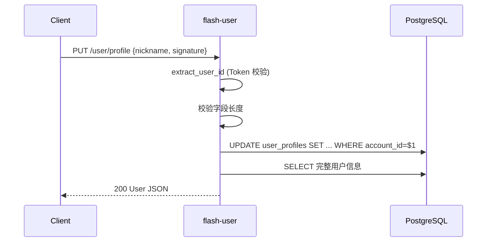
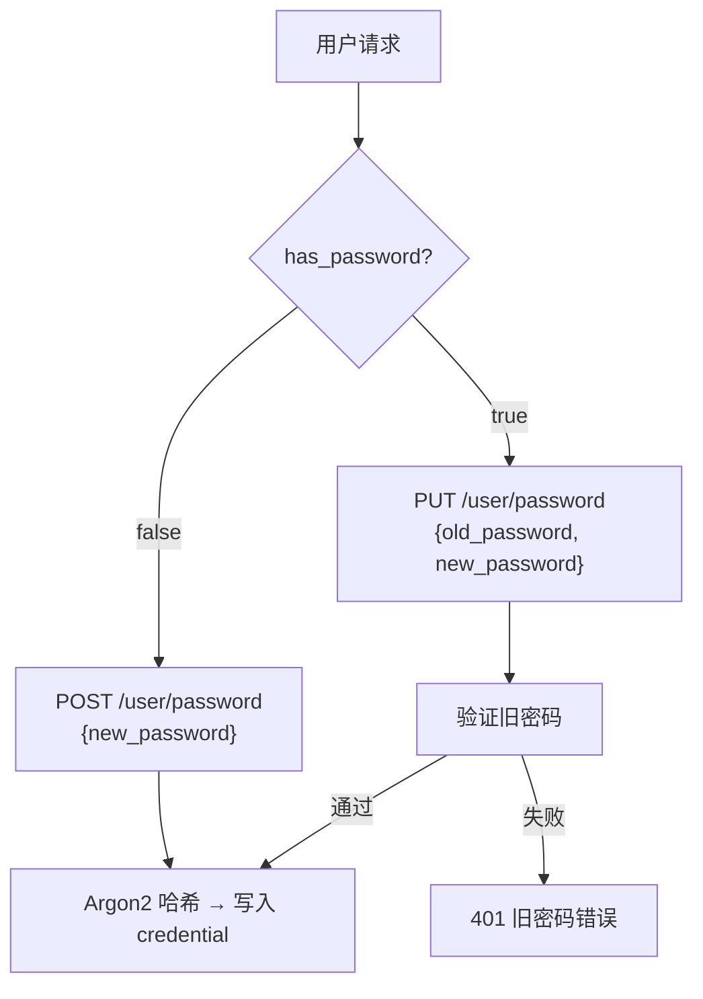

# session v0.0.2 — 服务端设计报告

> 关联设计：[session v0.0.1 客户端](../../v0.0.1/client/design.md) | [auth v0.0.2 服务端](../../../auth/v0.0.2/server/design.md)

## 1. 目标

- 将 `server/src/user/` 提取为独立 crate `flash-user`，与 flash-auth 对称
- 新增用户信息编辑接口：修改昵称、签名
- 密码管理拆分为两个独立接口：设置密码（首次）和修改密码（需验证旧密码）
- 将 `set_password` 从 flash-auth 迁入 flash-user
- 为客户端 `flash_session` 的 `SessionRepository` 提供完整的后端支撑

## 2. 现状分析

### 已有能力

| 能力 | 位置 | 说明 |
|------|------|------|
| GET /user/profile | `server/src/user/handler.rs` | 根据 Token 获取用户信息（user_id, phone, nickname, avatar） |
| POST /auth/password | `flash-auth/handler.rs` | 设置密码（需 Token），但放在了 auth 模块 |
| User 结构体 | `flash-core/state.rs` | user_id, phone, nickname, avatar |

### 存在的问题

| 问题 | 说明 |
|------|------|
| user 模块在主 binary 中 | `server/src/user/` 不是独立 crate，无物理隔离 |
| set_password 放在 flash-auth | 设置密码是用户行为，不是认证行为 |
| 无编辑能力 | profile 只有 GET，无法修改昵称 |
| 无签名字段 | user_profiles 表和 User 结构体都没有 signature 字段 |
| 密码只能设置不能改 | 没有"修改密码"接口（需验证旧密码） |
| extract_user_id 重复 | `user/handler.rs` 和 `flash-auth/handler.rs` 各有一份，逻辑完全相同 |
| 默认头像不合理 | 注册时用 `picsum.photos` 随机风景图，语义上不适合做用户头像 |

## 3. 数据模型与接口

### 数据库变更

#### user_profiles 表新增 signature 字段

```sql
ALTER TABLE user_profiles ADD COLUMN signature VARCHAR(100) DEFAULT '';
```

| 字段 | 类型 | 说明 |
|------|------|------|
| signature | VARCHAR(100) | 个性签名，默认空字符串，最长 100 字符 |

#### User 结构体更新

```rust
// flash-core/src/state.rs
#[derive(Clone, Serialize)]
pub struct User {
    pub user_id: i64,
    pub phone: String,
    pub nickname: String,
    pub avatar: String,
    pub signature: String,  // 新增
}
```

#### 默认头像策略

注册时不再使用外部随机图片服务，改为 identicon 标记：

```rust
// flash-auth 注册逻辑
let avatar = format!("identicon:{}", account_id);
```

avatar 字段存储的是 `identicon:{seed}` 格式的标记字符串。seed 默认为用户 ID，用户可以随机更换（生成新的随机 seed）。前端根据这个标记在本地生成基于 seed 的对称方块图案头像（类似 GitHub 风格的 5×5 像素方块）。用户上传自定义头像后，avatar 变为真实的图片 URL。

更换默认头像流程：
```
客户端生成随机 seed → PUT /user/profile {avatar: "identicon:{new_seed}"} → 服务端保存
```

前端判断逻辑：
```dart
bool get hasCustomAvatar => !avatar.startsWith('identicon:');
String get identiconSeed => avatar.substring('identicon:'.length);
```

| 决策 | 理由 |
|------|------|
| identicon 标记而非外部 URL | 不依赖第三方服务，离线可用 |
| 前端本地渲染 | 服务端不需要图片处理能力，减少后端复杂度 |
| seed 可随机更换 | 用户不满意默认头像时可以换一个，无需上传图片 |
| 对称方块图案 | 视觉上更像"头像"，辨识度高 |

### 接口契约

#### 接口总览

| 方法 | 路径 | 模块 | 说明 | 变更 |
|------|------|------|------|------|
| GET | `/user/profile` | flash-user | 获取用户信息 | 已有，响应新增 signature |
| PUT | `/user/profile` | flash-user | 编辑用户信息 | 新增 |
| POST | `/user/password` | flash-user | 设置密码（首次） | 从 `/auth/password` 迁移 |
| PUT | `/user/password` | flash-user | 修改密码（需旧密码） | 新增 |


---

#### GET /user/profile — 获取用户信息

```json
// 请求头
Authorization: Bearer <token>

// 成功响应 200
{
    "user_id": 9,
    "phone": "13800138000",
    "nickname": "用户8000",
    "avatar": "identicon:9",
    "signature": "连接此刻，不止于此"
}

// 错误响应
// 401 — Token 无效或缺失
// 404 — 用户不存在
```

---

#### PUT /user/profile — 编辑用户信息

```json
// 请求头
Authorization: Bearer <token>

// 请求体（字段均为可选，只传需要修改的）
{
    "nickname": "新昵称",
    "signature": "新签名"
}

// 成功响应 200 — 返回完整用户信息
{
    "user_id": 9,
    "phone": "13800138000",
    "nickname": "新昵称",
    "avatar": "identicon:9",
    "signature": "新签名"
}

// 错误响应
// 400 — nickname 为空字符串或超过 50 字符；signature 超过 100 字符
// 401 — Token 无效或缺失
// 404 — 用户不存在
```

| 决策 | 理由 |
|------|------|
| 字段均为 `Option` | 只更新传入的字段，未传的保持不变 |
| 返回完整 User | 客户端可直接用响应更新本地缓存，无需再请求一次 |
| phone 不可编辑 | 手机号是认证凭据，换绑属于 flash-auth 的职责 |

---

#### POST /user/password — 设置密码（首次）

用于尚未设置密码的用户（验证码登录后首次设置）。

```json
// 请求头
Authorization: Bearer <token>

// 请求体
{
    "new_password": "mypassword123"
}

// 成功响应 200
{
    "message": "密码设置成功"
}

// 错误响应
// 400 — 密码长度不足 6 位
// 401 — Token 无效或缺失
// 409 — 已设置过密码（应使用修改密码接口）
```

---

#### PUT /user/password — 修改密码（需旧密码）

用于已有密码的用户修改密码。

```json
// 请求头
Authorization: Bearer <token>

// 请求体
{
    "old_password": "oldpassword",
    "new_password": "newpassword123"
}

// 成功响应 200
{
    "message": "密码修改成功"
}

// 错误响应
// 400 — 新密码长度不足 6 位
// 401 — Token 无效或缺失；旧密码错误
// 404 — 未设置过密码（应使用设置密码接口）
```

| 决策 | 理由 |
|------|------|
| POST 设置 vs PUT 修改 | 语义清晰：POST 创建资源（首次设置），PUT 更新资源（修改） |
| 设置密码检查 409 | 已有密码时拒绝，防止绕过旧密码验证 |
| 修改密码验证旧密码 | 安全要求，防止 Token 泄露后被恶意修改 |

---

## 4. 核心流程

### 4.1 编辑用户信息



### 4.2 设置密码 vs 修改密码



## 5. 项目结构与技术决策

### 项目结构

```
server/modules/flash-user/
├── Cargo.toml
└── src/
    ├── lib.rs          # pub fn router() — 唯一公开 API
    ├── routes.rs       # 路由注册
    ├── handler.rs      # profile, update_profile, set_password, change_password
    └── model.rs        # 请求/响应结构体
```

### extract_user_id 提取到 flash-core

当前 `extract_user_id` 在 flash-auth 和 user 中各有一份。提取到 `flash-core` 作为公共工具：

```rust
// flash-core/src/jwt.rs 新增
pub fn extract_user_id(headers: &HeaderMap) -> Result<i64, StatusCode> {
    let token = headers
        .get("Authorization")
        .and_then(|v| v.to_str().ok())
        .and_then(|v| v.strip_prefix("Bearer "))
        .ok_or(StatusCode::UNAUTHORIZED)?;
    verify_token(token).map_err(|_| StatusCode::UNAUTHORIZED)
}
```

flash-auth 和 flash-user 都从 `flash_core::jwt::extract_user_id` 引用，消除重复。

### 职责划分

```
flash-user 的职责：
  ✅ 获取用户资料（GET /user/profile）
  ✅ 编辑用户资料（PUT /user/profile）— 昵称、签名
  ✅ 设置密码（POST /user/password）— 首次，无旧密码
  ✅ 修改密码（PUT /user/password）— 需验证旧密码

flash-user 不做的事：
  ❌ 不做登录/注册（flash-auth 的事）
  ❌ 不做 Token 生成（flash-auth 的事）
  ❌ 不做手机号/邮箱换绑（认证凭据变更，留给后续版本）
```

### 迁移影响

| 变更 | 说明 |
|------|------|
| `server/src/user/` 删除 | 迁入 flash-user crate |
| `server/src/main.rs` | `user::routes::router()` → `flash_user::router()` |
| `flash-auth/handler.rs` | 删除 `set_password`、`extract_user_id`、`PasswordRequest` |
| `flash-auth/routes.rs` | 删除 `/auth/password` 路由 |
| `flash-core/state.rs` | User 新增 `signature` 字段 |
| `flash-core/jwt.rs` | 新增 `extract_user_id` 公共函数 |
| `server/Cargo.toml` | 新增 `flash-user` workspace member |
| 数据库 | `ALTER TABLE user_profiles ADD COLUMN signature` |
| 客户端 `SessionRepository` | `setPassword` 路径从 `/auth/password` → `/user/password` |
| 客户端 `User` 模型 | 新增 `signature` 字段 |
| flash-auth 注册逻辑 | 默认头像从 `picsum.photos` 改为 `identicon:{id}` |
| 客户端头像组件 | 需判断 `identicon:` 前缀，本地渲染默认头像 |

### 技术决策

| 决策 | 方案 | 理由 |
|------|------|------|
| 独立 crate | `flash-user` | 与 flash-auth 对称，物理隔离 |
| 密码接口拆分 | POST 设置 + PUT 修改 | 安全性：修改密码必须验证旧密码 |

### 依赖清单

| 依赖 | 用途 | 已有/需新增 |
|------|------|------------|
| flash-core | AppState, extract_user_id, User | 已有 |
| axum | HTTP 框架 | 已有 |
| sqlx | 数据库操作 | 已有 |
| argon2 | 密码哈希 | 需新增到 flash-user |
| serde | 序列化 | 已有 |

## 6. 暂不实现

| 功能 | 理由 |
|------|------|
| 头像上传 | 推迟到 storage v0.0.1 实现后再接入 |
| 手机号/邮箱换绑 | 属于认证凭据变更，由 flash-auth 处理 |
| 用户注销（删除账号） | 需要完整的数据清理流程 |
| 用户搜索 | 属于社交功能，不在会话模块范围 |
