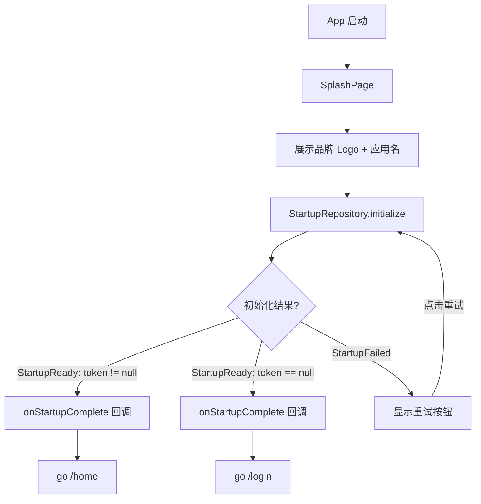
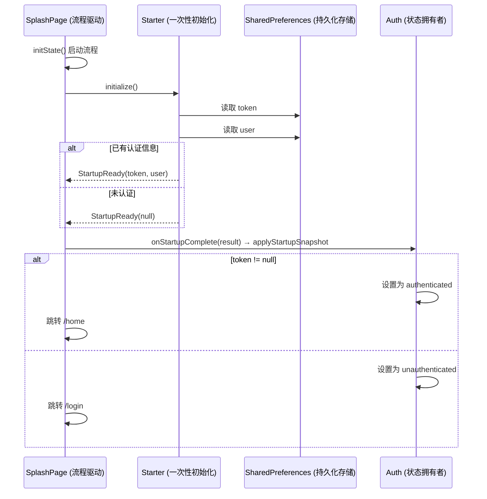

# Starter 模块 — Client 设计报告

## 1. 目标

- 闪屏页：启动时展示品牌形象（Logo + 应用名）
- 集中处理应用初始化（当前：认证状态检查；未来：本地缓存、版本检查等）
- 根据初始化结果跳转到主页或登录页
- 支持初始化失败时重试

---

## 2. 现状分析

- 前端项目目前是空白状态，之前的功能验证都在 playground 中完成，正式产品代码尚未开始
- 没有启动流程、没有页面路由、没有状态管理，一切从零开始
- 本次是前端产品化的第一步，需要从启动流程入手，建立项目的基础骨架

---

## 3. 数据模型与接口

### 数据模型

启动事件（Stream 事件类型）：

- `StartupLoading` — 正在初始化
- `StartupReady` — 初始化完成，携带 `StartupResult`
- `StartupFailed` — 初始化失败，携带错误信息

启动结果：

- `StartupResult` — 集中承载启动阶段从本地缓存读取的数据：token、user、hasPassword。通过 `token != null` 判断是否已认证。用户信息以 `user_info` 为 key 存储 JSON 字符串，读取时反序列化为 User 对象。未来可扩展本地缓存数据、用户偏好等

### 接口契约

Starter 模块不依赖 AuthService，不调用后端接口。直接从本地缓存（SharedPreferences）读取 token 和用户信息（JSON），纯本地操作。认证模块在启动阶段不参与。

SplashPage 通过 `onStartupComplete` 回调将启动结果传出，不直接依赖 AuthCubit。组装层（main.dart）负责将回调接到 AuthCubit，拆包 StartupResult 为原始字段（token、user、hasPassword）。这样 starter 和 auth 模块彼此完全不知道对方的存在。

### 本地缓存 Key 约定

| Key | 类型 | 说明 |
|-----|------|------|
| `auth_token` | String | JWT Token |
| `user_info` | String (JSON) | 用户信息，序列化为 JSON |
| `has_password` | bool | 是否已设置密码 |

---

## 4. 核心流程

### 启动流程



### 初始化时序



### 关键规则

- 最短停留 1.5 秒，保证品牌露出（`Future.wait` 同时等待初始化和延迟）
- 跳转使用 `go_router` 的 `context.go()`，不可返回闪屏页
- 退出登录后不经过闪屏页，闪屏只在冷启动时出现一次
- 初始化完成后 SplashPage 通过 `onStartupComplete` 回调将 StartupResult 传出，不直接依赖 AuthCubit
- 组装层（main.dart）负责将回调接到 AuthCubit.applyStartupSnapshot，拆包为原始字段
- AuthCubit 作为全局状态容器，在整个 App 生命周期内维护认证状态，只接收原始字段（token、user、hasPassword），不依赖 starter 的任何类型
- StreamController 使用 `.broadcast()` 支持多监听者

### UI 线框

```
┌─────────────────────────────┐
│                             │
│                             │
│                             │
│         [logo.png]          │
│          Flash IM           │
│                             │
│                             │
│                             │
│                             │
└─────────────────────────────┘
```

- 居中 Logo 图片 + "Flash IM" 文字，简洁干净
- 失败时 Logo 下方显示错误提示 + 重试按钮

---

## 5. 项目结构与技术决策

### 项目结构

```
client/lib/src/
├── app.dart                            # FlashApp，MaterialApp.router 接入 GoRouter
├── router.dart                         # GoRouter 路由配置，默认路由为闪屏页
├── domain/
│   └── model/
│       └── user.dart                   # User 模型（本地缓存 + 接口共用，含 toJson/fromJson）
├── auth/
│   ├── cubit/
│   │   ├── auth_cubit.dart             # 全局认证状态管理，生命周期与 App 一致
│   │   └── auth_state.dart             # 认证状态：unknown / authenticated / unauthenticated
│   └── view/
│       └── login_page.dart             # 登录页（当前为文本占位，后续实现）
├── home/
│   └── view/
│       └── home_page.dart              # 首页（当前为文本占位，后续实现）
└── starter/
    ├── data/
    │   ├── model/
    │   │   └── startup_result.dart     # StartupResult + 启动事件类型
    │   └── repository/
    │       └── startup_repository.dart # 从 SharedPreferences 读取缓存，通过 broadcast Stream 暴露事件流
    └── view/
        └── splash_page.dart            # 闪屏页：logo.png + Flash IM + onStartupComplete 回调通知外部
```

### 职责划分

- `domain/model` — 业务核心模型（User），不依赖任何框架，各模块共用
- `data/model` — 纯数据结构，定义启动事件和结果
- `data/repository` — 聚合初始化操作，直接从 SharedPreferences 读取缓存数据，通过 `StreamController.broadcast()` 暴露事件流
- `view` — 闪屏页 UI，监听事件流，通过 `onStartupComplete` 回调将结果传出后跳转
- `auth/cubit` — 全局认证状态管理（AuthCubit），生命周期与 App 一致，接收原始字段（token、user、hasPassword）维护认证状态，不依赖 starter 的任何类型
- `auth/view` — 登录页，当前为文本占位，后续实现完整登录表单
- `home/view` — 首页，当前为文本占位，后续实现完整主页

依赖方向：`view → data/repository → SharedPreferences`（starter 不依赖 auth 模块，auth 不依赖 starter 模块）

启动流程使用 Stream（broadcast），启动是一次性的异步事件流。SplashPage 通过 `onStartupComplete` 回调将结果传出，组装层（main.dart）负责拆包并交给 AuthCubit。starter 和 auth 彼此完全解耦，由 main.dart 在组装时连接。

### 技术决策

| 决策 | 方案 | 理由 |
|------|------|------|
| 启动事件流 | Stream（broadcast） | 启动是一次性事件流，broadcast 支持多监听者 |
| 全局认证状态 | AuthCubit（flutter_bloc） | 生命周期与 App 一致，接收原始字段，不依赖 starter |
| 模块解耦 | onStartupComplete 回调 | starter 和 auth 互不依赖，main.dart 组装层连接 |
| 最短停留 | Future.wait + 1.5s delay | 保证品牌露出，不阻塞初始化 |
| 路由管理 | go_router ^17.1.0 | Flutter 官方声明式路由，支持深链接、重定向、URL 模式匹配 |
| 跳转方式 | context.go() | 替换当前路由栈，不可返回闪屏页 |

---

## 6. 暂不实现

| 功能 | 理由 |
|------|------|
| 版本检查 / 强制更新 | 后续加，需要后端接口支持 |
| 引导页（首次安装） | 后续加，需要本地标记 |
| 启动动画 | 当前只需静态 Logo，后续可加 |
