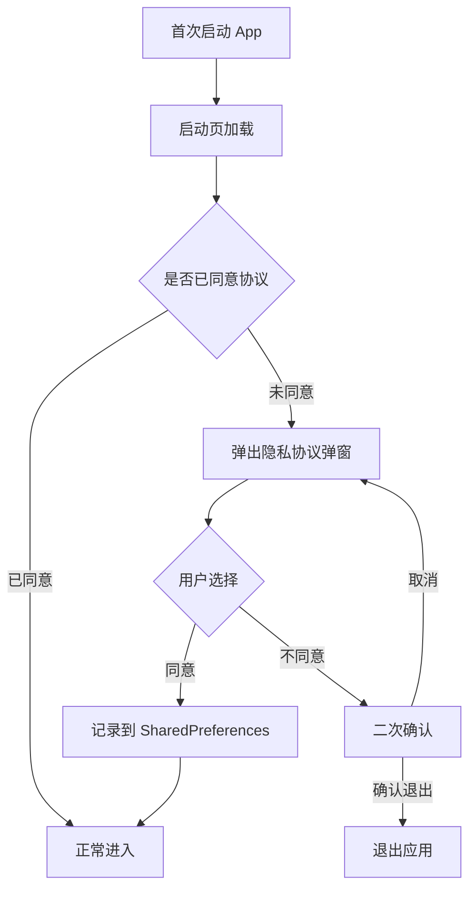
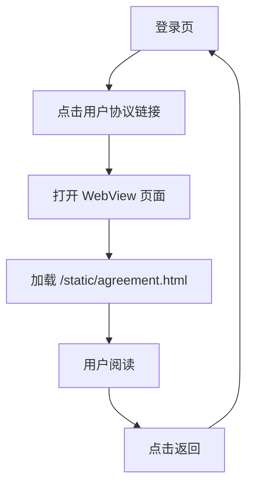
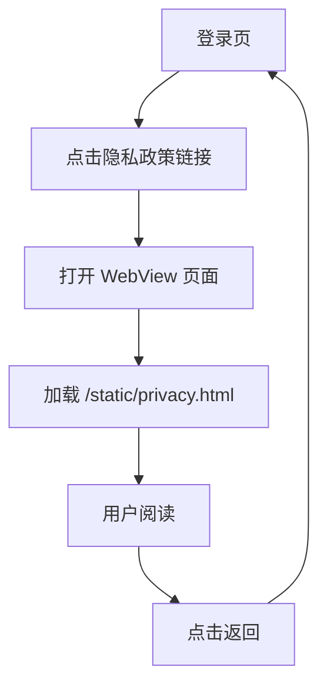
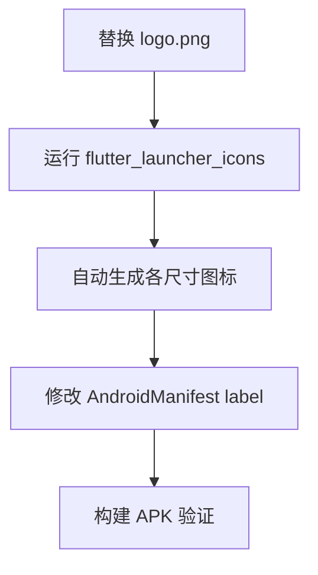
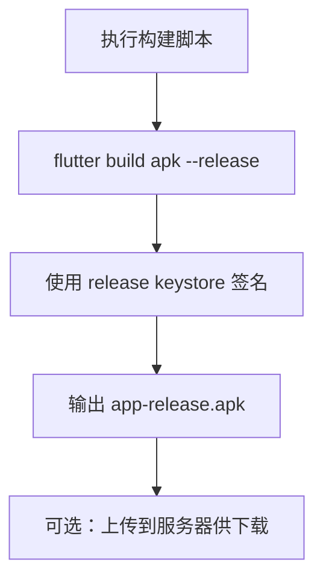

# Android 发布准备 — 功能分析

## 概述

为闪讯 Android 端做发布准备：隐私协议页面（用户协议 + 隐私政策）、应用签名配置、APK/AAB 构建脚本、Google Play 上架所需的元数据。协议内容以 HTML 静态文件部署在后端，客户端通过 WebView 加载。

## 一、交互链

### 场景 1：首次启动隐私协议弹窗

**用户故事**：作为新用户，我首次打开闪讯时需要明确同意隐私协议，以便满足合规要求。

用户首次安装并打开 App，启动页加载完成后弹出隐私协议弹窗。弹窗展示简要说明和协议链接，底部有"同意"和"不同意"两个按钮。点击"同意"记录状态并进入正常流程；点击"不同意"弹出二次确认，确认后退出应用。后续启动不再弹出。

### 场景 2：查看用户协议

**用户故事**：作为用户，我想在登录前查看用户协议，以便了解使用条款。

用户在登录页看到"登录即代表您同意《用户协议》和《隐私政策》"的文字，点击蓝色的"用户协议"链接，跳转到协议页面（WebView 加载 HTML），阅读完后点击返回回到登录页。

### 场景 3：查看隐私政策

**用户故事**：作为用户，我想在登录前查看隐私政策，以便了解数据如何被使用。

和场景 1 相同的交互，只是加载的 URL 不同（`/static/privacy.html`）。

### 场景 3：应用品牌配置

**用户故事**：作为开发者，我想配置应用名称和图标，以便用户安装后看到正式的品牌形象。

开发者替换 logo 图片，运行 `flutter_launcher_icons` 生成各尺寸图标，修改 AndroidManifest 中的应用名称为"闪讯"。

### 场景 4：构建 APK 分发

**用户故事**：作为开发者，我想一键构建签名 APK，以便分发给用户安装。

开发者在本地执行构建脚本，脚本自动使用 release 签名构建 APK，输出安装包路径和大小。

## 二、逻辑树

### 事件流：协议页面加载

| 时刻 | 事件 | 处理 | 产生的新事件 |
|------|------|------|-------------|
| T0 | 用户点击协议链接 | Navigator.push WebView 页面 | 页面跳转 |
| T1 | WebView 加载 URL | HTTP GET /static/agreement.html | 页面渲染 |
| T2 | 用户点击返回 | Navigator.pop | 回到登录页 |

### 事件流：APK 构建

| 时刻 | 事件 | 处理 | 产生的新事件 |
|------|------|------|-------------|
| T0 | 执行构建脚本 | flutter clean + pub get | 环境准备 |
| T1 | flutter build apk | Gradle 编译 + 签名 | 生成 APK |
| T2 | 输出结果 | 打印路径和大小 | 构建完成 |

## 三、功能编号与网络定位

### 本次新增节点

| 编号 | 功能节点 | 层级 | 简介 |
|------|---------|------|------|
| F-18 | 协议页面 | 前端基础 | WebView 加载用户协议/隐私政策 HTML |

注：签名配置和构建脚本是工程化工具，不分配功能编号。静态 HTML 文件是内容，不分配编号。

### 前置依赖

| 依赖节点 | 依赖方式 | 是否已有 |
|----------|---------|---------|
| I-12 静态文件服务 | /static/ 路由 | ✅ 已有 |
| F-01 登录注册页 | 协议链接入口 | ✅ 已有 |
| webview_flutter | WebView 渲染 | ✅ 已有（v0.23.0 加的） |

### 边界接口

| 接口 | 定义方 | 消费方 | 说明 |
|------|--------|--------|------|
| GET /static/agreement.html | 后端静态服务 | 前端 WebView | 用户协议 HTML |
| GET /static/privacy.html | 后端静态服务 | 前端 WebView | 隐私政策 HTML |

## 四、结论

- 开发顺序：HTML 协议文件 → 前端协议页面 → 签名配置 → 构建脚本
- 复杂度低：核心就是两个 HTML 文件 + 一个 WebView 页面 + Gradle 签名配置
- 协议内容使用通用模板，后续可随时更新 HTML 文件而不需要发新版 App

### 上架流程

#### Google Play

| 步骤 | 说明 | 前置条件 |
|------|------|---------|
| 1. 注册开发者账号 | [play.google.com/console](https://play.google.com/console)，一次性 $25 | 需要 Google 账号 + 信用卡 |
| 2. 创建应用 | 填写应用名称、默认语言、应用类型（App） | — |
| 3. 填写商品详情 | 应用描述、截图（手机+平板各 2~8 张）、图标（512×512）、功能图（1024×500） | 截图需要真机或模拟器截取 |
| 4. 内容分级 | 填写问卷（是否含暴力/赌博等），获取分级证书 | — |
| 5. 隐私政策 | 填写隐私政策 URL（`http://你的IP:9600/static/privacy.html`） | 本版本产出 |
| 6. 上传 AAB | `flutter build appbundle --release` 生成 `.aab` 文件上传 | 签名配置完成 |
| 7. 选择发布轨道 | 内部测试 → 封闭测试 → 开放测试 → 正式发布 | 建议先走内部测试 |
| 8. 审核 | Google 审核 1~7 天 | — |

> 建议先用"内部测试"轨道，最多 100 人，无需审核即可安装。适合当前阶段。

#### 国内应用商店（华为/小米/OPPO/vivo）

| 步骤 | 说明 | 前置条件 |
|------|------|---------|
| 1. 注册开发者账号 | 各平台开发者中心注册，需要实名认证（个人/企业） | 身份证 + 手机号 |
| 2. 创建应用 | 填写包名（`com.toly1994.flash_im`）、应用名、分类 | — |
| 3. 上传 APK | 国内商店用 APK（不是 AAB） | 签名配置完成 |
| 4. 填写应用信息 | 描述、截图、图标、版权证明 | — |
| 5. 隐私合规 | 隐私政策 URL + 权限说明（为什么要麦克风/相机/存储） | 本版本产出 |
| 6. 软件著作权 | 部分商店要求提供软著证书（华为必须，小米可选） | 需要单独申请，周期 1~3 个月 |
| 7. 审核 | 各平台 1~3 个工作日 | — |

> 国内商店的核心门槛是**软件著作权**和**隐私合规**。如果暂时没有软著，可以先上小米（不强制要求）或直接 APK 分发。

#### 本版本产出物与上架的关系

| 产出物 | Google Play | 国内商店 |
|--------|-------------|---------|
| 隐私政策 HTML | ✅ 必须 | ✅ 必须 |
| 用户协议 HTML | ✅ 推荐 | ✅ 推荐 |
| Release 签名 | ✅ 必须 | ✅ 必须 |
| AAB 构建 | ✅ 必须 | ❌ 不需要 |
| APK 构建 | ❌ 不需要 | ✅ 必须 |
| 应用图标 512×512 | ✅ 必须 | ✅ 必须 |

### 暂不实现

| 功能 | 理由 |
|------|------|
| 实际上架 Google Play | 需要 $25 开发者账号，本版本只做到"能构建签名 AAB" |
| 实际上架国内商店 | 需要软著证书，周期长 |
| 应用内更新检测 | 后续版本加 |
| 多渠道打包 | 后续需要时再做 |
