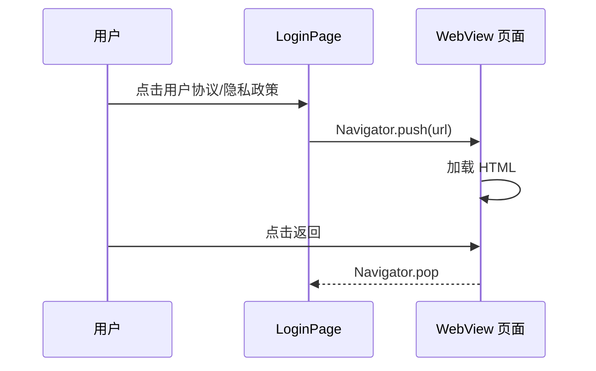

# Android 发布准备 — 客户端设计报告

> 关联设计：[starter v0.0.2 analysis](../analysis.md)

## 1. 目标

- 首次启动弹出隐私协议弹窗，用户必须同意才能继续使用
- 登录页协议链接点击后跳转 WebView 页面加载 HTML
- 配置 release 签名（keystore）
- 提供 APK/AAB 构建脚本

## 2. 现状分析

### 已有能力

- 登录页已有协议文字展示（agreement_row.dart），但点击无响应
- 后端已有 `/static/` 静态文件路由（tower-http ServeDir）
- 项目已引入 `qr` 包（扫码页用过）

### 存在的问题

| 问题 | 影响 |
|------|------|
| 协议链接点击无响应 | 用户无法查看协议内容，上架审核不通过 |
| 无隐私协议 HTML 文件 | 上架商店必须提供隐私政策 URL |
| 使用 debug 签名 | 无法上架商店，换电脑构建后用户需卸载重装 |
| 无构建脚本 | 每次手动敲命令容易出错 |
| 应用名为 flash_im | 桌面显示不友好 |
| 应用图标为 Flutter 默认 | 无品牌辨识度 |
| 设置页为空 | 点击无响应 |
| 无"关于"页面 | 用户无法了解应用信息 |
| 无名片/二维码页面 | 无法方便地分享自己的账号 |
| 无注销入口 | 上架审核要求必须提供注销途径 |

## 3. 数据模型与接口

无新增接口。使用已有的静态文件服务：

| URL | 内容 |
|-----|------|
| `GET /static/agreement.html` | 用户协议 |
| `GET /static/privacy.html` | 隐私政策 |

## 4. 核心流程

### 协议页面跳转



## 5. 项目结构与技术决策

### 项目结构

```
client/modules/flash_starter/lib/src/
├── splash_page.dart             ← 修改：启动完成后检查协议状态
├── privacy_consent_dialog.dart  ← 新增：隐私协议弹窗组件

client/modules/flash_auth/lib/src/view/
├── components/
│   └── agreement_row.dart       ← 修改：链接点击跳转 PolicyPage
├── policy_page.dart             ← 新增：通用 WebView 协议页面

client/lib/src/home/profile/
├── profile_page.dart            ← 修改：加"我的名片"入口，设置跳转
├── settings_page.dart           ← 新增：设置页（账号/关于/退出）
├── about_page.dart              ← 新增：关于闪讯独立页面
├── my_qr_code_page.dart         ← 新增：我的名片（二维码+签名+logo）

server/static/
├── agreement.html               ← 新增：用户协议 HTML
└── privacy.html                 ← 新增：隐私政策 HTML

client/android/
├── app/build.gradle.kts         ← 修改：签名配置
├── app/src/main/AndroidManifest.xml ← 修改：应用名改为"闪讯"
└── key.properties               ← 新增：keystore 路径和密码（不提交 git）

scripts/client/
└── build_apk.py                 ← 新增：APK/AAB 构建脚本
```

### 职责划分

- `policy_page.dart`：通用协议页面，接收 title + url 参数，WebView 渲染
- `agreement_row.dart`：登录页底部协议文字，点击跳转 policy_page
- `build_apk.py`：构建脚本，封装 flutter build 命令

### 技术决策

| 决策 | 方案 | 理由 |
|------|------|------|
| 协议渲染方式 | WebView 加载远程 HTML | 更新协议不需要发新版 App |
| 协议 URL | 后端 /static/ 目录 | 已有基础设施，零成本 |
| 签名方式 | key.properties + build.gradle.kts | Flutter 官方推荐方式 |
| key.properties | 加入 .gitignore | 密钥不能提交到代码仓库 |

### 第三方依赖

| 依赖 | 用途 | 已有/需新增 |
|------|------|-----------|
| webview_flutter | WebView 渲染 | ✅ 已有 |

## 6. 验收标准

| 验收条件 | 验收方式 |
|----------|----------|
| 点击用户协议跳转并显示内容 | 手动操作 |
| 点击隐私政策跳转并显示内容 | 手动操作 |
| `flutter build apk --release` 使用 release 签名 | 查看 APK 签名信息 |
| `flutter build appbundle --release` 生成 AAB | 文件存在 |
| 构建脚本一键完成 | 执行脚本 |
| key.properties 不在 git 中 | `git status` 确认 |

## 7. 暂不实现

| 功能 | 理由 |
|------|------|
| 实际上架 | 需要开发者账号和软著 |
| 应用内更新检测 | 后续版本 |
| 协议弹窗（首次启动强制阅读） | 当前登录页勾选即可，后续按需加 |
