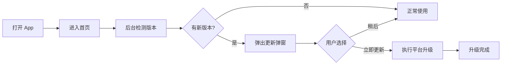
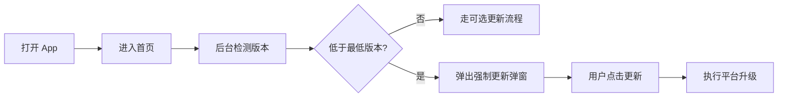
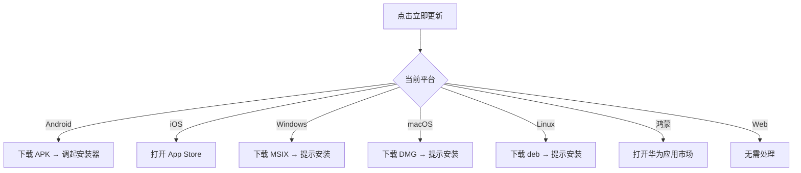
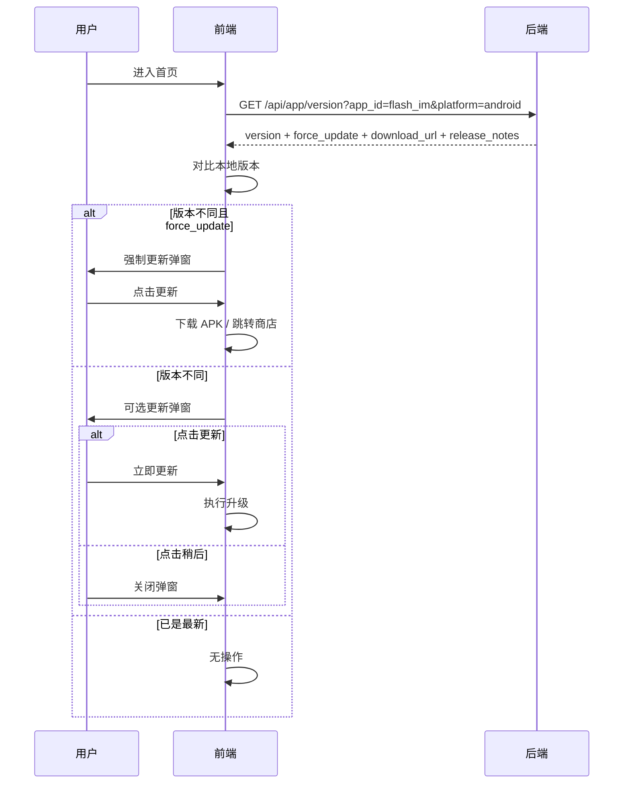

# 应用版本检测与升级 — 功能分析

## 概述

用户打开闪讯后，应用在后台静默检测是否有新版本。如果有，弹窗告知用户更新内容并提供升级入口。支持"强制更新"（低于最低版本必须升级）和"可选更新"（有新版本但可以跳过）两种模式。各平台走不同的升级路径：Android 下载 APK 安装、iOS/鸿蒙跳转商店、桌面端下载安装包提示安装、Web 无需处理。

---

## 一、交互链

### 场景 1：可选更新

**用户故事**：作为闪讯用户，我打开 App 后想知道是否有新版本可用，以便决定是否升级。

用户打开闪讯 → 进入首页 → 后台静默请求版本接口 → 发现有新版本 → 弹出更新弹窗（显示版本号 + 更新日志）→ 用户点击"立即更新"→ 根据平台执行升级动作 → 升级完成。或者用户点击"稍后"→ 弹窗关闭，正常使用。

### 场景 2：强制更新

**用户故事**：作为闪讯用户，如果我的版本过旧（存在安全漏洞），App 应强制我更新后才能继续使用。

用户打开闪讯 → 进入首页 → 后台检测版本 → 发现当前版本低于最低版本要求 → 弹出强制更新弹窗（无"稍后"按钮）→ 用户只能点击"立即更新"→ 执行平台升级。

### 场景 3：各平台升级动作

**用户故事**：作为不同平台的用户，点击"立即更新"后，App 应引导我完成对应平台的升级流程。

---

## 二、逻辑树

### 事件流：版本检测与升级

| 时刻 | 事件 | 处理 | 产生的新事件 |
|------|------|------|-------------|
| T1 | 用户进入首页 | HomePage initState 触发版本检测 | 发起 HTTP 请求 |
| T2 | 请求 GET /api/app/version?app_id=xxx&platform=xxx | 后端查 app_versions 表，返回该应用该平台最新版本记录 | 返回响应 |
| T3 | 收到响应 | 对比本地版本号与返回的 version | 判断更新类型 |
| T4a | 本地版本 != version 且 force_update=true | 弹出强制更新弹窗（不可关闭） | 等待用户操作 |
| T4b | 本地版本 != version 且 force_update=false | 弹出可选更新弹窗 | 等待用户操作 |
| T4c | 本地版本 = version | 无操作 | — |
| T5 | 用户点击"立即更新" | 根据平台执行升级动作 | 跳转/下载 |
| T6 | 用户点击"稍后"（可选更新时） | 关闭弹窗 | — |

### 状态流转

| 实体 | 触发事件 | 前状态 | 后状态 |
|------|---------|--------|--------|
| 版本检测 | 进入首页 | idle | checking |
| 版本检测 | 收到响应（有更新） | checking | has_update / force_update |
| 版本检测 | 收到响应（已最新） | checking | up_to_date |
| 版本检测 | 用户点击稍后 | has_update | dismissed |
| 版本检测 | 用户点击更新 | has_update / force_update | updating |
| 版本检测 | 请求失败 | checking | idle（静默失败，不打扰用户） |

---

## 三、功能编号与网络定位

### 本次新增节点

| 编号 | 功能节点 | 层级 | 模块 | 简介 |
|------|---------|------|------|------|
| I-21 | 版本信息管理 | 基础设施层 | flash-core（或独立模块） | 后端版本配置表 + 查询接口 |
| P-73 | 版本检测与更新弹窗 | 前端业务层 | flash_starter | 启动后检测 + 弹窗 UI + 平台升级分发 |

### 前置依赖

| 依赖节点 | 依赖方式 | 是否已有 |
|----------|---------|---------|
| I-01 应用状态管理 | 共享 db pool | ✅ |
| F-03 启动流程框架 | 检测时机挂载点 | ✅ |
| F-02 用户会话状态 | 获取当前版本号 | ✅ |

### 边界接口

| 接口 | 定义方 | 消费方 | 说明 |
|------|--------|--------|------|
| GET /api/app/version?app_id=xxx&platform=xxx | 后端 I-21 | 前端 P-73 | 返回该应用该平台的最新版本信息 |
| url_launcher | 系统 | 前端 P-73 | iOS/鸿蒙跳转商店 |
| dio.download | 前端 | 服务器静态文件 | Android/桌面端下载安装包 |

---

## 四、结论

- **开发顺序**：后端接口（简单）→ 前端检测逻辑 + 弹窗 UI → 各平台升级动作适配
- **复杂度集中点**：Android APK 下载安装（需要存储权限 + 安装权限 + FileProvider）
- **暂不实现**：
  - 热更新（Shorebird）— 复杂度高，独立迭代
  - 增量更新（差分包）— 投入产出比低
  - 灰度发布 — 当前用户规模不需要
  - Web 端 — 刷新即最新，无需版本检测
