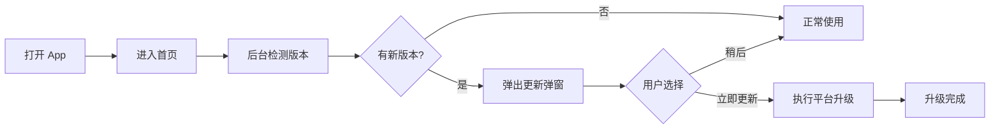
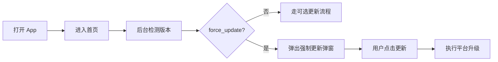
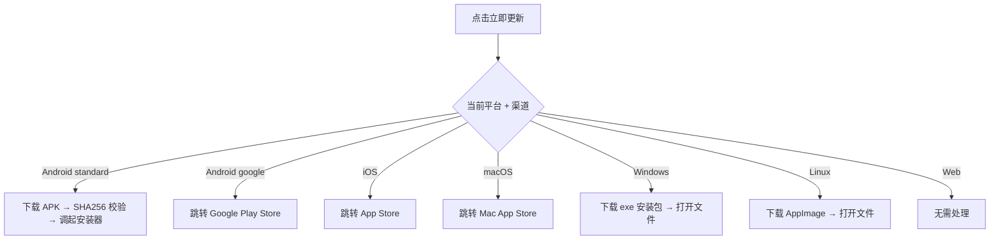
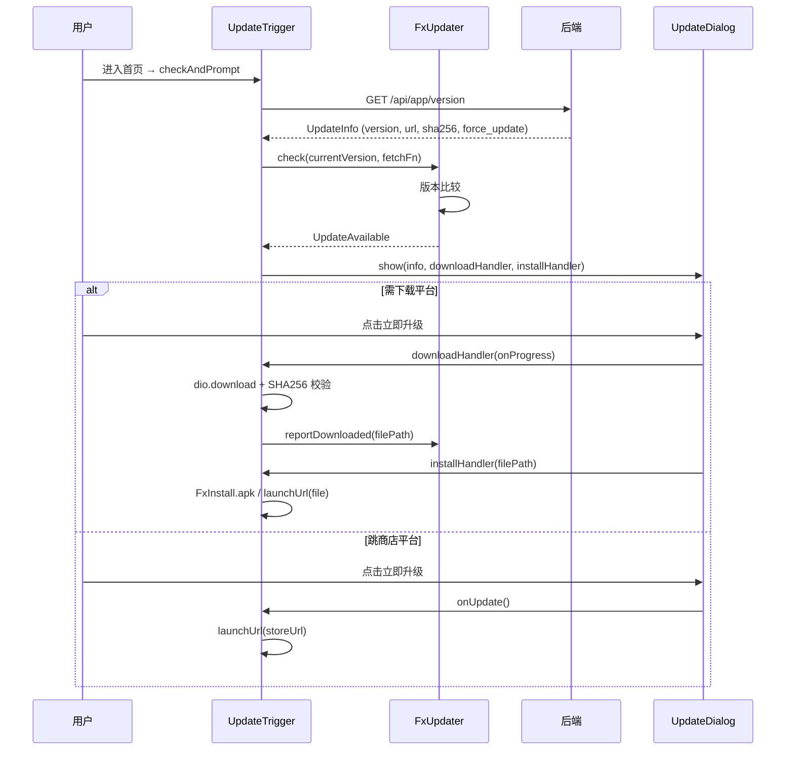

# 应用版本检测与升级 — 功能分析

## 概述

用户打开闪讯后，应用在后台静默检测是否有新版本。如果有，弹窗告知用户更新内容并提供升级入口。支持"强制更新"（该版本标记 force_update=true 时不可跳过）和"可选更新"（有新版本但可以稍后）两种模式。各平台走不同的升级路径：Android（自有渠道）下载 APK 安装、Android（Google Play）/iOS/macOS 跳转商店、Windows/Linux 下载安装包、Web 无需处理。

---

## 一、交互链

### 场景 1：可选更新

**用户故事**：作为闪讯用户，我打开 App 后想知道是否有新版本可用，以便决定是否升级。

用户打开闪讯 → 进入首页 → 后台静默请求版本接口 → 发现有新版本 → 弹出更新弹窗（显示版本号 + 更新日志 + 文件大小）→ 用户点击"立即更新"→ 根据平台执行升级动作 → 升级完成。或者用户点击"稍后"→ 弹窗关闭，正常使用。

### 场景 2：强制更新

**用户故事**：作为闪讯用户，如果当前版本存在安全漏洞或协议不兼容，App 应强制我更新后才能继续使用。

用户打开闪讯 → 进入首页 → 后台检测版本 → 发现新版本且 force_update=true → 弹出强制更新弹窗（无"稍后"按钮）→ 用户只能点击"立即更新"→ 执行平台升级。

### 场景 3：各平台升级动作

**用户故事**：作为不同平台的用户，点击"立即更新"后，App 应引导我完成对应平台的升级流程。

---

## 二、逻辑树

### 事件流：版本检测与升级

| 时刻 | 事件 | 处理 | 产生的新事件 |
|------|------|------|-------------|
| T1 | 用户进入首页 | HomePage initState 触发 UpdateTrigger.checkAndPrompt | 发起 HTTP 请求 |
| T2 | 请求 GET /api/app/version?app_id=1&platform=android | 后端查 app_versions 表（published=true），返回最新版本记录 | 返回响应 |
| T3 | 收到响应 | FxUpdater.check 比较本地版本号与返回的 version | 判断更新类型 |
| T4a | 本地版本 < 最新版本 且 force_update=true | 弹出强制更新弹窗（不可关闭） | 等待用户操作 |
| T4b | 本地版本 < 最新版本 且 force_update=false | 弹出可选更新弹窗 | 等待用户操作 |
| T4c | 本地版本 >= 最新版本 | 无操作 | — |
| T5a | 用户点击"立即更新"（需下载平台） | 弹窗内下载 → 进度条 → SHA256 校验 → 安装 | 升级完成 |
| T5b | 用户点击"立即更新"（跳商店平台） | launchUrl 打开对应商店链接 | 跳转完成 |
| T6 | 用户点击"稍后"（可选更新时） | 关闭弹窗，FxUpdater.dismiss() | — |

### 状态流转

| 实体 | 触发事件 | 前状态 | 后状态 |
|------|---------|--------|--------|
| FxUpdater | 进入首页触发 check | idle | checking |
| FxUpdater | check 返回 UpdateAvailable | checking | has_update |
| FxUpdater | check 返回 UpdateNotNeeded | checking | up_to_date |
| FxUpdater | 用户点击稍后（dismiss） | has_update | dismissed |
| FxUpdater | 开始下载 | has_update | downloading |
| FxUpdater | 下载完成 | downloading | downloaded |
| FxUpdater | 请求失败 | checking | idle（静默失败，不打扰用户） |

---

## 三、功能编号与网络定位

### 本次新增节点

| 编号 | 功能节点 | 层级 | 模块 | 简介 |
|------|---------|------|------|------|
| I-21 | 版本信息管理 | 基础设施层 | app-center | 后端 app_versions 表 + 版本查询/创建/发布/撤回接口 |
| P-73 | 版本检测与更新弹窗 | 前端业务层 | fx_updater + UpdateTrigger | 启动后检测 + 弹窗 UI + 下载校验 + 平台升级分发 |

### 前置依赖

| 依赖节点 | 依赖方式 | 是否已有 |
|----------|---------|---------|
| I-01 应用状态管理 | 共享 db pool | ✅ |
| F-03 启动流程框架 | 检测时机挂载点 | ✅ |
| F-02 用户会话状态 | 获取当前版本号（package_info_plus） | ✅ |

### 边界接口

| 接口 | 定义方 | 消费方 | 说明 |
|------|--------|--------|------|
| GET /api/app/version?app_id=xxx&platform=xxx | 后端 I-21 | 前端 P-73 | 返回该应用该平台最新已发布版本信息 |
| POST /api/app/version | 后端 I-21 | upload/update.py | 创建版本记录 |
| POST /api/app/version/publish | 后端 I-21 | Web 管理器 | 发布版本 |
| url_launcher | 系统 | 前端 P-73 | iOS/macOS/Google Play 跳转商店 |
| dio.download | 前端 | 服务器静态文件 | Android standard / Windows / Linux 下载安装包 |
| FxInstall.apk | fx_install_android | 前端 P-73 | Android APK 安装（FileProvider + 权限检测） |

---

## 四、结论

- **开发顺序**：后端接口 → fx_updater 通用包 → fx_install_android 原生 Plugin → UpdateTrigger 集成 → Android Flavor 配置 → 构建脚本（calculate + update）
- **复杂度集中点**：Android APK 安装（FileProvider + 权限自动检测 + 双渠道 Manifest 分离 + SHA256 校验）
- **已实现**：
  - 后端 app-center 模块（版本 CRUD + published 发布控制）
  - 前端 fx_updater 通用包（版本比较 + 检查器 + 弹窗含进度条 + 全局状态管理，已发 pub）
  - fx_install_android（Android 原生安装，自带 FileProvider + 权限检测 + 结果回调，已发 pub）
  - UpdateTrigger 胶水层（注入 fetch + 下载 + SHA256 流式校验 + 渠道策略分发）
  - Android standard/google 双 flavor（Manifest 权限分离）
  - AppChannel 编译时渠道标识（--dart-define 注入）
  - 构建脚本自动计算 sha256（calculate.py 内嵌在 Android/Windows/Linux 打包脚本中）
  - 版本上传脚本（update.py：scp + 创建记录）
  - Web 版本管理系统（Vue，可视化发布操作）
  - iOS/macOS 跳转 App Store（共用 Apple ID）
  - Google Play 渠道跳转 Play Store
- **暂不实现**：
  - 热更新（Shorebird）— 复杂度高，独立迭代
  - 增量更新（差分包）— 投入产出比低
  - 灰度发布 — 当前用户规模不需要
  - Web 端 — 刷新即最新，无需版本检测
  - Google Play In-App Update API — 当前跳商店即可
  - 断点续传 — 后续优化
