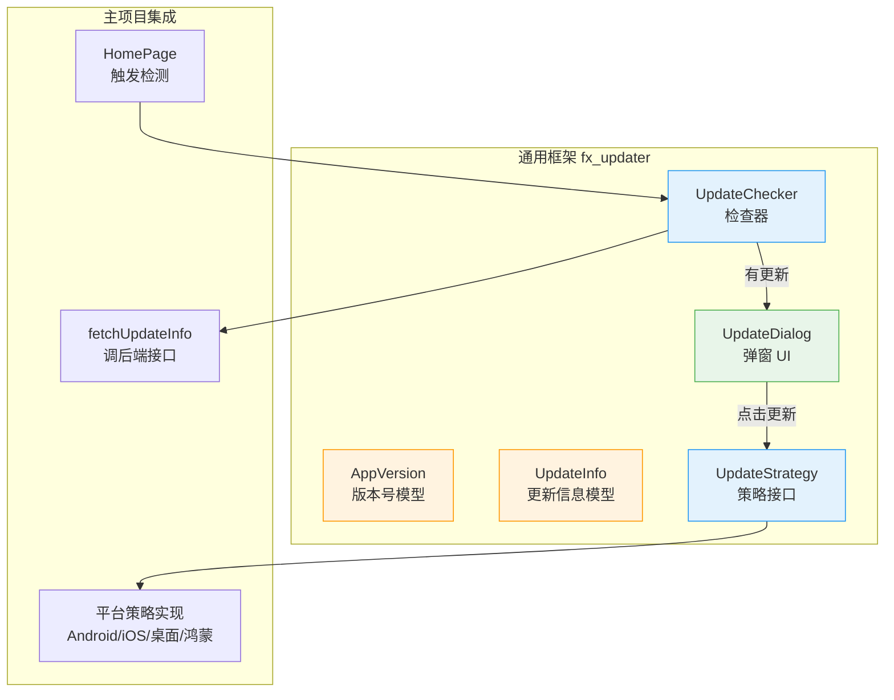

# 应用版本检测与升级 — 前端设计报告

> 关联设计：[starter v0.0.3 后端](../server/design.md)

## 1. 目标

- 创建 `fx_updater` 通用包：版本模型 + 检查器 + 策略接口 + 弹窗 UI
- 主项目集成：注入 fetch 回调 + 首页触发检测 + 分平台升级

## 2. 现状分析

- 已有 `packages/` 目录放通用工具（fx_logger、fx_env）
- 已有后端接口 `GET /api/app/version?app_id=1&platform=xxx`
- 已有 `package_info_plus` 获取本地版本号
- 已有 `url_launcher` 可跳转商店
- 已有 `dio` 可下载文件

## 3. 架构设计

### 分层结构



### 职责划分

| 层 | 归属 | 职责 |
|---|---|---|
| `fx_updater` | packages/ | 版本比较、检查流程、策略接口定义、通用弹窗 |
| 主项目 | client/lib/ | 注入 fetch 回调、注册平台策略、触发检测时机 |

## 4. 数据模型

### AppVersion

```dart
class AppVersion implements Comparable<AppVersion> {
  final int major;
  final int minor;
  final int patch;

  factory AppVersion.parse(String version); // "1.2.3" → AppVersion(1,2,3)
  bool operator >(AppVersion other);
  bool operator <(AppVersion other);
}
```

### UpdateInfo

```dart
class UpdateInfo {
  final String version;       // 最新版本号
  final String downloadUrl;   // 下载地址
  final int fileSize;         // 文件大小
  final String? sha256;       // 校验哈希
  final String releaseNotes;  // 更新日志
  final bool forceUpdate;     // 是否强制

  factory UpdateInfo.fromJson(Map<String, dynamic> json);
}
```

### UpdateCheckResult

```dart
sealed class UpdateCheckResult {}
class UpdateAvailable extends UpdateCheckResult { final UpdateInfo info; }
class UpdateNotNeeded extends UpdateCheckResult {}
class UpdateCheckFailed extends UpdateCheckResult { final String error; }
```

## 5. 核心接口

### UpdateChecker

```dart
typedef FetchUpdateInfo = Future<UpdateInfo?> Function();

class UpdateChecker {
  final AppVersion currentVersion;
  final FetchUpdateInfo fetchUpdateInfo;

  Future<UpdateCheckResult> check();
}
```

使用方注入 `fetchUpdateInfo`（闪讯：调后端接口），框架负责版本比较逻辑。

### UpdateStrategy

```dart
abstract class UpdateStrategy {
  Future<void> execute(UpdateInfo info);
}

class UrlLaunchStrategy implements UpdateStrategy { ... }   // iOS/鸿蒙：跳商店
class DownloadStrategy implements UpdateStrategy { ... }    // Android/桌面：下载安装包
class NoOpStrategy implements UpdateStrategy { ... }        // Web：无操作
```

主项目根据平台选择策略注入。

### UpdateDialog

```dart
class UpdateDialog extends StatelessWidget {
  final UpdateInfo info;
  final VoidCallback onUpdate;
  final VoidCallback? onDismiss;  // forceUpdate 时为 null

  static Future<void> show(BuildContext context, {...});
}
```

通用弹窗，显示版本号 + 更新日志 + 按钮。`forceUpdate=true` 时不可关闭。

## 6. 主项目集成

### 检测时机

在 `HomePage.initState` 中后台触发：

```dart
void _checkUpdate() async {
  final checker = UpdateChecker(
    currentVersion: AppVersion.parse(packageInfo.version),
    fetchUpdateInfo: () => _fetchFromServer(),
  );
  final result = await checker.check();
  if (result is UpdateAvailable && mounted) {
    UpdateDialog.show(context, info: result.info, onUpdate: () {
      _getStrategy().execute(result.info);
    });
  }
}
```

### 平台策略选择

```dart
UpdateStrategy _getStrategy() {
  if (kIsWeb) return NoOpStrategy();
  if (Platform.isIOS) return UrlLaunchStrategy();   // App Store
  if (Platform.isAndroid) return DownloadStrategy(); // 下载 APK
  if (Platform.isWindows || Platform.isMacOS || Platform.isLinux) {
    return DownloadStrategy(); // 下载安装包
  }
  return UrlLaunchStrategy(); // 鸿蒙：跳华为市场
}
```

## 7. 项目结构

```
packages/
└── fx_updater/
    ├── pubspec.yaml
    └── lib/
        ├── fx_updater.dart           # barrel export
        └── src/
            ├── app_version.dart      # 版本号模型
            ├── update_info.dart      # 更新信息模型
            ├── update_checker.dart   # 检查器
            ├── update_strategy.dart  # 策略接口 + 内置实现
            └── update_dialog.dart    # 通用弹窗

client/lib/src/
└── update/
    └── update_trigger.dart           # 主项目集成逻辑（fetch + 策略选择）
```

## 8. 技术决策

| 决策 | 方案 | 理由 |
|------|------|------|
| 包归属 | packages/fx_updater | 通用能力，不绑闪讯业务 |
| 状态管理 | 无（一次性检查，不需要持续状态） | 简单场景不引入 Cubit |
| 下载能力 | dio（主项目已有） | 不在 fx_updater 中依赖 dio，通过策略注入 |
| 弹窗 | fx_updater 提供通用样式 | 各项目可用默认弹窗，也可自定义 |

## 9. 验收标准

| 验收条件 | 验收方式 |
|----------|----------|
| fx_updater 编译通过 | `flutter analyze` 零错误 |
| 版本比较正确 | "1.0.0" < "1.0.1" < "1.1.0" < "2.0.0" |
| 有更新时弹窗显示 | 手动验证（本地版本设低） |
| 强制更新不可关闭 | force_update=true 时无"稍后"按钮 |
| Android 点击更新触发下载 | 手动验证 |
| iOS 点击更新跳转 App Store | 手动验证 |
| Web 端不触发检测 | 无弹窗 |

## 10. 暂不实现

| 功能 | 理由 |
|------|------|
| 下载进度条 | 首版先跳转/直接下载，后续优化 |
| SHA256 校验 | 首版先跑通流程，后续加 |
| 下载缓存检查 | 后续优化 |
| 后台静默下载 | 复杂度高，后续迭代 |
