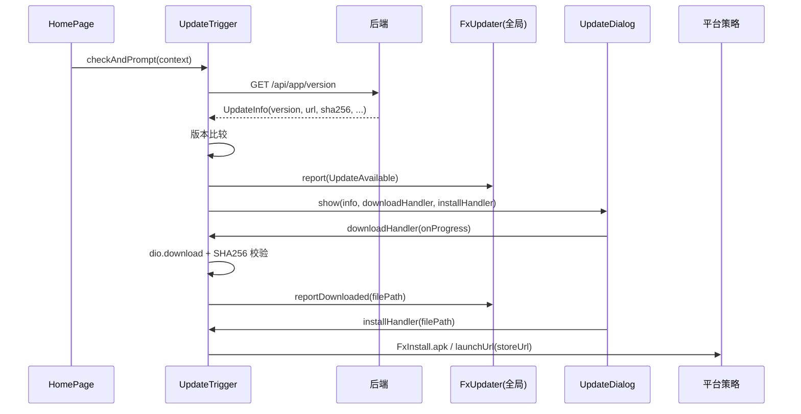
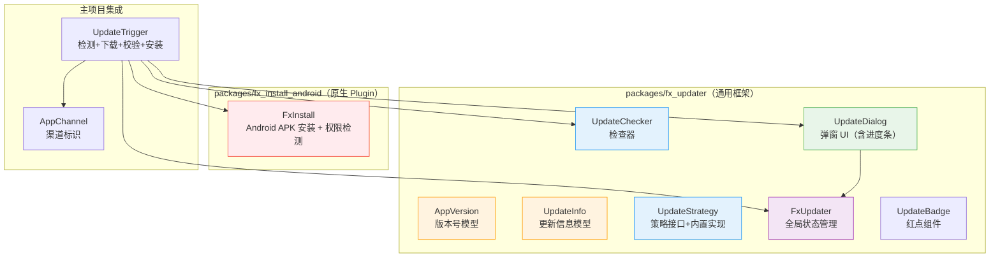
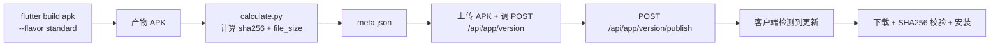

# 应用版本检测与升级 — 前端设计报告

> 关联设计：[starter v0.0.3 后端](../server/design.md) | [Android Flavor 配置](../TODO_android_flavor.md)

## 1. 目标

- 创建 `fx_updater` 通用包：版本模型 + 检查器 + 弹窗 UI + 全局状态（已发 pub）
- 创建 `fx_install_android`：Android APK 安装原生 Plugin，自带 FileProvider + 权限检测 + 结果回调（已发 pub）
- 主项目集成：注入 fetch 回调 + 首页触发检测 + 分平台升级
- Android 双渠道（standard/google）：standard 下载安装，google 跳 Play Store
- iOS/macOS 跳转 App Store
- 下载产物 SHA256 流式校验，防篡改/防损坏

## 2. 现状分析

| 能力 | 状态 | 依赖 |
|------|------|------|
| `packages/fx_updater` | ✅ 已实现 | url_launcher, path_provider, path |
| `packages/fx_install_android` | ✅ 已实现 | Flutter MethodChannel + Kotlin，自带 FileProvider |
| 后端接口 `GET /api/app/version` | ✅ 已实现 | app-center 模块 |
| `package_info_plus` 获取本地版本号 | ✅ 已有 | — |
| `dio` 下载文件 | ✅ 已有 | — |
| `crypto` SHA256 校验 | ✅ 已集成 | crypto ^3.0.6 |
| `AppChannel` 渠道标识 | ✅ 已实现 | flash_shared |
| Android flavor 配置 | ✅ 已实现 | build.gradle.kts |
| FileProvider + 安装权限 | ✅ 已实现 | Manifest 分离 |

## 3. 架构设计

### 整体数据流



### 分层结构



### 职责划分

| 层 | 归属 | 职责 |
|---|---|---|
| `fx_updater` | packages/ | 版本比较、检查流程、弹窗（含下载进度）、全局状态管理 |
| `fx_install_android` | packages/ | Android 原生 APK 安装（自带 FileProvider + 权限检测 + 结果回调） |
| `AppChannel` | modules/flash_shared | 编译时渠道标识（standard/google） |
| `UpdateTrigger` | client/lib/src/update/ | 注入 fetch 回调、下载逻辑、SHA256 校验、安装分发 |

## 4. 数据模型

### AppVersion

```dart
class AppVersion implements Comparable<AppVersion> {
  final int major;
  final int minor;
  final int patch;

  factory AppVersion.parse(String version); // "1.2.3+4" → AppVersion(1,2,3)
  int compareTo(AppVersion other);          // major → minor → patch 逐级比较
  bool operator >(AppVersion other);
}
```

### UpdateInfo

```dart
class UpdateInfo {
  final String version;       // 最新版本号
  final String downloadUrl;   // 下载地址
  final int fileSize;         // 文件大小（字节）
  final String? sha256;       // 校验哈希（后端在构建时计算）
  final String releaseNotes;  // 更新日志
  final bool forceUpdate;     // 是否强制更新

  factory UpdateInfo.fromJson(Map<String, dynamic> json);
  String get fileSizeText;    // 格式化："25.3 MB"
}
```

### UpdateCheckResult

```dart
sealed class UpdateCheckResult {}
class UpdateAvailable extends UpdateCheckResult { final UpdateInfo info; }
class UpdateNotNeeded extends UpdateCheckResult {}
class UpdateCheckFailed extends UpdateCheckResult { final String error; }
```

### FxUpdater（全局单例）

```dart
class FxUpdater {
  Stream<UpdateCheckResult> get stream;       // 状态变更流
  Stream<double> get progressStream;          // 下载进度流
  bool get hasUpdate;                         // 是否有可用更新
  UpdateInfo? get updateInfo;                 // 更新信息
  bool get isDownloading;                     // 正在下载
  bool get isDownloaded;                      // 已下载完成
  String? get downloadedFilePath;             // 下载文件路径

  void report(UpdateCheckResult result);      // 报告检测结果
  void reportProgress(double value);          // 报告下载进度
  void reportDownloaded(String filePath);     // 报告下载完成
  void dismiss();                             // 用户忽略更新
}
```

## 5. 核心流程

### 5.1 版本检测

```dart
class UpdateChecker {
  final AppVersion currentVersion;
  final FetchUpdateInfo fetchUpdateInfo;  // 外部注入的数据获取回调

  Future<UpdateCheckResult> check() async {
    final info = await fetchUpdateInfo();
    if (info == null) return UpdateCheckFailed('无法获取更新信息');
    final latest = AppVersion.parse(info.version);
    return latest > currentVersion ? UpdateAvailable(info) : UpdateNotNeeded();
  }
}
```

### 5.2 下载 + SHA256 校验

```dart
Future<String> _downloadFile(UpdateInfo info, void Function(double) onProgress) async {
  // 1. dio.download → 临时目录
  // 2. onReceiveProgress 驱动进度回调
  // 3. 下载完成后：流式计算 SHA256
  //    sha256.bind(file.openRead()).first → 不一次性加载到内存
  // 4. 比对 info.sha256，不匹配则删除文件并抛异常
  // 5. 校验通过 → reportDownloaded → 返回 filePath
}
```

### 5.3 安装分发

```dart
Future<void> installFile(String filePath) async {
  if (Platform.isAndroid) {
    await FxInstall.apk(filePath);        // fx_install_android
  } else {
    await launchUrl(Uri.file(filePath));   // 桌面端：打开文件
  }
}
```

### 5.4 渠道策略

```dart
bool shouldDownload() {
  if (Platform.isAndroid && AppChannel.isGoogle) return false;  // Google Play 不下载
  return Platform.isAndroid || Platform.isWindows || Platform.isLinux;
}

/// 跳转商店（iOS/macOS/Google Play）
Future<void> executeUpdate(UpdateInfo info) async {
  final String storeUrl = _getStoreUrl();
  if (storeUrl.isNotEmpty) {
    await launchUrl(Uri.parse(storeUrl), mode: LaunchMode.externalApplication);
  }
}

String _getStoreUrl() {
  if (Platform.isIOS) return _appStoreUrl;
  if (Platform.isMacOS) return _appStoreUrl;
  if (Platform.isAndroid && AppChannel.isGoogle) return _playStoreUrl;
  return '';
}
```

## 6. UpdateDialog 弹窗

弹窗 UI 内置于 `fx_updater`，支持完整的下载生命周期：

| 状态 | UI 表现 | 底部操作 |
|------|---------|----------|
| info | 显示版本号 + 更新日志 + 文件大小 | "稍后" + "立即升级"（强制更新无"稍后"） |
| downloading | 追加进度条 + 百分比 | "下载中，请稍候..." |
| completed | 追加 ✅ "下载完成" | "立即安装" |
| failed | 追加 ❌ 错误信息 | "关闭" + "重试" |

弹窗还支持恢复已有下载状态（通过 FxUpdater 单例判断）。

## 7. fx_install_android 原生实现

### Dart 层

```dart
class FxInstall {
  static const MethodChannel _channel = MethodChannel('fx_install_android');

  /// 安装 APK，返回结果（成功/取消/权限拒绝）
  static Future<InstallResult> apk(String filePath) async {
    final dynamic result = await _channel.invokeMethod('installApk', {'filePath': filePath});
    return InstallResult.fromMap(result);
  }
}
```

### Kotlin 层

```kotlin
// 自带 FileProvider，使用方无需额外配置
val uri = FxInstallFileProvider.getUriForFile(context, file)
val intent = Intent(Intent.ACTION_VIEW).apply {
    setDataAndType(uri, "application/vnd.android.package-archive")
    addFlags(Intent.FLAG_GRANT_READ_URI_PERMISSION)
    addFlags(Intent.FLAG_ACTIVITY_NEW_TASK)
}
// 自动检测安装权限，无权限时跳设置页请求，授权后自动继续安装
```

### 特性

- 自带 FileProvider（authority: `${applicationId}.fxInstallFileProvider`），不与主项目冲突
- 自动检测 `canRequestPackageInstalls`，无权限时跳系统设置页
- 用户授权后自动继续安装流程
- 返回结构化结果 `InstallResult(isSuccess, errorMessage)`
- 兼容 Android 6.0+

## 8. Android Flavor 配置

| Flavor | 用途 | 构建产物 | 安装权限 | 更新策略 |
|--------|------|---------|---------|---------|
| `standard` | 国内自有渠道 | APK | ✅ REQUEST_INSTALL_PACKAGES | 下载 + SHA256 校验 + 安装 |
| `google` | Google Play | AAB | ❌（tools:remove） | 跳转 Play Store |

渠道通过 `--dart-define=CHANNEL=standard/google` 注入，`AppChannel` 运行时读取。

## 9. 项目结构

```
packages/
├── fx_updater/
│   ├── pubspec.yaml                    # url_launcher, path_provider, path（已发 pub）
│   └── lib/
│       ├── fx_updater.dart             # barrel export
│       └── src/
│           ├── data/
│           │   ├── app_version.dart    # 版本号模型
│           │   └── update_info.dart    # 更新信息 + CheckResult
│           ├── logic/
│           │   ├── update_checker.dart # 检查器
│           │   ├── update_manager.dart # FxUpdater 全局单例
│           │   └── update_strategy.dart# 策略接口 + 内置实现
│           └── view/
│               ├── update_dialog.dart  # 弹窗 UI（含进度条）
│               └── update_badge.dart   # 红点组件
└── fx_install_android/
    ├── pubspec.yaml                    # Flutter plugin（已发 pub）
    ├── lib/
    │   └── fx_install_android.dart     # Dart API（FxInstall + InstallResult）
    └── android/
        ├── build.gradle.kts
        └── src/main/
            ├── AndroidManifest.xml     # 自带 FileProvider 声明
            ├── res/xml/fx_install_paths.xml
            └── kotlin/.../
                ├── FxInstallPlugin.kt        # 主逻辑（权限检测 + ActivityResult）
                └── FxInstallFileProvider.kt  # 自定义 FileProvider

client/lib/src/update/
└── update_trigger.dart                 # 主项目集成（fetch + 下载 + SHA256 + 安装 + 商店跳转）

client/modules/flash_shared/lib/src/
└── channel.dart                        # AppChannel 渠道标识
```

## 10. 构建与发布流程



构建脚本 `scripts/build_center/build_android.py`：
- 默认构建 `arm64-v8a` 的 APK（standard flavor）
- `--aab` 时自动切换 `google` flavor 构建 AAB
- 构建完成后自动调用 `calculate.py` 生成 `meta.json`（含 sha256、file_size）

## 11. 技术决策

| 决策 | 方案 | 理由 |
|------|------|------|
| 包归属 | packages/fx_updater | 通用能力，不绑闪讯业务，已发 pub |
| 安装 Plugin | packages/fx_install_android | 自带 FileProvider + 权限检测 + 结果回调，已发 pub |
| 下载能力 | dio（主项目已有） | fx_updater 不依赖 dio，通过回调注入 |
| SHA256 校验 | crypto 包 + 流式计算 | 避免大文件一次性加载到内存 |
| 状态管理 | FxUpdater 单例 + Stream | 弹窗/红点/进度条多处消费 |
| 渠道标识 | dart-define 编译时注入 | 零运行时开销，tree-shaking 友好 |
| Manifest 权限分离 | Gradle flavor overlay | google 渠道用 tools:remove 确保无安装权限 |

## 12. 验收标准

| 验收条件 | 验收方式 |
|----------|----------|
| 编译通过 | `flutter analyze` 零错误 |
| 版本比较正确 | "0.0.1" < "1.0.0" 触发更新 |
| 有更新时弹窗显示 | 手动验证 |
| 强制更新不可关闭 | force_update=true 时无"稍后"按钮 |
| 下载进度条正常 | 弹窗显示实时百分比 |
| SHA256 校验通过 | 下载后不报错，进入安装 |
| SHA256 校验失败 | 篡改文件后弹窗显示"下载失败" |
| Android standard 安装 | 点击安装触发系统安装界面 |
| Android google 跳商店 | 点击更新跳转 Play Store |
| iOS 跳 App Store | 手动验证 |
| Windows 下载安装包 | 下载后打开文件 |
| Web 端不触发检测 | 无弹窗 |
| 红点显示 | 有更新时底部导航出现红点 |

## 13. 已实现 vs 暂不实现

| 功能 | 状态 | 说明 |
|------|------|------|
| 版本检测 + 弹窗 | ✅ | — |
| 下载进度条 | ✅ | 弹窗内实时进度 |
| SHA256 校验 | ✅ | 流式计算，不一次性加载到内存 |
| APK 安装（FileProvider） | ✅ | fx_install_android（自带 FileProvider + 权限检测 + 结果回调） |
| Android flavor 双渠道 | ✅ | standard + google |
| 全局更新状态（红点） | ✅ | FxUpdater + UpdateBadge |
| 下载恢复/断点续传 | ⬜ | 后续优化 |
| 后台静默下载 | ⬜ | 复杂度高，后续迭代 |
| Google Play In-App Update | ⬜ | 可选，google flavor 当前跳商店即可 |
| 热更新（Shorebird） | ⬜ | 独立迭代 |
