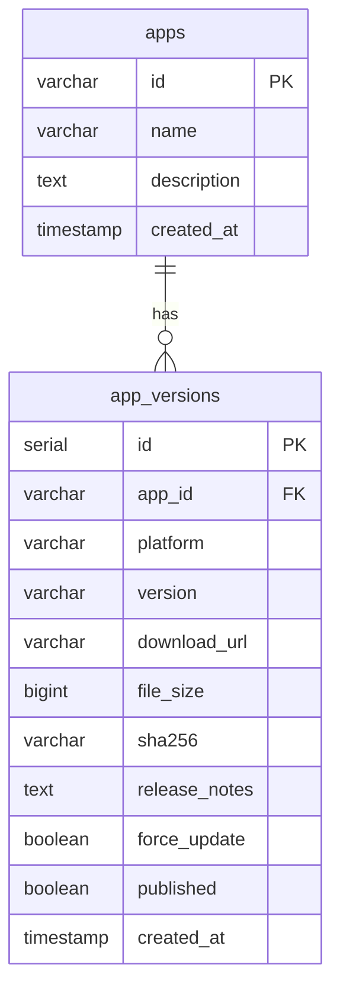
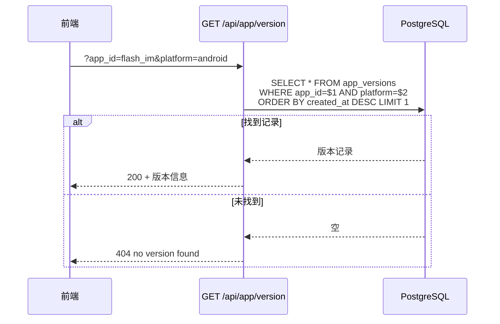

# 应用版本管理 — 后端设计报告

> 关联设计：[starter v0.0.3 前端](../client/design.md)

## 1. 目标

- 提供版本检测接口，支持按 app_id + platform 查询最新版本
- 支持多应用接入（一套服务管理多个 App 的版本信息）
- 支持强制更新标记
- 返回下载地址、文件大小、SHA256、更新日志

## 2. 现状分析

- 后端目前无版本管理相关表和接口
- 已有 `flash-core` 提供 AppState（db pool）和 AppError
- 已有静态文件服务（`/uploads`、`/static`），可复用来托管安装包
- 版本管理逻辑简单，无需独立模块，放在 `flash-core` 或直接在 `main.rs` 中注册路由即可

## 3. 数据模型与接口

### 数据模型

```sql
-- 应用注册表
CREATE TABLE apps (
    id VARCHAR(64) PRIMARY KEY,          -- 应用标识（如 flash_im）
    name VARCHAR(128) NOT NULL,          -- 显示名称（闪讯）
    description TEXT,                    -- 简介
    created_at TIMESTAMPTZ NOT NULL DEFAULT NOW()
);

-- 版本记录表
CREATE TABLE app_versions (
    id SERIAL PRIMARY KEY,
    app_id VARCHAR(64) NOT NULL REFERENCES apps(id),
    platform VARCHAR(32) NOT NULL,       -- android/ios/windows/macos/linux/ohos
    version VARCHAR(32) NOT NULL,        -- 语义化版本号 x.y.z
    download_url VARCHAR(512) NOT NULL,  -- 安装包下载地址
    file_size BIGINT NOT NULL DEFAULT 0, -- 文件大小（字节）
    sha256 VARCHAR(64),                  -- 文件 SHA256 哈希
    release_notes TEXT,                  -- 更新日志
    force_update BOOLEAN NOT NULL DEFAULT FALSE, -- 强制更新开关
    published BOOLEAN NOT NULL DEFAULT FALSE,    -- 是否已发布（未发布时客户端查不到）
    created_at TIMESTAMPTZ NOT NULL DEFAULT NOW(),
    UNIQUE(app_id, platform, version)
);

-- 查询索引
CREATE INDEX idx_app_versions_lookup ON app_versions(app_id, platform, created_at DESC);
```



| 决策 | 理由 |
|------|------|
| apps 独立一张表 | 未来多 App 接入，app_id 作为外键约束 |
| UNIQUE(app_id, platform, version) | 同一应用同一平台不能有重复版本号 |
| 按 created_at DESC 取最新 | 不用额外标记"当前版本"，最新记录就是当前版本 |
| force_update 在版本记录上 | 每个版本独立控制，不影响历史记录 |
| sha256 可为空 | iOS/鸿蒙跳转商店无需校验文件 |
| published 默认 false | 新增版本不立即生效，需手动确认发布。避免商店审核未通过时客户端已提示更新 |

### 接口契约

接口速览：

| 方法 | 路径 | 说明 |
|------|------|------|
| GET | /api/app/list | 获取所有应用列表 |
| POST | /api/app | 新增应用 |
| GET | /api/app/versions | 获取某应用的全部版本记录 |
| GET | /api/app/version | 查询最新已发布版本（客户端调用，仅返回 published=true） |
| POST | /api/app/version | 新增版本记录 |
| PUT | /api/app/version | 更新已有版本信息（修正时调用） |
| DELETE | /api/app/version | 删除版本记录 |
| POST | /api/app/version/publish | 发布版本（设 published=true） |
| POST | /api/app/version/unpublish | 撤回发布（设 published=false） |

---

**GET /api/app/version**

查询指定应用在指定平台的最新版本。

请求参数（query）：

| 参数 | 类型 | 必填 | 说明 |
|------|------|------|------|
| app_id | string | 是 | 应用标识 |
| platform | string | 是 | 平台标识 |

成功响应（200）：

```json
{
  "version": "1.2.0",
  "download_url": "https://your-server/releases/flash_im_1.2.0.apk",
  "file_size": 52428800,
  "sha256": "a1b2c3d4...",
  "release_notes": "新增消息置顶功能\n修复群聊闪退问题",
  "force_update": false
}
```

异常响应：

| 状态码 | 场景 | 响应 |
|--------|------|------|
| 400 | 缺少 app_id 或 platform | `{"error": "app_id and platform are required"}` |
| 404 | 无该应用或无该平台版本记录 | `{"error": "no version found"}` |

---

**POST /api/app/version**

新增版本记录（发布新版本时调用）。

请求体（JSON）：

```json
{
  "app_id": "flash_im",
  "platform": "android",
  "version": "1.2.0",
  "download_url": "https://your-server/releases/flash_im_1.2.0.apk",
  "file_size": 52428800,
  "sha256": "a1b2c3d4...",
  "release_notes": "新增消息置顶功能",
  "force_update": false
}
```

成功响应（201）：

```json
{
  "id": 1,
  "message": "version created"
}
```

异常响应：

| 状态码 | 场景 | 响应 |
|--------|------|------|
| 400 | 缺少必填字段 | `{"error": "app_id, platform, version, download_url are required"}` |
| 409 | 版本已存在（UNIQUE 冲突） | `{"error": "version already exists"}` |

---

**PUT /api/app/version**

更新已有版本的信息（修正下载地址、更新日志等）。

请求参数（query）：

| 参数 | 类型 | 必填 | 说明 |
|------|------|------|------|
| app_id | string | 是 | 应用标识 |
| platform | string | 是 | 平台标识 |
| version | string | 是 | 要更新的版本号 |

请求体（JSON，所有字段可选）：

```json
{
  "download_url": "https://new-url/flash_im_1.2.0.apk",
  "file_size": 53000000,
  "sha256": "new_hash...",
  "release_notes": "修正更新日志",
  "force_update": true
}
```

成功响应（200）：

```json
{
  "message": "version updated"
}
```

异常响应：

| 状态码 | 场景 | 响应 |
|--------|------|------|
| 404 | 版本记录不存在 | `{"error": "version not found"}` |



## 5. 项目结构与技术决策

### 项目结构

```
server/
├── modules/
│   └── app-center/                        # 新增：应用中心模块
│       ├── Cargo.toml
│       └── src/
│           ├── lib.rs                     # 模块入口，导出 router
│           ├── models.rs                  # App + AppVersion 结构体
│           └── routes.rs                  # GET /api/app/version handler
├── migrations/
│   └── 20260605_create_app_version_tables.sql
└── src/
    └── main.rs                            # 注册 app-center 路由
```

`app-center` 作为独立模块，未来可扩展：应用注册、版本管理、下载统计等都放这里。

### 技术决策

| 决策 | 方案 | 理由 |
|------|------|------|
| 模块归属 | 独立 `app-center` 模块 | 未来多应用管理、下载统计等功能都归这个模块 |
| 路由前缀 | /api/app/version | 和业务接口区分，属于"应用基础设施" |
| 认证 | 无需 JWT | 版本信息是公开的，无需登录即可查询 |
| 数据写入方式 | 手动 SQL 或管理脚本 | 发版时通过脚本插入版本记录，不做管理后台 |

## 6. 验收标准

| 验收条件 | 验收方式 |
|----------|----------|
| 编译通过 | `cargo build` 零错误 |
| 建表迁移成功 | `python scripts/server/reset_db.py` 后表存在 |
| 插入测试数据后接口返回正确 | `curl /api/app/version?app_id=flash_im&platform=android` 返回 200 |
| 缺少参数返回 400 | `curl /api/app/version` 返回 400 |
| 无版本记录返回 404 | `curl /api/app/version?app_id=xxx&platform=yyy` 返回 404 |

## 7. 暂不实现

| 功能 | 理由 |
|------|------|
| 版本管理后台 | 当前手动插 SQL 或脚本即可，用户量小不需要后台 |
| 灰度发布 | 用户规模不需要 |
| 下载统计 | 后续有需要再加 |
| 版本回滚 | 发新版本覆盖即可 |
