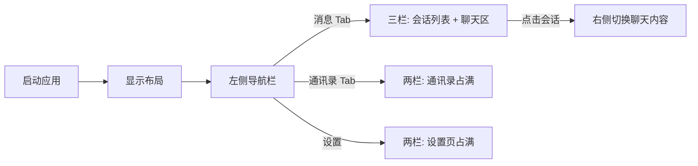
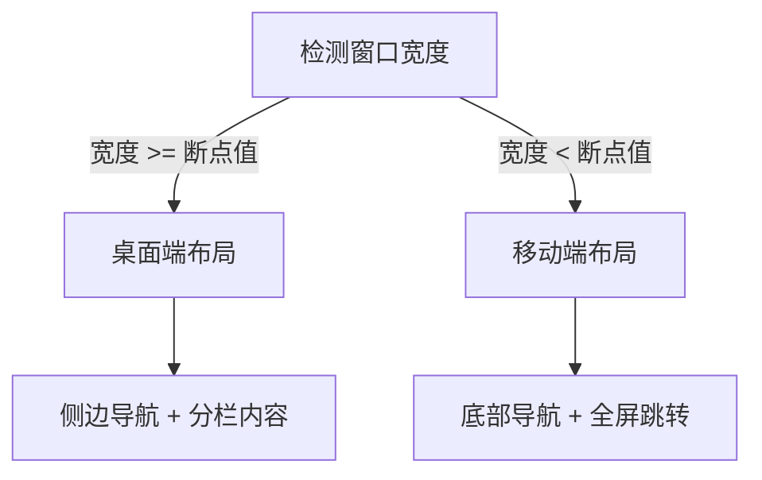

# macOS 桌面端构建与 UI 适配 — 功能分析

## 概述

将闪讯从移动端扩展到 macOS 桌面端。包含两个维度的工作：

1. **构建与分发**（运维流程）：macOS 应用的构建、签名、公证、DMG 打包、App Store 上传的自动化脚本
2. **桌面端 UI 适配**（业务功能）：针对大屏幕优化布局，从移动端的全屏跳转改为桌面端的分栏布局

构建与分发属于运维流程，不分配功能编号。桌面端 UI 适配是用户可感知的功能变更，需要分配编号。

---

## 一、交互链

### 场景 1：macOS 构建与分发（运维流程）

**用户故事**：作为开发者，我想一条命令完成 macOS 应用的构建、签名、打包和公证，以便快速发布新版本。

开发者执行 `python3 scripts/build_center/build_macos.py --dmg`，脚本自动完成：构建 → 签名 → 打包 DMG → 公证。

### 场景 2：桌面端会话浏览与聊天

**用户故事**：作为桌面端用户，我想在同一屏幕上看到会话列表和聊天内容，以便快速切换对话而不丢失上下文。

用户打开闪讯桌面端，左侧是侧边导航栏（消息/通讯录/我/设置），消息 Tab 下中间是会话列表，右侧是当前聊天内容。点击不同会话时，右侧内容切换，左侧列表保持不动。通讯录和设置 Tab 为两栏布局（侧边栏 + 内容占满）。

### 场景 3：窗口尺寸自适应

**用户故事**：作为用户，我想在缩小窗口时自动切换为移动端布局，以便在不同窗口大小下都能正常使用。

当窗口宽度大于断点值时显示桌面端布局；小于断点值时回退为移动端布局（底部导航 + 全屏跳转）。断点值通过全局配置管理（`tolyui_rx_layout` 的 `ReParserStrategyTheme`），不硬编码。

---

## 二、逻辑树

### 事件流：桌面端布局切换

| 时刻 | 事件 | 处理 | 产生的新事件 |
|------|------|------|-------------|
| T1 | 应用启动 / 窗口尺寸变化 | `Rx$` 组件检测宽度 | 触发布局模式判断 |
| T2 | 宽度 >= 断点值 | 渲染 DesktopLayout | 侧边导航 + 分栏内容 |
| T3 | 宽度 < 断点值 | 渲染 MobileLayout | 底部导航 + 全屏跳转 |
| T4 | 用户点击会话（桌面端） | setState 更新 selectedConv | 右侧聊天区切换内容 |
| T5 | 用户点击会话（移动端） | Navigator.push ChatPage | 全屏进入聊天页 |

### 事件流：macOS 构建签名公证

| 时刻 | 事件 | 处理 | 产生的新事件 |
|------|------|------|-------------|
| T1 | 执行 build_macos.py --dmg | 清理旧产物 | 开始构建 |
| T2 | flutter build macos --release | 编译 Dart + 原生代码 | 产出 .app |
| T3 | codesign 签名 | 先签框架，再深度签名整体（含 --timestamp） | .app 已签名 |
| T4 | create-dmg / hdiutil | 打包为 DMG（自定义背景） | 产出 .dmg |
| T5 | xcrun notarytool submit | Apple 服务器扫描验证 | 公证结果 |
| T6 | 公证通过 | 状态 Accepted | DMG 可分发 |

### 状态流转

| 实体 | 触发事件 | 前状态 | 后状态 |
|------|---------|--------|--------|
| HomePage 布局 | 窗口宽度变化 | 移动端布局 | 桌面端布局 |
| 聊天区域（桌面端） | 点击会话 | 空白占位 | 当前会话聊天内容 |
| 会话列表项 | 选中 | 白色背景 | 淡蓝高亮 |
| DMG 产物 | 公证完成 | 未公证 | 已公证可分发 |

---

## 三、功能编号与网络定位

### 本次新增节点

| 编号 | 功能节点 | 层级 | 简介 |
|------|---------|------|------|
| P-64 | 桌面端自适应布局 | 前端业务层 | 根据窗口宽度切换桌面端分栏/移动端底部导航布局 |
| P-65 | 桌面端会话分栏 | 前端业务层 | 桌面端下消息 Tab 三栏展示，通讯录/设置两栏展示 |

> 注：macOS 构建/签名/公证/DMG 打包属于运维流程，不分配功能编号。

### 前置依赖

| 依赖节点 | 依赖方式 | 是否已有 |
|----------|---------|---------|
| P-01 会话列表展示 | 复用 ConversationListPage 组件 | ✅ |
| P-06 聊天页 | 复用 ChatPage 组件（embedded 模式） | ✅ |
| F-01 登录注册页 | 启动流程不变 | ✅ |
| F-04 WsClient | WebSocket 连接不变 | ✅ |

### 边界接口

| 接口/协议 | 定义方 | 消费方 | 说明 |
|-----------|--------|--------|------|
| ChatPage.embedded | flash_im_chat | DesktopLayout | 控制嵌入模式样式 |
| ConversationListPage.activeConversationId | flash_im_conversation | DesktopLayout | 控制选中高亮 |
| ConversationTile.isActive | flash_im_conversation | ConversationListPage | 高亮背景色 |

---

## 四、结论

### 开发顺序

1. ✅ 构建脚本（build_macos.py）：构建 + 签名 + DMG + 公证 + App Store 上传
2. ✅ 响应式布局库（tolyui_rx_layout 1.0.0+2）：Rx$ 便捷组件
3. ✅ HomePage 拆分：home_actions_mixin + mobile_layout + desktop_layout
4. ✅ 桌面端三栏/两栏布局
5. ✅ ChatPage embedded 模式
6. ✅ 桌面端输入框（ChatInputDesktop）
7. ✅ 窗口管理（window_manager）
8. ✅ IM 调色主题（FlashImTheme ThemeExtension）

### 暂不实现

- 桌面端快捷键支持
- 窗口最小化到托盘
- 桌面端系统通知弹窗
- 中间面板宽度可拖拽调整
