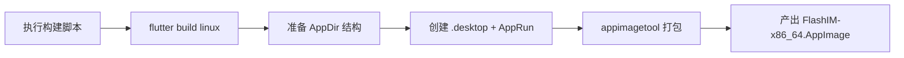
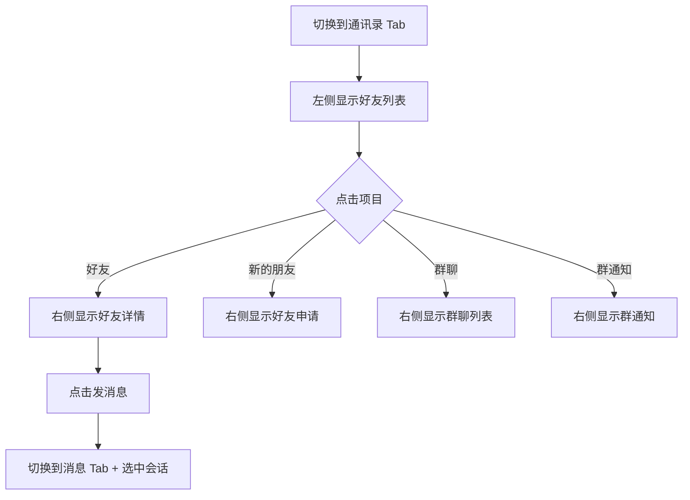
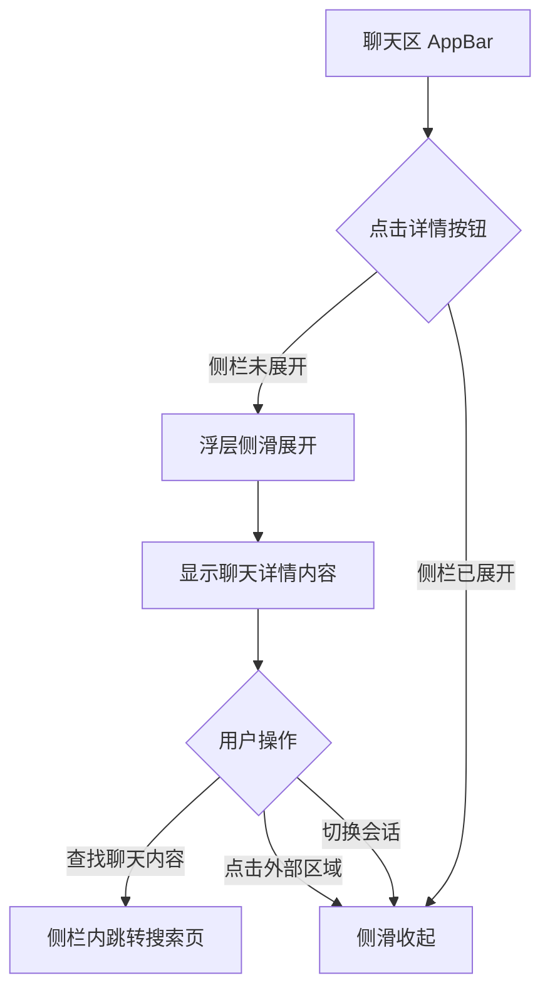
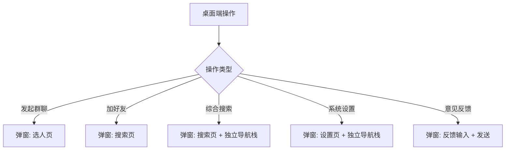

# 桌面端 UI 增强（v0.0.2）— 功能分析

## 概述

在 v0.0.1 建立的桌面端三栏布局基础上，全面完善桌面端体验。**UI 设计参考微信桌面端**，保持视觉风格和交互模式一致。包含以下维度的工作：

1. **Linux 构建脚本**（运维流程）：AppImage 打包的自动化脚本
2. **桌面端通讯录三栏布局**：好友列表 + 右侧面板（好友详情/好友申请/群聊/群通知）
3. **聊天详情侧栏展开**：浮层侧滑动画，TapRegion 外域关闭，独立 Navigator
4. **设置页三栏**：左侧菜单列表 + 右侧内容区 + 顶部标题栏/WindowsButtons
5. **弹窗化操作**：发起群聊、加好友、综合搜索、设置、意见反馈 → 弹窗 + 独立导航栈
6. **底部菜单**：TolyDropMenu 从右下角弹出（系统设置/意见反馈/退出登录）
7. **通用组件封装**：adaptivePush、UnreadBadge、context.rx 扩展
8. **意见反馈功能**：用户输入后通过 ChatCubit 发消息给闪讯团队

Linux 构建脚本属于运维流程，不分配功能编号。其余是用户可感知的功能变更。

---

## 一、交互链

### 场景 1：Linux 构建与分发（运维流程）

**用户故事**：作为开发者，我想一条命令完成 Linux AppImage 的构建与打包，以便快速发布 Linux 版本。

### 场景 2：桌面端通讯录三栏浏览

**用户故事**：作为桌面端用户，我想在通讯录 Tab 中点击好友/入口后直接在右侧看到详情，以便不离开通讯录就能完成常用操作。

### 场景 3：聊天详情侧栏展开

**用户故事**：作为桌面端用户，我想在聊天时点击右上角按钮展开详情侧栏，以便查看聊天成员、搜索聊天记录。

参考微信桌面端：点击聊天窗口右上角按钮，右侧浮层滑出详情面板，聊天区宽度不变。

### 场景 4：弹窗化操作

**用户故事**：作为桌面端用户，我想在执行操作时以弹窗形式完成，而不是全屏跳转，以便保持当前上下文。

### 场景 5：意见反馈

**用户故事**：作为用户，我想快速提交意见反馈，以便向闪讯团队反映问题或建议。

---

## 二、逻辑树

### 事件流：聊天详情侧栏展开/收起

| 时刻 | 事件 | 处理 | 产生的新事件 |
|------|------|------|-------------|
| T1 | 用户点击聊天区详情按钮 | ChatPage 调用 onToggleDetail 回调 | 通知 DesktopLayout |
| T2 | DesktopLayout 触发动画 | AnimationController forward/reverse | SlideTransition 动画 |
| T3 | 用户点击侧栏外部区域 | TapRegion onTapOutside 触发 | 侧栏收起 |
| T4 | 用户切换会话 | _selectConversation 重置状态 | 侧栏收起 + 动画 reverse |

### 事件流：弹窗化搜索

| 时刻 | 事件 | 处理 | 产生的新事件 |
|------|------|------|-------------|
| T1 | 用户点击搜索栏 | showDialog 弹出搜索弹窗 | 独立 Navigator 创建 |
| T2 | 用户输入关键词 | SearchCubit 防抖搜索 | 结果列表更新 |
| T3 | 用户点击搜索结果 | 关闭弹窗 + 回调通知 | 激活对应会话/好友 |
| T4 | 用户点击关闭按钮 | onClose 回调关闭弹窗 | 弹窗消失 |

### 状态流转

| 实体 | 触发事件 | 前状态 | 后状态 |
|------|---------|--------|--------|
| 聊天详情侧栏 | 点击详情按钮 | 隐藏（Offset 1,0） | 展开（Offset 0,0） |
| 聊天详情侧栏 | 切换会话/外域点击 | 展开 | 隐藏 |
| 通讯录右侧面板 | 点击入口项 | 好友详情/空白 | 对应二级界面 |
| 搜索弹窗 | 点击搜索结果 | 弹窗可见 | 弹窗关闭 + 会话激活 |
| 底部菜单 | 点击菜单按钮 | 隐藏 | TolyDropMenu 从右下角弹出 |

---

## 三、功能编号与网络定位

### 本次新增节点

| 编号 | 功能节点 | 层级 | 简介 |
|------|---------|------|------|
| P-68 | 桌面端通讯录三栏 | 前端业务层 | 通讯录 Tab 右侧面板：好友详情/申请/群聊/群通知 |
| P-69 | 聊天详情侧栏 | 前端业务层 | 消息 Tab 聊天区右侧浮层侧滑详情面板 |
| P-70 | 设置页三栏 | 前端业务层 | "我的" Tab 左侧菜单 + 右侧内容区 |
| P-71 | 桌面端弹窗化操作 | 前端业务层 | 搜索/创建群/加好友/设置/反馈 → 弹窗 + 独立导航栈 |
| P-72 | 意见反馈 | 前端业务层 | 用户输入反馈内容，通过 ChatCubit 发送给闪讯团队 |

> 注：Linux AppImage 构建脚本属于运维流程，不分配功能编号。

### 前置依赖

| 依赖节点 | 依赖方式 | 是否已有 |
|----------|---------|---------|
| P-64 桌面端自适应布局 | 复用 DesktopLayout 框架 | ✅ |
| P-65 桌面端会话分栏 | 在此基础上扩展详情侧栏 | ✅ |
| P-20 好友列表页 | 复用 FriendListPage 组件 | ✅ |
| P-24 好友详情页 | 复用 FriendDetailPage（embedded 模式） | ✅ |
| P-31 单聊详情页 | 复用 PrivateChatInfoPage（showAppBar 模式） | ✅ |
| P-37 群聊详情页 | 复用 GroupChatInfoPage（showAppBar 模式） | ✅ |

### 边界接口

| 接口/协议 | 定义方 | 消费方 | 说明 |
|-----------|--------|--------|------|
| ChatPage.onToggleDetail | flash_im_chat | DesktopLayout | 通知父级展开/收起详情侧栏 |
| adaptivePush | flash_shared | 全局 | 根据 context.rx 断点自动选择弹窗/push |
| UnreadBadge | flash_shared | nav_rail + mobile_layout + conversation_tile | 统一未读角标组件 |
| context.rx | tolyui_rx_layout | flash_shared + 全局 | 从 BuildContext 获取当前断点级别 |
| TolyDropMenu | tolyui_navigation | nav_rail | 底部菜单弹出 |

---

## 四、结论

### 开发顺序（实际执行）

1. ✅ 设置页三栏（DesktopSettingsPanel）
2. ✅ ChatPage onToggleDetail + 聊天详情侧栏浮层
3. ✅ 通讯录三栏完善（右侧面板切换）
4. ✅ 弹窗化操作（搜索/创建群/加好友）
5. ✅ 底部菜单（TolyDropMenu）
6. ✅ 好友详情桌面端适配（embedded 模式）
7. ✅ 文件拆分（desktop/ 子目录）
8. ✅ 通用组件封装（adaptivePush + UnreadBadge + context.rx）
9. ✅ 意见反馈功能
10. ✅ tolyui_feedback 溢出算法 bug 修复

### 设计参考

- **整体风格参考微信桌面端**：侧边栏深色窄条 + 中间列表面板 + 右侧内容区
- 聊天详情侧栏参考微信桌面端的浮层侧滑行为
- 好友详情参考微信桌面端的分组信息展示
- 底部菜单参考微信桌面端的弹出菜单
- 配色、间距、圆角等视觉细节对齐微信桌面端风格

### 暂不实现

- 详情侧栏宽度可拖拽调整
- 通讯录内嵌聊天区（改为切换到消息 Tab）
- adaptivePush 全局替换（已封装，后续逐步迁移）
