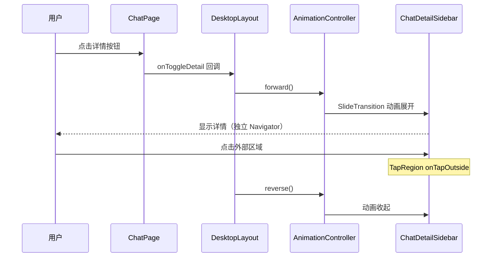
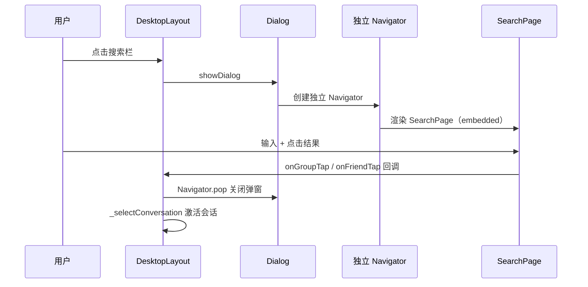

# ui/desktop — 前端设计报告

> 关联设计：[ui/desktop v0.0.1 前端](../../v0.0.1/client/design.md)

## 1. 目标

- 设置页三栏布局：左侧菜单列表 + 右侧内容区 + 顶部标题栏
- 聊天详情侧栏：浮层侧滑动画 + TapRegion 外域关闭 + 独立 Navigator
- 通讯录三栏完善：右侧面板显示好友详情/申请/群聊/群通知
- 弹窗化操作：搜索/创建群/加好友/设置/反馈 → 弹窗 + 独立导航栈
- 底部菜单：TolyDropMenu 从右下角弹出
- 通用组件封装：adaptivePush、UnreadBadge、context.rx
- 意见反馈功能：通过 ChatCubit 发消息给闪讯团队
- 文件结构拆分：desktop_layout.dart 拆为 6 个文件

## 2. 现状分析

### 已有能力

| 能力 | 状态 |
|------|------|
| 桌面端三栏布局框架 | ✅ |
| ChatPage embedded 模式 | ✅ |
| FlashImTheme 主题系统 | ✅ |
| tolyui_rx_layout 响应式断点 | ✅ |

### 存在的不足

| 问题 | 解决方案 |
|------|---------|
| 设置页直接占满右侧，无分栏 | DesktopSettingsPanel 三栏 |
| 聊天详情需全屏跳转 | 浮层侧栏 + 独立 Navigator |
| 通讯录入口点击全屏跳转 | 右侧面板切换 |
| 搜索/创建群等操作全屏跳转 | 弹窗 + 独立导航栈 |
| 未读角标各处重复实现 | UnreadBadge 统一组件 |
| desktop_layout.dart 800+ 行 | 拆分为 6 个文件 |

## 3. 项目结构

### 最终文件结构

```
client/lib/src/home/
├── view/
│   ├── desktop/                          # 桌面端布局（拆分后）
│   │   ├── desktop_layout.dart           # 主框架（~250行）
│   │   ├── nav_rail.dart                 # 侧边导航栏 + TolyDropMenu
│   │   ├── conversation_panel.dart       # 消息 Tab 会话面板
│   │   ├── chat_detail_sidebar.dart      # 聊天详情侧栏（独立 Navigator）
│   │   ├── contact_detail_panel.dart     # 通讯录右侧面板
│   │   └── actions_mixin.dart            # 弹窗操作 mixin
│   ├── mobile_layout.dart
│   ├── home_page.dart
│   └── home_actions_mixin.dart
├── profile/
│   ├── desktop_settings_panel.dart       # 桌面端设置三栏面板
│   ├── feedback_page.dart                # 意见反馈页面
│   ├── settings_page.dart
│   └── ...
```

### 新增共享组件

```
client/modules/flash_shared/lib/src/
├── adaptive_push.dart                    # 自适应跳转（桌面弹窗/移动push）
└── badge.dart                            # UnreadBadge 统一角标组件

docs/ref/tolyui_rx_layout-1.0.0+2/lib/src/responsive/
└── rx_context.dart                       # context.rx 扩展
```

## 4. 核心流程

### 聊天详情侧栏



### 弹窗化搜索



## 5. 技术决策

| 决策 | 方案 | 理由 |
|------|------|------|
| 侧栏展开方式 | 浮层 SlideTransition + Stack | 不影响聊天区宽度，参考微信 |
| 外域关闭 | TapRegion | Flutter 内置，无需遮罩层 |
| 侧栏内导航 | 独立 Navigator | 子页面跳转不影响外层 |
| 弹窗内导航 | 独立 Navigator | 弹窗内子页面跳转不跳出 |
| 断点判断 | context.rx（tolyui_rx_layout 扩展） | 和 Rx$ 组件一致的断点策略 |
| 底部菜单 | TolyDropMenu + Placement.rightEnd | 从右下角向上弹出，无气泡 |
| 未读角标 | UnreadBadge（BadgeSize 枚举） | 统一样式，正圆/胶囊自适应 |
| 意见反馈发送 | ChatCubit（临时创建） | 和输入框一样的流程，本地缓存正确入库 |
| 文件拆分 | desktop/ 子目录 + 组件 + mixin | 主文件从 800 行降到 250 行 |

### 依赖变更

| 依赖 | 变更 |
|------|------|
| tolyui_rx_layout | pub → 本地路径（新增 rx_context.dart） |
| tolyui_navigation | 新增，本地路径 |
| pubspec_overrides.yaml | 新建，覆盖 tolyui_feedback/meta 为本地路径 |

## 6. 验收标准

| 验收条件 | 验收方式 |
|----------|----------|
| 编译通过 | Windows 桌面端构建成功 |
| 设置页三栏正常 | 点击菜单项右侧内容切换 |
| 聊天详情侧栏正常 | 点击展开/收起/外域关闭/切换会话收起 |
| 通讯录右侧面板正常 | 好友详情/申请/群聊/群通知 切换 |
| 弹窗化操作正常 | 搜索/创建群/加好友 弹窗内完成 |
| 底部菜单正常 | TolyDropMenu 从右下角弹出 |
| 未读角标统一 | 侧边栏/底部导航/会话列表 样式一致 |
| 意见反馈正常 | 输入内容 → 发送 → 激活会话 |
| 移动端不受影响 | 缩小窗口验证 |

## 7. 暂不实现

| 功能 | 理由 |
|------|------|
| 详情侧栏宽度可拖拽 | 复杂度高，收益低 |
| adaptivePush 全局替换 | 已封装，后续逐步迁移 |
| 通讯录内嵌聊天区 | 切换到消息 Tab 已满足需求 |
| 意见反馈图片上传 | 后续版本 |
