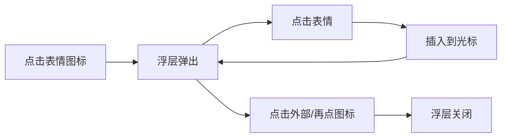
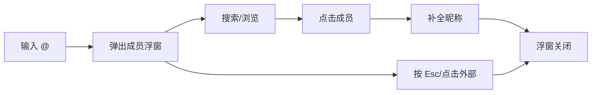
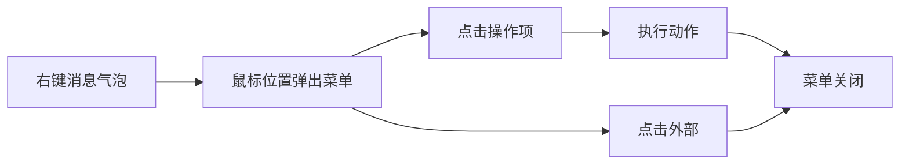

# 桌面端交互优化 v0.0.4 — 功能分析

## 概述

桌面端目前沿用了移动端的交互模式：表情面板内嵌底部、@ 选择器全屏 push、消息操作只能长按触发。这些在触屏设备上合理，但在鼠标+键盘环境下显得笨重。本次迭代将这四处交互改为桌面端原生风格：浮层弹出表情、图片选择入口、小弹窗 @ 选择、右键上下文菜单。

---

## 一、交互链

### 场景 1：表情面板浮层

**用户故事**：作为桌面端用户，我想快速插入表情，不希望面板占用输入区域的高度。

点击表情图标 → 输入栏上方弹出浮层面板 → 点击表情 → 表情插入光标位置 → 面板保持打开 → 点击面板外区域或再次点击图标 → 面板关闭。

### 场景 2：@ 成员选择小弹窗

**用户故事**：作为桌面端用户，我在群聊中输入 @，想在当前位置快速选择要提醒的人，不想跳到新页面。

输入 @ → 输入框上方弹出成员选择浮窗 → 可搜索过滤 → 点击成员 → 自动补全昵称 → 浮窗关闭。

### 场景 3：右键操作菜单

**用户故事**：作为桌面端用户，我想右键消息气泡弹出操作菜单（复制、引用、撤回、删除等），而不是长按。

右键消息气泡 → 在鼠标位置弹出上下文菜单 → 点击操作项 → 执行对应动作 → 菜单关闭。

---

## 二、逻辑树

### 事件流：表情浮层

| 时刻 | 事件 | 处理 | 产生的新事件 |
|------|------|------|-------------|
| T1 | 点击表情图标 | TolyPopover.controller.open()，浮层从图标上方弹出 | 浮层显示 |
| T2 | 点击表情字符 | 插入到 TextEditingController 光标位置 | 文本变更 |
| T3 | 点击浮层外/再次点击图标/按 Esc | TolyPopover 自动关闭（barrierDismissible） | 浮层消失 |

### 事件流：@ 浮窗

| 时刻 | 事件 | 处理 | 产生的新事件 |
|------|------|------|-------------|
| T1 | 输入 @ 字符 | 检测触发条件，TolyPopover.controller.open() | 弹出浮窗 |
| T2 | 输入搜索文字 | 过滤成员列表（复用已有的 MentionPicker 组件） | 列表刷新 |
| T3 | 点击成员 | 补全 `@昵称 `，controller.close() | 浮窗关闭 |
| T4 | 按 Esc / 点击外部 / 删除 @ 字符 | TolyPopover 自动关闭 | — |

### 事件流：右键菜单

| 时刻 | 事件 | 处理 | 产生的新事件 |
|------|------|------|-------------|
| T1 | 右键消息气泡 | onSecondaryTapUp → ctrl.open(position: localPosition) | 弹出菜单 |
| T2 | 点击菜单项 | 执行对应 action，ctrl.close() | 菜单关闭 |
| T3 | 点击菜单外 | TolyPopover 自动关闭 | — |

### 状态流转

| 实体 | 触发事件 | 前状态 | 后状态 |
|------|---------|--------|--------|
| 表情浮层 | 点击表情图标 | hidden | visible |
| 表情浮层 | 点击外部 | visible | hidden |
| @ 浮窗 | 输入 @ | hidden | visible |
| @ 浮窗 | 选择成员 | visible | hidden |
| 右键菜单 | 右键气泡 | hidden | visible |
| 右键菜单 | 点击操作项 | visible | hidden |

---

## 三、功能编号与网络定位

### 本次新增节点

本次为纯 UI 交互优化，不引入新的数据流或业务逻辑。属于已有节点（P-11 功能面板、P-48 长按菜单、P-54 Emoji 表情面板）的桌面端适配，**不分配新编号**。

### 前置依赖

| 依赖节点 | 依赖方式 | 是否已有 |
|----------|---------|---------|
| P-11 功能面板 | 输入栏扩展 | ✅ |
| P-48 长按菜单 | 复用 MenuAction + 操作逻辑 | ✅ |
| P-54 Emoji 表情面板 | 复用 EmojiPanel 组件 | ✅ |
| F-07 共享头像组件 | @ 浮窗中展示成员头像 | ✅ |

### 边界接口

无新增接口。所有改动在前端 `flash_im_chat` 模块内部完成，不涉及后端变更。

---

## 四、结论

- **开发顺序**：右键菜单 → 表情浮层 → @ 选择器 → 转发弹窗 → 窗口按钮 → @ 工具栏按钮
- **复杂度集中点**：
  - TolyPopover 的 `isBubble` 默认 true，必须显式设 false 去掉箭头
  - `adaptivePush` 内部独立 Navigator 会导致 pop 结果丢失，转发场景需直接用 showDialog
  - Windows 窗口按钮贴顶需要 `Positioned(top:0)` + `kApp.isWindows` 平台判断
- **改动范围**：
  - `chat_input_desktop.dart`：表情浮层 + @ 按钮 + adaptivePush @ 选择器
  - `message_bubble.dart`：桌面端右键 TolyPopover
  - `desktop_context_menu.dart`：新建，右键菜单内容组件
  - `message_action_menu.dart`：`_getActions` 改为公共方法
  - `chat_page.dart`：`_handleMenuAction` + `_forwardMessage` + WindowsButtons
  - `desktop_layout.dart`：贴顶按钮 + 详情按钮
  - `emoji_panel.dart`：增加 height 参数
- **暂不实现**：
  - 表情分类/搜索/自定义表情包
  - 右键菜单的子菜单/二级操作
  - 会话列表右键菜单（本次只做消息气泡）
  - 移动端交互改动（移动端体验已成熟，不改）
