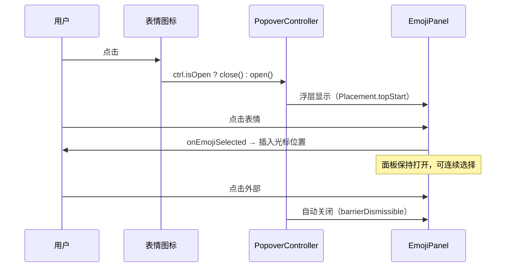
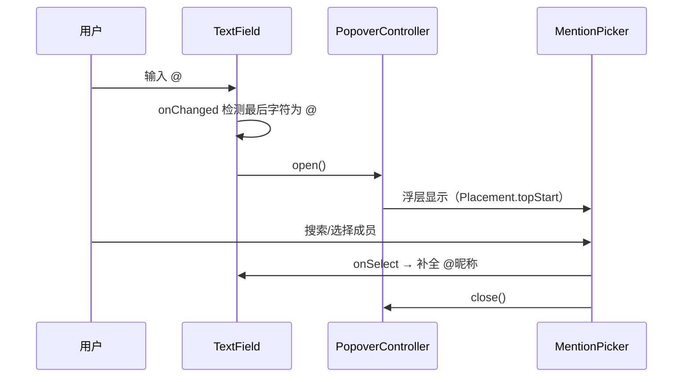
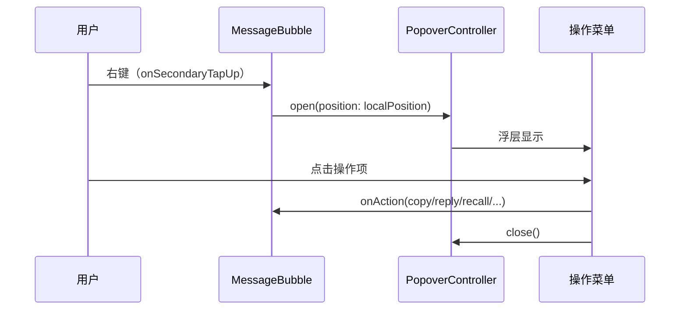

# 桌面端交互优化 — 前端设计报告

> 关联设计：[desktop v0.0.3](../../v0.0.3/client/design.md)

## 1. 目标

- 表情面板改为 TolyPopover 浮层弹出，不占输入区高度
- @ 成员选择器改为 adaptivePush 桌面端弹窗，不全屏 push
- 消息气泡右键弹出操作菜单，替代移动端长按
- 转发界面桌面端弹窗化
- Windows 窗口按钮 + 详情按钮贴顶
- 群聊输入栏增加 @ 按钮

## 2. 现状分析

| 能力 | 当前状态 | 问题 |
|------|---------|------|
| 表情面板 | 内嵌在输入框 Column 底部，200px 高度 | 桌面端占用输入区空间，不符合桌面交互习惯 |
| 图片选择 | 桌面端输入栏有图片图标 | ✅ 已有，无需改动 |
| @ 选择器 | 全屏 push MemberPickerPage | 桌面端跳转新页面太重，应该用浮窗 |
| 消息操作 | onLongPressStart 长按触发 | 桌面端用户习惯右键操作 |
| TolyPopover | tolyui_feedback 已依赖 | ✅ 基础设施就绪 |
| 平台分流 | Rx$ + embedded 参数 | ✅ 已有桌面/移动端分流机制 |

## 3. 核心流程

### 3.1 表情浮层



### 3.2 @ 浮窗



### 3.3 右键菜单



## 4. 项目结构与技术决策

### 改动文件清单

| 文件 | 操作 | 职责变更 |
|------|------|----------|
| `flash_im_chat/lib/src/view/chat_input_desktop.dart` | 修改 | 表情图标包裹 TolyPopover，移除内嵌 EmojiPanel |
| `flash_im_chat/lib/src/view/chat_input_desktop.dart` | 修改 | @ 检测时用 PopoverController.open() 代替 push |
| `flash_im_chat/lib/src/view/bubble/message_bubble.dart` | 修改 | 桌面端加 onSecondaryTapUp，包裹 TolyPopover |
| `flash_im_chat/lib/src/view/desktop_context_menu.dart` | 新建 | 桌面端右键菜单内容组件（竖向列表样式） |

### 技术决策

| 决策 | 方案 | 理由 |
|------|------|------|
| 浮层组件 | TolyPopover（tolyui_feedback），`isBubble: false` | 项目已有依赖，API 完善，默认带边线阴影 |
| 右键菜单样式 | 竖向列表（TolyPopover 默认装饰提供边线阴影） | 不重复加装饰，由 Popover 统一管理 |
| 移动端保持不变 | 通过 `kApp.isDesktop` / `kApp.isWindows` 分流 | 移动端已有的长按+底部面板体验成熟，不改 |
| 表情面板保持打开 | 选择表情后不关闭浮层 | 允许连续选择多个表情，点击外部才关闭 |
| @ 选择器 | `adaptivePush`（桌面端弹窗 + 移动端全屏） | 复用已有封装，桌面端窄屏对话框 |
| 转发界面 | 桌面端 `showDialog`（不用 adaptivePush） | adaptivePush 的独立 Navigator 导致 pop 结果丢失 |
| 窗口按钮 | `Positioned(top:0, right:0)` 贴顶，仅 Windows | macOS 有系统红绿灯，不需要自绘 |

### 依赖清单

| 依赖 | 用途 | 状态 |
|------|------|------|
| tolyui_feedback | TolyPopover + Placement + DecorationConfig | ✅ 已有 |
| flash_shared | 平台判断 kApp.isDesktop | ✅ 已有 |

## 5. 各优化项实现要点

### 5.1 表情浮层

改动位置：`chat_input_desktop.dart` 工具栏的表情图标

```dart
// 之前：图标点击切换 _showEmoji 状态，Column 底部内嵌 EmojiPanel
// 之后：图标包裹 TolyPopover，浮层显示 EmojiPanel

TolyPopover(
  placement: Placement.topStart,
  maxWidth: 400,
  maxHeight: 280,
  decorationConfig: DecorationConfig(backgroundColor: Colors.white, radius: Radius.circular(12)),
  overlay: EmojiPanel(onEmojiSelected: _onEmojiSelected),
  builder: (context, ctrl, child) => GestureDetector(
    onTap: () => ctrl.isOpen ? ctrl.close() : ctrl.open(),
    child: child,
  ),
  child: _buildToolIcon(Icons.emoji_emotions_outlined, () {}),
)
```

移除 `_showEmoji` 状态变量和底部的 `if (_showEmoji) SizedBox(height: 200, ...)` 代码。

### 5.2 图片选择

当前桌面端已有图片选择入口（`_selectImage` 方法），无需额外改动。

### 5.3 @ 浮窗

改动位置：`chat_input_desktop.dart` 的 `_openMentionPicker` 方法

```dart
// 之前：Navigator.push(MaterialPageRoute(...))
// 之后：用 PopoverController 打开浮层

final PopoverController _mentionCtrl = PopoverController();

// 输入框包裹 TolyPopover
TolyPopover(
  controller: _mentionCtrl,
  placement: Placement.topStart,
  maxHeight: 240,
  maxWidth: 280,
  decorationConfig: DecorationConfig(backgroundColor: Colors.white, radius: Radius.circular(8)),
  overlay: MentionPicker(
    fetcher: widget.membersFetcher,
    showAll: true,
    onSelect: (userId, nickname) {
      _onMentionSelected(userId, nickname);
      _mentionCtrl.close();
    },
    onDismiss: _mentionCtrl.close,
  ),
  child: _buildInputArea(),  // TextField 区域
)

// _onTextChanged 中检测到 @ 时：
_mentionCtrl.open();
```

### 5.4 右键菜单

改动位置：`message_bubble.dart` + 新建 `desktop_context_menu.dart`

**message_bubble.dart**：桌面端气泡包裹 TolyPopover，加 `onSecondaryTapUp`

```dart
// 桌面端分支
TolyPopover(
  controller: _menuCtrl,
  placement: Placement.bottomStart,
  decorationConfig: DecorationConfig(backgroundColor: Colors.white, radius: Radius.circular(8)),
  overlayBuilder: (context, ctrl) => DesktopContextMenu(
    message: message,
    isMe: isMe,
    isGroup: isGroup,
    isPinned: isPinned,
    onAction: (action) { ctrl.close(); onAction(action); },
  ),
  builder: (context, ctrl, child) => GestureDetector(
    onSecondaryTapUp: (details) => ctrl.open(position: details.localPosition),
    onLongPressStart: onLongPress != null ? (_) => onLongPress!(context) : null,
    child: child,
  ),
  child: _buildBubble(),
)
```

**desktop_context_menu.dart**：白底竖向列表

```dart
class DesktopContextMenu extends StatelessWidget {
  // 图标 + 文字 的竖向列表，参考微信桌面端风格
  // 复用 MessageActionMenu 的 _getActions 逻辑获取操作列表
  // 每项：Row(icon, text)，hover 高亮
}
```

## 6. 验收标准

| 验收条件 | 验收方式 |
|----------|----------|
| flutter analyze 零错误 | 命令行验证 |
| 桌面端点击表情图标弹出浮层 | Windows 运行验证 |
| 浮层内点击表情插入到输入框 | 手动验证 |
| 点击浮层外部自动关闭 | 手动验证 |
| 桌面端输入 @ 弹出成员浮窗 | Windows 运行验证 |
| 浮窗内选择成员后补全并关闭 | 手动验证 |
| 桌面端右键消息弹出操作菜单 | Windows 运行验证 |
| 菜单项点击后执行操作并关闭 | 手动验证 |
| 移动端交互保持不变（长按 + 底部面板） | Android 运行验证 |

## 7. 暂不实现

| 功能 | 理由 |
|------|------|
| 表情分类/搜索/自定义表情包 | 当前 48 个 emoji 够用，复杂度高 |
| 右键菜单动画 | TolyPopover 自带淡入动画，不需要额外处理 |
| 会话列表右键菜单 | 本次只做消息气泡，后续迭代 |
| 移动端交互改动 | 移动端体验已成熟，不改 |
