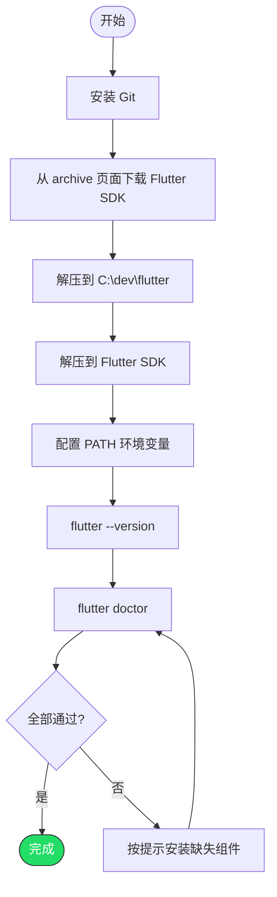

# Windows 系统安装和配置 Flutter SDK

> 从零开始，到 `flutter doctor` 全绿

---

## 系统要求

- Windows 10 或更高版本（64 位）
- 磁盘空间 ≥ 2.5 GB（不含 IDE 和模拟器）
- Git for Windows

---

## 第一步：安装 Git

```powershell
winget install Git.Git
```

安装后重启终端，验证：

```powershell
git --version
```

---

## 第二步：下载 Flutter SDK

1. 打开 https://docs.flutter.dev/install/archive
2. 选择 Windows 标签页，下载最新 Stable 版本的 zip 包
3. 解压到你喜欢的目录

> 路径中不要有中文或空格。

---

## 第三步：配置环境变量

### 一键脚本

以管理员身份打开 PowerShell：

```powershell
# 添加 Flutter 到用户 PATH
$flutterPath = "<你的Flutter解压路径>\flutter\bin"
$currentPath = [System.Environment]::GetEnvironmentVariable("Path", "User")

if ($currentPath -notlike "*$flutterPath*") {
    [System.Environment]::SetEnvironmentVariable(
        "Path", "$currentPath;$flutterPath", "User"
    )
    Write-Host "Flutter added to PATH" -ForegroundColor Green
} else {
    Write-Host "Flutter already in PATH" -ForegroundColor Yellow
}

# 国内镜像（可选但推荐）
[System.Environment]::SetEnvironmentVariable("PUB_HOSTED_URL", "https://pub.flutter-io.cn", "User")
[System.Environment]::SetEnvironmentVariable("FLUTTER_STORAGE_BASE_URL", "https://storage.flutter-io.cn", "User")

Write-Host "Please restart your terminal." -ForegroundColor Yellow
```

### 手动配置

1. 系统设置 → 环境变量 → 用户变量
2. 编辑 `Path`，新增 `<你的Flutter解压路径>\flutter\bin`
3. 新建变量（国内镜像，可选）：
   - `PUB_HOSTED_URL` = `https://pub.flutter-io.cn`
   - `FLUTTER_STORAGE_BASE_URL` = `https://storage.flutter-io.cn`

---

## 第四步：验证安装

重新打开终端：

```powershell
flutter --version
```

看到版本号输出即成功。

---

## 第五步：运行 flutter doctor

```powershell
flutter doctor
```

它会检查所有依赖项并告诉你哪些还没装好。典型输出：

```
[✓] Flutter (Channel stable, 3.x.x)
[✗] Android toolchain - develop for Android devices
[✗] Chrome - develop for the web
[✓] Visual Studio - develop for Windows
[✓] Android Studio
[✓] Connected device
```

带 `✗` 的项目根据后续各平台文档逐一解决即可。

---

## 完整流程



---

## 常见问题

### Q: `flutter` 命令找不到

PATH 没生效。确认 `C:\dev\flutter\bin` 在 PATH 中，然后重启终端。

### Q: 下载 Dart SDK 很慢

没配国内镜像。设置 `PUB_HOSTED_URL` 和 `FLUTTER_STORAGE_BASE_URL` 环境变量。

### Q: 想升级 Flutter

```powershell
flutter upgrade
```
