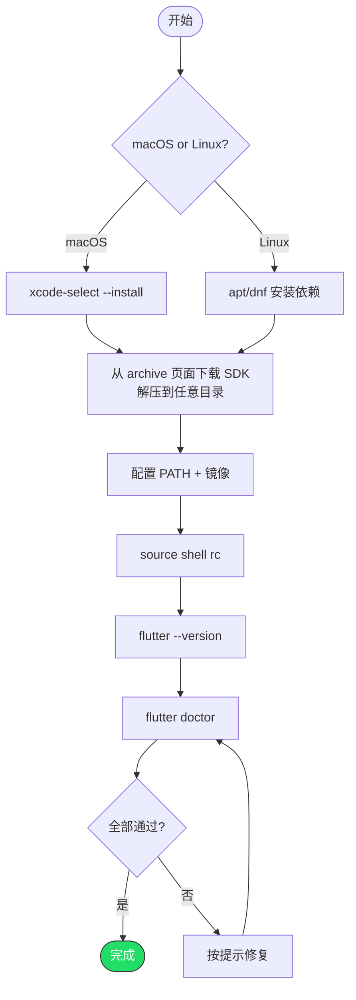

# macOS / Linux 系统安装和配置 Flutter SDK

> 两个平台流程几乎一致，差异处会标注

---

## 系统要求

| | macOS | Linux |
|--|-------|-------|
| 系统版本 | macOS 11 (Big Sur)+ | Ubuntu 20.04+ / Fedora 36+ 等 |
| 磁盘空间 | ≥ 2.5 GB | ≥ 2.5 GB |
| 前置工具 | Xcode CLI Tools | build-essential, curl, git |

---

## 第一步：安装前置依赖

### macOS

```bash
xcode-select --install
```

### Linux (Ubuntu/Debian)

```bash
sudo apt update
sudo apt install -y curl git unzip xz-utils zip \
  libglu1-mesa clang cmake ninja-build pkg-config \
  libgtk-3-dev liblzma-dev libstdc++-12-dev
```

### Linux (Fedora)

```bash
sudo dnf install -y curl git unzip xz zip \
  mesa-libGLU clang cmake ninja-build pkg-config \
  gtk3-devel lzma-sdk-devel
```

---

## 第二步：下载 Flutter SDK

1. 打开 https://docs.flutter.dev/install/archive
2. 选择对应平台标签页（macOS / Linux），下载最新 Stable 版本
3. 解压到你喜欢的目录

```bash
# macOS（zip 包）
unzip flutter_macos_*.zip

# Linux（tar.xz 包）
tar xf flutter_linux_*.tar.xz
```

### 方式 B：下载压缩包

```bash
mkdir -p ~/dev
cd ~/dev
# macOS
curl -LO https://storage.googleapis.com/flutter_infra_release/releases/stable/macos/flutter_macos_arm64_3.27.4-stable.zip
unzip flutter_macos_*.zip

# Linux
curl -LO https://storage.googleapis.com/flutter_infra_release/releases/stable/linux/flutter_linux_3.27.4-stable.tar.xz
tar xf flutter_linux_*.tar.xz
```

> 版本号请以 https://docs.flutter.dev/get-started/install 上的最新版为准。

---

## 第三步：配置环境变量

### 一键脚本

```bash
#!/bin/bash
# Flutter 环境配置脚本

# 检测 shell 配置文件
if [ -f "$HOME/.zshrc" ]; then
    RC="$HOME/.zshrc"
elif [ -f "$HOME/.bashrc" ]; then
    RC="$HOME/.bashrc"
else
    RC="$HOME/.profile"
fi

cat >> "$RC" << 'EOF'

# Flutter
export PATH="<你的Flutter解压路径>/flutter/bin:\$PATH"

# 国内镜像（可选但推荐）
export PUB_HOSTED_URL="https://pub.flutter-io.cn"
export FLUTTER_STORAGE_BASE_URL="https://storage.flutter-io.cn"
EOF

echo "Flutter env added to $RC"
echo "Run: source $RC"
```

保存为 `setup_flutter_env.sh`，执行：

```bash
bash setup_flutter_env.sh
source ~/.zshrc  # 或 source ~/.bashrc
```

### 手动配置

在 `~/.zshrc` 或 `~/.bashrc` 末尾添加：

```bash
export PATH="<你的Flutter解压路径>/flutter/bin:$PATH"
export PUB_HOSTED_URL="https://pub.flutter-io.cn"
export FLUTTER_STORAGE_BASE_URL="https://storage.flutter-io.cn"
```

---

## 第四步：验证

```bash
flutter --version
flutter doctor
```

---

## 完整流程



---

## 常见问题

### Q: macOS 提示 "flutter" 无法验证开发者

```bash
sudo xattr -d com.apple.quarantine ~/dev/flutter/bin/flutter
```

### Q: Linux 运行 Flutter 桌面应用报 GTK 错误

确保安装了 `libgtk-3-dev`（Ubuntu）或 `gtk3-devel`（Fedora）。

### Q: 升级 Flutter

```bash
flutter upgrade
```
