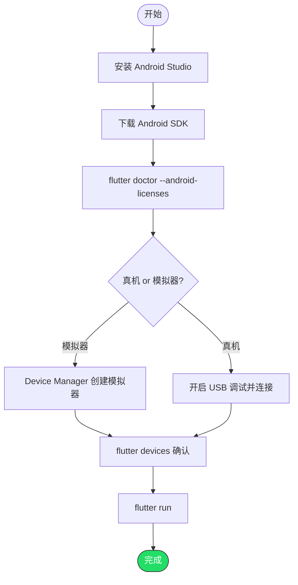

# 在 Android 平台运行 Flutter 项目

> 前提：已完成 Flutter SDK 安装（参考 01 或 02 文档）

---

## 第一步：安装 Android Studio

1. 下载：https://developer.android.com/studio
2. 安装时勾选 Android SDK、Android SDK Platform-Tools、Android Emulator
3. 首次启动后，按向导完成 SDK 下载

> 也可以用 VS Code / Cursor / Kiro 开发，但 Android Studio 的 SDK Manager 和模拟器管理最方便，建议至少装一次。

---

## 第二步：配置 Android SDK

### 确认 SDK 路径

Android Studio → Settings → Languages & Frameworks → Android SDK，记下 SDK Location：

| 系统 | 默认路径 |
|------|---------|
| Windows | `C:\Users\<用户名>\AppData\Local\Android\Sdk` |
| macOS | `~/Library/Android/sdk` |
| Linux | `~/Android/Sdk` |

### 设置环境变量（如果 flutter doctor 提示找不到 SDK）

```bash
# macOS / Linux，加到 ~/.zshrc 或 ~/.bashrc
export ANDROID_HOME="$HOME/Library/Android/sdk"   # macOS
# export ANDROID_HOME="$HOME/Android/Sdk"          # Linux
export PATH="$ANDROID_HOME/platform-tools:$PATH"
```

```powershell
# Windows PowerShell
[System.Environment]::SetEnvironmentVariable(
    "ANDROID_HOME",
    "$env:LOCALAPPDATA\Android\Sdk",
    "User"
)
```

---

## 第三步：接受 Android 许可证

```bash
flutter doctor --android-licenses
```

一路输入 `y` 接受即可。

---

## 第四步：创建模拟器（或连接真机）

### 方式 A：使用模拟器

1. Android Studio → Tools → Device Manager → Create Device
2. 选择一个设备（如 Pixel 7），点 Next
3. 下载一个系统镜像（推荐最新 API 级别），点 Next → Finish
4. 点击 ▶ 启动模拟器

### 方式 B：使用真机

1. 手机开启「开发者选项」→ 打开「USB 调试」
2. USB 连接电脑，手机弹窗点「允许调试」
3. 验证连接：

```bash
flutter devices
```

应该能看到你的设备。

---

## 第五步：运行项目

```bash
cd your_flutter_project
flutter run
```

如果有多个设备，指定设备：

```bash
flutter devices              # 查看设备列表
flutter run -d <device_id>   # 指定设备运行
```

---

## 完整流程



---

## 常见问题

### Q: flutter doctor 报 `Android toolchain` 有问题

通常是没接受许可证或 SDK 路径没配对。先跑 `flutter doctor --android-licenses`，再检查 `ANDROID_HOME` 环境变量。

### Q: 模拟器启动很慢

- 确保 BIOS 中开启了 VT-x / AMD-V 虚拟化
- Windows 用户确认 Hyper-V 或 HAXM 已启用
- 推荐使用 x86_64 镜像而非 ARM 镜像

### Q: 真机连接后 `flutter devices` 看不到

- 确认 USB 调试已开启
- 换一根数据线（有些线只能充电）
- Windows 可能需要安装设备驱动
