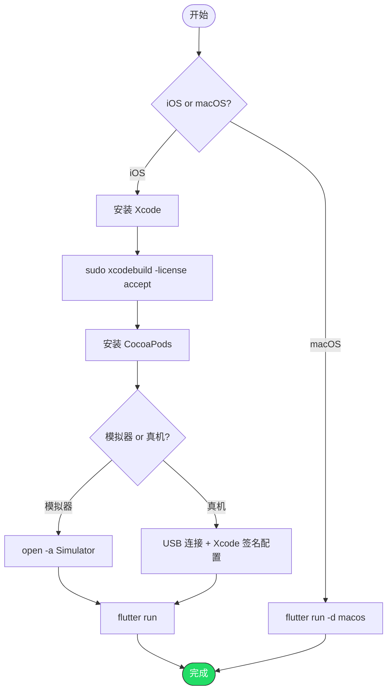

# 在 iOS / macOS 平台运行 Flutter 项目

> 前提：macOS 系统 + 已完成 Flutter SDK 安装（参考 02 文档）
> iOS 和 macOS 开发只能在 macOS 上进行

---

## iOS 开发

### 第一步：安装 Xcode

1. 从 Mac App Store 安装 Xcode（需要 15.0+）
2. 安装完成后，首次打开 Xcode，接受许可协议
3. 命令行确认：

```bash
sudo xcodebuild -license accept
```

### 第二步：安装 CocoaPods

Flutter iOS 项目使用 CocoaPods 管理原生依赖：

```bash
sudo gem install cocoapods
```

如果 gem 报权限问题，用 Homebrew：

```bash
brew install cocoapods
```

### 第三步：配置 iOS 模拟器

```bash
# 打开 iOS 模拟器
open -a Simulator
```

或者在 Xcode → Window → Devices and Simulators 中管理。

### 第四步：运行到 iOS 模拟器

```bash
cd your_flutter_project
flutter run
```

Flutter 会自动选择已打开的 iOS 模拟器。

### 第五步：运行到 iOS 真机

1. 用 USB 连接 iPhone
2. 在 Xcode 中打开 `ios/Runner.xcworkspace`
3. 选择你的 Apple 开发者团队（Signing & Capabilities）
4. 首次需要在 iPhone 上信任开发者证书：设置 → 通用 → VPN 与设备管理

```bash
flutter run -d <iphone_device_id>
```

> 免费 Apple ID 也可以用于开发测试，但有 7 天签名限制。

---

## macOS 桌面开发

### 运行

```bash
cd your_flutter_project
flutter run -d macos
```

就这么简单。macOS 桌面应用不需要额外配置。

---

## 完整流程



---

## 常见问题

### Q: `flutter doctor` 报 Xcode 相关错误

```bash
sudo xcode-select --switch /Applications/Xcode.app/Contents/Developer
sudo xcodebuild -runFirstLaunch
```

### Q: CocoaPods 安装失败

```bash
brew install cocoapods
```

### Q: iOS 真机运行报签名错误

在 Xcode 中打开 `ios/Runner.xcworkspace`，选择 Signing & Capabilities，设置你的 Team。免费账号选 Personal Team。

### Q: macOS 应用需要网络权限

编辑 `macos/Runner/DebugProfile.entitlements`，确保包含：

```xml
<key>com.apple.security.network.client</key>
<true/>
```
