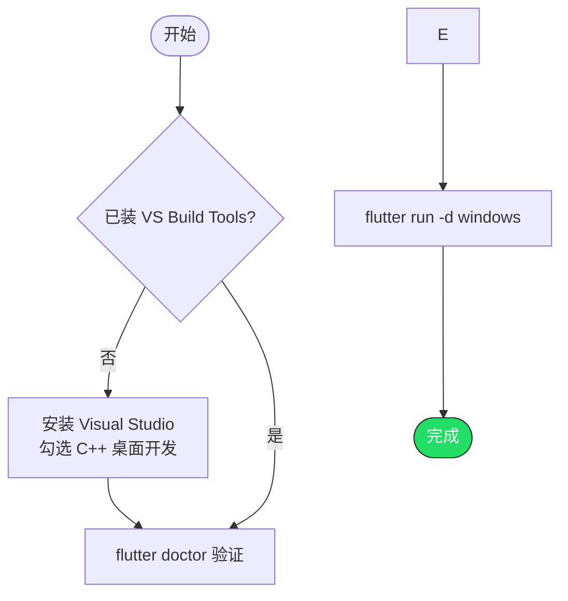

# 在 Windows 平台运行 Flutter 项目

> 前提：已完成 Flutter SDK 安装（参考 01 文档）

---

## 第一步：安装 Visual Studio

Flutter Windows 桌面开发需要 Visual Studio（不是 VS Code）的 C++ 桌面开发工具。

### 方式 A：脚本安装

```powershell
winget install Microsoft.VisualStudio.2022.BuildTools `
  --override "--quiet --wait --add Microsoft.VisualStudio.Workload.VCTools --includeRecommended"
```

### 方式 B：手动安装

1. 下载 Visual Studio 2022（Community 免费版即可）：https://visualstudio.microsoft.com/
2. 安装时勾选「使用 C++ 的桌面开发」

> 如果你之前为 Rust 安装过 VS Build Tools，这一步已经完成了。

---

## 第二步：验证

```powershell
flutter doctor
```

确认 `Visual Studio - develop for Windows` 显示 `[✓]`。

---

## 第三步：运行

```powershell
cd your_flutter_project
flutter run -d windows
```

首次编译需要几分钟，后续增量编译很快。

---

## 完整流程



---

## 常见问题

### Q: flutter doctor 报 Visual Studio 未安装

确保安装了「使用 C++ 的桌面开发」工作负载，不是只装了 VS Code。

### Q: 编译报 CMake 错误

Visual Studio 安装时需要包含 CMake 组件（「使用 C++ 的桌面开发」默认包含）。

### Q: 窗口大小怎么设置

编辑 `windows/runner/main.cpp`，修改 `Win32Window::Size` 的宽高值。
