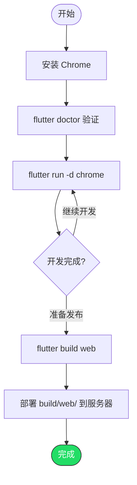

# 在 Web 平台运行 Flutter 项目

> 前提：已完成 Flutter SDK 安装（参考 01 或 02 文档）
> Web 支持开箱即用，配置最简单

---

## 第一步：安装 Chrome

Flutter Web 开发和调试需要 Chrome 浏览器。

- 下载：https://www.google.com/chrome/
- 已安装的话跳过

---

## 第二步：验证

```bash
flutter doctor
```

确认 `Chrome - develop for the web` 显示 `[✓]`。

---

## 第三步：运行

```bash
cd your_flutter_project
flutter run -d chrome
```

会自动打开 Chrome 并加载应用。

### 指定端口

```bash
flutter run -d chrome --web-port=8080
```

### 使用其他浏览器

```bash
flutter run -d web-server --web-port=8080
```

然后手动在任意浏览器打开 `http://localhost:8080`。

---

## 第四步：构建发布版本

```bash
flutter build web
```

产物在 `build/web/` 目录，可以直接部署到任何静态文件服务器（Nginx、Vercel、GitHub Pages 等）。

### 选择渲染引擎

```bash
# CanvasKit（默认，渲染质量高，体积较大）
flutter build web --web-renderer canvaskit

# HTML（体积小，兼容性好，渲染精度略低）
flutter build web --web-renderer html
```

---

## 完整流程



---

## 常见问题

### Q: flutter doctor 找不到 Chrome

设置 Chrome 路径环境变量：

```bash
# macOS / Linux
export CHROME_EXECUTABLE="/Applications/Google Chrome.app/Contents/MacOS/Google Chrome"

# Windows PowerShell
[System.Environment]::SetEnvironmentVariable("CHROME_EXECUTABLE", "C:\Program Files\Google\Chrome\Application\chrome.exe", "User")
```

### Q: Web 应用加载很慢

- 开发模式本身较慢，发布版本会快很多
- 使用 `--web-renderer html` 可以减小体积
- 确保 CanvasKit 资源能正常下载（国内可能需要镜像）

### Q: 中文字体显示为方块

CanvasKit 模式下需要加载字体。在 `pubspec.yaml` 中声明字体，或使用 HTML 渲染模式。
