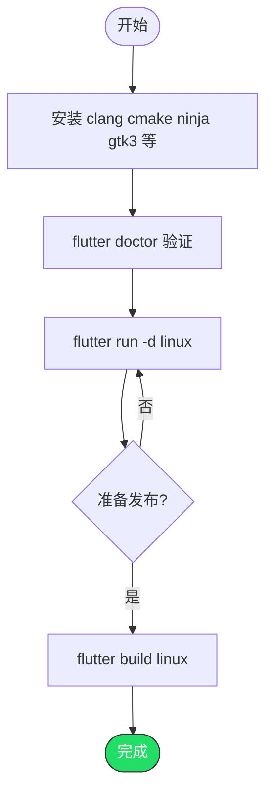

# 在 Linux 平台运行 Flutter 项目

> 前提：已完成 Flutter SDK 安装（参考 02 文档）

---

## 第一步：安装 Linux 桌面开发依赖

### Ubuntu / Debian

```bash
sudo apt install -y clang cmake ninja-build pkg-config \
  libgtk-3-dev liblzma-dev libstdc++-12-dev
```

### Fedora

```bash
sudo dnf install -y clang cmake ninja-build pkg-config \
  gtk3-devel lzma-sdk-devel
```

### Arch Linux

```bash
sudo pacman -S clang cmake ninja pkg-config gtk3 lzma
```

---

## 第二步：验证

```bash
flutter doctor
```

确认 `Linux toolchain` 显示 `[✓]`。

---

## 第三步：运行

```bash
cd your_flutter_project
flutter run -d linux
```

---

## 第四步：构建发布版本

```bash
flutter build linux
```

产物在 `build/linux/x64/release/bundle/`，可以直接运行或打包分发。

---

## 完整流程



---

## 常见问题

### Q: 报 `GTK` 相关错误

缺少 GTK 开发库。Ubuntu 装 `libgtk-3-dev`，Fedora 装 `gtk3-devel`。

### Q: 报 `ninja` 或 `cmake` 找不到

```bash
# Ubuntu
sudo apt install -y cmake ninja-build

# Fedora
sudo dnf install -y cmake ninja-build
```

### Q: 应用窗口标题怎么改

编辑 `linux/my_application.cc`，修改 `gtk_window_set_title` 的参数。
