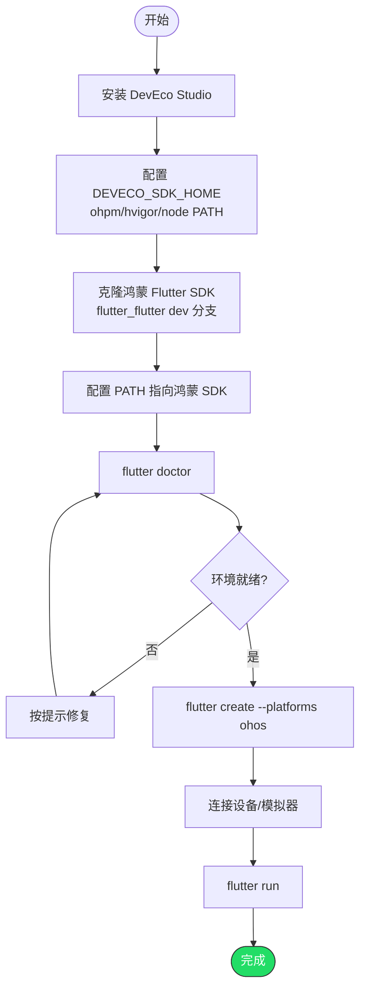

# 在 HarmonyOS 平台运行 Flutter 项目

> 鸿蒙 Flutter 支持由社区维护（非 Google 官方），基于 Flutter SDK 的 OpenHarmony 扩展
> 当前状态：Beta（基于 Flutter 3.27.4 HarmonyOS Edition 0.1.0）

---

## 背景说明

HarmonyOS NEXT 不再兼容 Android APK，需要专门适配。社区项目 `flutter_flutter`（OpenHarmony 分支）提供了 Flutter 对鸿蒙平台的支持，可以将 Flutter 应用编译为鸿蒙原生应用。

---

## 第一步：安装 DevEco Studio

DevEco Studio 是华为官方的鸿蒙 IDE（类似 Android Studio）。

1. 下载：https://developer.huawei.com/consumer/cn/deveco-studio/
2. 安装并首次启动，按向导完成 SDK 下载
3. 新版 DevEco Studio 已内置 Node.js 和 ohpm，无需单独安装

---

## 第二步：配置环境变量

安装完成后，需要将以下路径加入环境变量：

### Windows

```powershell
# DevEco Studio 工具路径（根据实际安装路径调整）
$devecoBase = "C:\Program Files\Huawei\DevEco Studio"

# 设置环境变量
[System.Environment]::SetEnvironmentVariable("DEVECO_SDK_HOME", "$env:LOCALAPPDATA\Huawei\Sdk", "User")

# 添加到 PATH
$paths = @(
    "$devecoBase\tools\ohpm\bin",
    "$devecoBase\tools\hvigor\bin",
    "$devecoBase\tools\node"
)
$currentPath = [System.Environment]::GetEnvironmentVariable("Path", "User")
foreach ($p in $paths) {
    if ($currentPath -notlike "*$p*") {
        $currentPath = "$currentPath;$p"
    }
}
[System.Environment]::SetEnvironmentVariable("Path", $currentPath, "User")

Write-Host "HarmonyOS env configured. Restart terminal." -ForegroundColor Green
```

### macOS / Linux

```bash
# 加到 ~/.zshrc 或 ~/.bashrc
export DEVECO_SDK_HOME="$HOME/Library/Huawei/Sdk"  # macOS
# export DEVECO_SDK_HOME="$HOME/Huawei/Sdk"         # Linux

export PATH="$PATH:/Applications/DevEco-Studio.app/Contents/tools/ohpm/bin"
export PATH="$PATH:/Applications/DevEco-Studio.app/Contents/tools/hvigor/bin"
export PATH="$PATH:/Applications/DevEco-Studio.app/Contents/tools/node"
```

---

## 第三步：安装鸿蒙版 Flutter SDK

鸿蒙 Flutter 使用独立的 SDK 分支，不是官方 stable 分支：

```bash
# 克隆鸿蒙 Flutter SDK
git clone https://gitee.com/openharmony-sig/flutter_flutter.git -b dev ~/dev/flutter_harmony
```

配置环境变量指向鸿蒙版 SDK：

```bash
# 加到 shell 配置文件
export PATH="$HOME/dev/flutter_harmony/bin:$PATH"
```

> 注意：鸿蒙版 Flutter SDK 和官方 SDK 的 `flutter` 命令会冲突。建议用不同的终端 profile 或 alias 区分。

---

## 第四步：验证环境

```bash
flutter doctor
```

应该能看到 OpenHarmony 相关的检查项。

---

## 第五步：创建并运行鸿蒙项目

### 创建项目

```bash
flutter create --platforms ohos my_harmony_app
cd my_harmony_app
```

### 连接设备

1. 鸿蒙手机开启「开发者选项」→「USB 调试」
2. USB 连接电脑
3. 或使用 DevEco Studio 的模拟器

```bash
flutter devices
```

### 运行

```bash
flutter run -d <harmony_device_id>
```

---

## 完整流程



---

## 注意事项

### 当前限制

- 鸿蒙 Flutter 仍处于 Beta 阶段，部分插件和功能可能不完善
- 并非所有 pub.dev 上的插件都支持鸿蒙平台，需要检查插件是否有 `ohos` 平台支持
- 性能和稳定性在持续优化中

### 多 SDK 共存建议

如果同时开发标准 Flutter 和鸿蒙 Flutter，建议：

```bash
# 在 ~/.zshrc 或 ~/.bashrc 中设置 alias
alias flutter_std="$HOME/dev/flutter/bin/flutter"
alias flutter_ohos="$HOME/dev/flutter_harmony/bin/flutter"
```

或者使用 [fvm](https://fvm.app/)（Flutter Version Management）管理多个 SDK 版本。

---

## 常见问题

### Q: ohpm 命令找不到

DevEco Studio 的工具路径没加到 PATH。检查第二步的环境变量配置。

### Q: 编译报 hvigor 错误

确保 hvigor 路径正确，且 Node.js 版本兼容（DevEco Studio 内置的即可）。

### Q: 插件不支持 ohos 平台

目前需要为鸿蒙平台单独开发 platform channel 插件。可以参考社区已适配的插件列表，或自行编写 ohos 端实现。

---

## 参考资源

- 鸿蒙 Flutter SDK 仓库：https://gitee.com/openharmony-sig/flutter_flutter
- DevEco Studio 下载：https://developer.huawei.com/consumer/cn/deveco-studio/
- Flutter HarmonyOS Edition 发布说明：基于 Flutter 3.27.4，Beta 阶段，持续更新中
