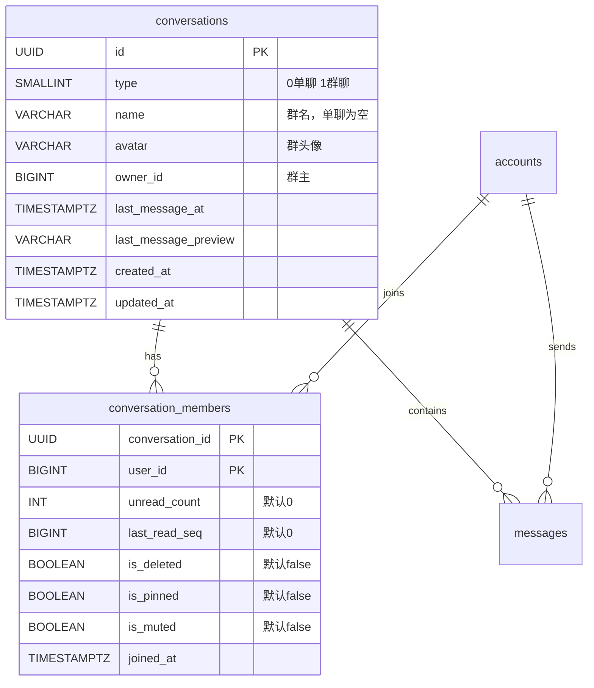

# 会话列表技术分析

> 从微信的日常使用体验出发，分析会话列表背后涉及的技术考量和需要解决的问题。

## 一、用户视角：会话列表的日常体验

打开微信，第一个页面就是会话列表。每一行是一段对话，包含：

- 对方头像（单聊）或群头像（群聊）
- 名称（对方昵称或群名）
- 最后一条消息的预览文字
- 最后消息的时间
- 未读消息数（红色角标）
- 置顶标记（灰色背景）
- 免打扰标记（小铃铛图标）

用户的核心操作：

| 操作 | 频率 | 说明 |
|------|------|------|
| 浏览列表 | 极高 | 每次打开 App 都会看 |
| 点击进入聊天 | 高 | 进入具体对话 |
| 下拉刷新 | 中 | 检查是否有新消息 |
| 左滑操作 | 低 | 置顶、标记已读、删除 |
| 长按操作 | 低 | 置顶、免打扰、删除 |

## 二、技术考量

### 1. 数据归属：消息和会话的关系

IM 中的消息不是散装的，每条消息都属于一个会话。会话是消息的容器，解决的是"这条消息属于哪段对话"的问题。

没有会话的情况下，查询"我和张三的聊天记录"需要：

```sql
WHERE (sender_id = 我 AND receiver_id = 张三) OR (sender_id = 张三 AND receiver_id = 我)
```

有了会话，查询变成：

```sql
WHERE conversation_id = 'xxx'
```

群聊场景下差异更大。50 人群里的消息，没有会话就需要维护一张"消息-接收者"的关系表，每条消息 50 条记录。有了会话，每条消息只需要一个 conversation_id。

### 2. 列表查询效率

会话列表需要展示每个会话的：最后消息预览、最后消息时间、未读数。

如果这些信息每次都从消息表实时计算：

| 操作 | 查询次数 | 说明 |
|------|---------|------|
| 最后消息 | N 次 | 每个会话查一次 MAX(created_at) |
| 未读数 | N 次 | 每个会话 COUNT 一次 |
| 总计 | 2N 次 | 100 个会话 = 200 次查询 |

预存方案：在会话表中维护 last_message_preview、last_message_at、unread_count 字段。每次有新消息时更新这些字段（写入时多做一步），打开列表时只需要一次查询（读取时极快）。

这是典型的"写时多做一点，读时省很多"的权衡。IM 场景下读远多于写（用户打开列表的频率远高于发消息的频率），所以这个权衡是值得的。

### 3. 多视角问题：同一会话，不同状态

同一个会话，不同参与者看到的状态不同：

| 状态 | 是否共享 | 说明 |
|------|---------|------|
| 会话类型 | 共享 | 单聊/群聊，所有人一样 |
| 群名称 | 共享 | 所有群成员看到的一样 |
| 最后消息 | 共享 | 所有人看到的一样 |
| 未读数 | 独立 | 每个人不同 |
| 是否置顶 | 独立 | 每个人自己决定 |
| 是否免打扰 | 独立 | 每个人自己决定 |
| 是否删除 | 独立 | 你删了对方还在 |

这要求数据模型分成两层：

- 会话表（conversations）：存共享信息，所有参与者看到的一样
- 成员表（conversation_members）：存独立信息，每个参与者各一条记录

### 4. 单聊的特殊性：幽灵身份

单聊会话没有自己的名字和头像。你看到的是"张三"，张三看到的是你的名字。同一个会话，两个人看到的标题和头像完全不同。

技术上的处理：

- 会话表的 name 和 avatar 字段为空（单聊不需要）
- 显示时从成员表找到"对方是谁"（同一会话中 user_id 不是自己的那条记录）
- 再从用户资料表查出对方的昵称和头像

群聊则直接用会话表的 name 和 avatar，所有人看到的一样。

### 5. 排序与分页

会话列表的排序规则：按最后消息时间倒序，最近聊过的在最上面。没有消息的会话排最后。

分页考量：

| 方案 | 优点 | 缺点 |
|------|------|------|
| 一次全量加载 | 实现简单 | 会话多时慢，浪费带宽 |
| limit/offset 分页 | 实现简单，支持跳页 | offset 大时性能下降 |
| 游标分页（基于时间戳） | 性能稳定 | 实现稍复杂 |

当前阶段用 limit/offset 足够。会话数量在千级以内时性能没有问题。如果未来会话数量增长到万级，可以切换到游标分页。

### 6. 实时更新

会话列表不是静态的。新消息到来时，对应的会话需要：

- 更新最后消息预览和时间
- 未读数 +1
- 移动到列表顶部

实现方式：

| 方案 | 说明 |
|------|------|
| 轮询 | 定时拉取列表，简单但浪费资源 |
| WebSocket 推送 | 服务端主动通知变更，实时性好 |
| 本地计算 | 收到消息后客户端自己更新列表状态 |

最优方案是 WebSocket 推送 + 本地计算结合：收到新消息时，客户端本地更新会话的预览、时间、未读数，不需要重新拉取整个列表。

### 7. 删除的语义

IM 中的"删除会话"和常规的删除不同：

- 不是真的删除数据（软删除）
- 只影响当前用户，对方不受影响
- 对方再发消息时，会话可以"复活"

技术实现：在成员表中设置 is_deleted = true，查询列表时过滤掉 is_deleted = true 的记录。收到新消息时重置 is_deleted = false。

### 8. 会话创建的幂等性

两个人之间只能有一个私聊会话。创建接口需要是幂等的：

- 第一次调用：创建新会话 + 两条成员记录
- 后续调用：返回已有的会话

这在网络不稳定时很重要。客户端可能因为超时而重试，幂等接口保证不会创建重复会话。

实现方式：创建前先查询两人之间是否已有 type=0 的会话，有则直接返回。

## 三、需要解决的问题清单

| 问题 | 优先级 | 当前版本 | 后续版本 |
|------|--------|---------|---------|
| 会话与消息的归属关系 | P0 | ✅ 会话表设计 | - |
| 列表查询效率 | P0 | ✅ 预存字段 | 消息版本更新预存字段 |
| 多视角状态管理 | P0 | ✅ 两表分离 | - |
| 单聊对方信息查询 | P0 | ✅ 三表关联 | - |
| 分页加载 | P1 | ✅ limit/offset | 游标分页（如需要） |
| 实时更新 | P1 | ❌ 暂不实现 | WebSocket 推送 + 本地计算 |
| 删除会话 | P1 | ✅ 软删除 | 新消息时复活 |
| 创建幂等 | P1 | ✅ 查询后创建 | - |
| 会话置顶 | P2 | ❌ 字段已预留 | 后续版本 |
| 免打扰 | P2 | ❌ 字段已预留 | 后续版本 |
| 未读数更新 | P2 | ❌ 始终为 0 | 消息收发版本 |
| 群聊会话 | P2 | ❌ type 已预留 | 群聊版本 |
| 本地缓存 | P3 | ❌ | 本地缓存版本 |
| 离线同步 | P3 | ❌ | 离线同步版本 |

## 四、数据模型建议



## 五、结论

会话列表看似简单，背后涉及数据归属、查询效率、多视角状态、实时更新、软删除、幂等创建等多个技术维度。当前版本聚焦核心能力（创建、查询、删除），通过预留字段为后续功能（未读数、置顶、免打扰、群聊）留好扩展空间。
