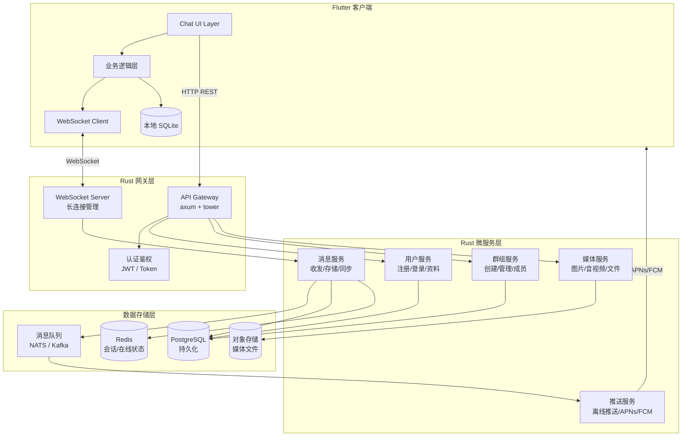
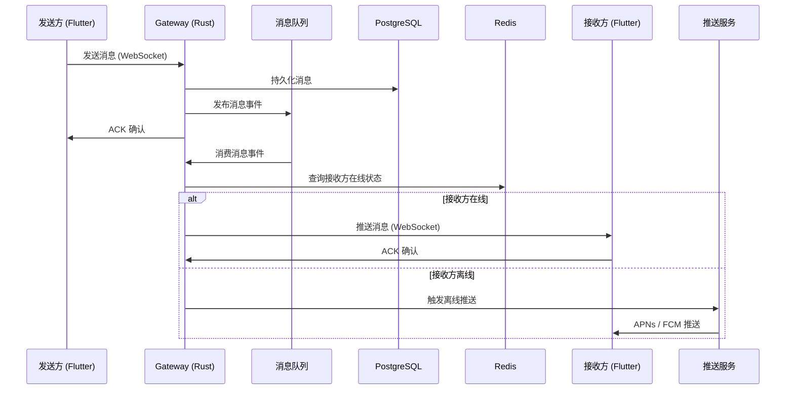
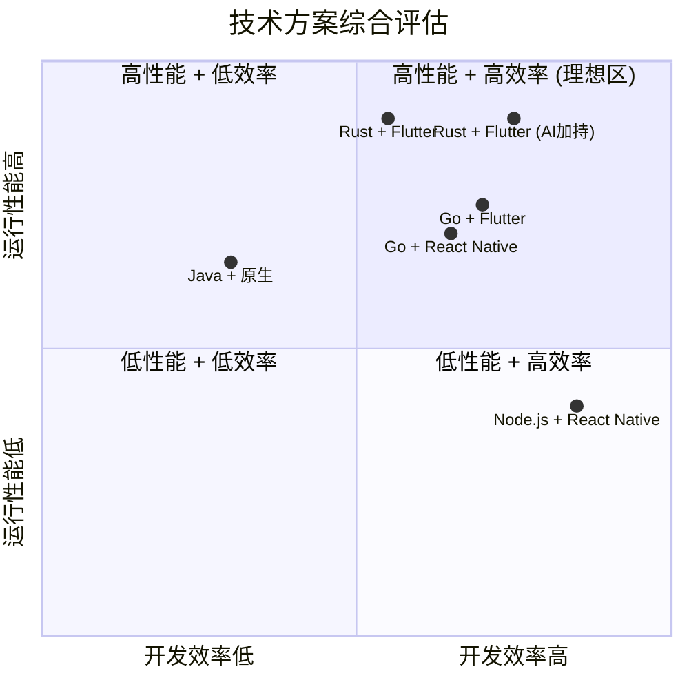
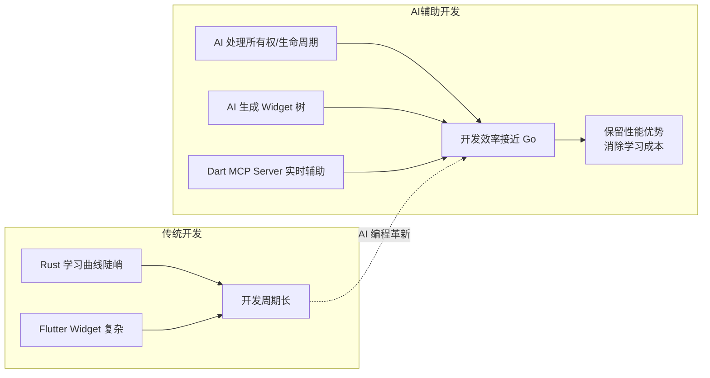
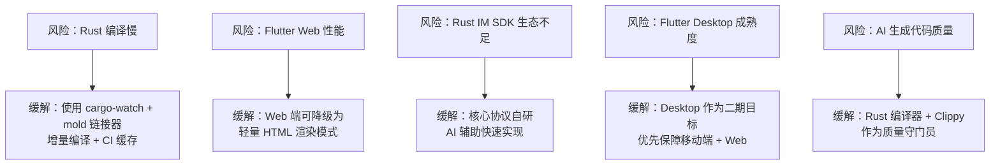
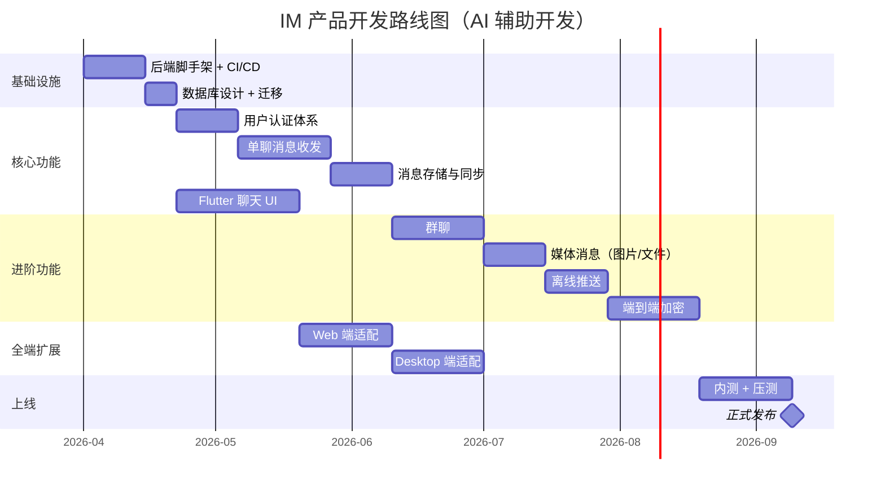

# Rust + Flutter 全栈 IM 即时通信产品可行性评估报告

> 评估日期：2026-03-11
> 背景前提：基于 AI 辅助编程（Copilot / Cursor / Kiro 等），不过多考虑团队传统技术能力成本

---

## 1. 方案概述

目标：构建一个覆盖 iOS、Android、Web、Desktop（macOS/Windows/Linux）的全端 IM 即时通信产品。

主方案：**Rust 后端 + Flutter 前端**

```
┌─────────────────────────────────────────────────────┐
│                    客户端 (Flutter)                    │
│   iOS / Android / Web / macOS / Windows / Linux      │
└──────────────────────┬──────────────────────────────┘
                       │ WebSocket / gRPC
┌──────────────────────▼──────────────────────────────┐
│                    后端 (Rust)                        │
│   API Gateway → 消息路由 → 存储 → 推送              │
└─────────────────────────────────────────────────────┘
```

---

## 2. 技术可行性分析

### 2.1 Rust 后端


| 维度 | 评估 |
|------|------|
| 性能 | 极优。零成本抽象，无 GC 停顿，内存安全。基准测试显示 Rust 比 Go 快约 30%+，部分场景可达 12 倍差距 |
| 并发模型 | Tokio 异步运行时成熟，天然适合高并发长连接场景 |
| WebSocket | `tokio-tungstenite`、`axum` 内置 WebSocket 支持，生态完善 |
| 框架选择 | `axum`（推荐，Tower 生态兼容）、`actix-web`（性能极致） |
| 数据库 | `sqlx`（异步 SQL）、`sea-orm`、`diesel` 均可用 |
| 消息队列 | NATS / Kafka / Redis Pub/Sub 均有 Rust 客户端 |
| AI 编程支持 | Copilot / Cursor 对 Rust 支持良好，所有权和生命周期提示准确率持续提升 |
| 部署 | 编译为单一二进制，无运行时依赖，容器镜像极小（~10MB） |

**风险点：**
- Rust 异步编程的生命周期问题在复杂业务逻辑中仍有一定心智负担
- 编译速度较慢（增量编译已大幅改善，但全量编译仍需数分钟）
- 部分第三方 SDK（如推送服务）Rust 绑定不如 Go/Node 丰富

### 2.2 Flutter 前端

| 维度 | 评估 |
|------|------|
| 平台覆盖 | iOS、Android、Web、macOS、Windows、Linux 六端统一 |
| 渲染性能 | Skia/Impeller 自绘引擎，60/120fps 流畅渲染 |
| IM UI 生态 | `flutter_chat_ui`（Flyer Chat v2）、Stream Chat SDK 等成熟方案 |
| 本地存储 | `drift`（SQLite ORM）、`hive`、`isar` 可选 |
| WebSocket | `web_socket_channel` 官方包，跨平台统一 API |
| 推送通知 | `firebase_messaging` + 平台原生推送 |
| AI 编程支持 | Dart/Flutter MCP Server（SDK 3.9+）已发布，Copilot/Cursor 支持优秀 |
| 市场占有率 | 2023 年 46% 跨平台开发者使用 Flutter，领先 React Native（35%） |

**风险点：**
- Web 端性能和 SEO 不如原生 Web 框架
- Desktop 端（尤其 Linux）生态相对移动端薄弱
- 部分原生功能（如后台保活、系统级通知）需要平台通道桥接

---

## 3. IM 核心架构设计




### 3.1 消息投递流程



---

## 4. 对比方案评估

### 4.1 后端技术对比


| 维度 | Rust | Go | Node.js (TypeScript) | Java/Kotlin (Spring) |
|------|------|----|---------------------|---------------------|
| 原始性能 | ⭐⭐⭐⭐⭐ | ⭐⭐⭐⭐ | ⭐⭐⭐ | ⭐⭐⭐⭐ |
| 内存效率 | ⭐⭐⭐⭐⭐ | ⭐⭐⭐⭐ | ⭐⭐ | ⭐⭐⭐ |
| 并发能力 | ⭐⭐⭐⭐⭐ | ⭐⭐⭐⭐⭐ | ⭐⭐⭐ | ⭐⭐⭐⭐ |
| 开发效率 | ⭐⭐⭐ | ⭐⭐⭐⭐ | ⭐⭐⭐⭐⭐ | ⭐⭐⭐ |
| AI 编程友好度 | ⭐⭐⭐⭐ | ⭐⭐⭐⭐ | ⭐⭐⭐⭐⭐ | ⭐⭐⭐⭐ |
| IM 生态/SDK | ⭐⭐⭐ | ⭐⭐⭐⭐ | ⭐⭐⭐⭐⭐ | ⭐⭐⭐⭐⭐ |
| 部署运维 | ⭐⭐⭐⭐⭐ | ⭐⭐⭐⭐⭐ | ⭐⭐⭐ | ⭐⭐⭐ |
| 长连接承载量 | ⭐⭐⭐⭐⭐ | ⭐⭐⭐⭐⭐ | ⭐⭐⭐ | ⭐⭐⭐⭐ |

**小结：**
- Rust 在性能、内存、部署方面有绝对优势，适合追求极致性能的 IM 场景
- Go 是最均衡的选择，开发效率和性能兼顾，IM 领域有 Tinode 等成熟开源项目
- Node.js 开发最快，AI 生成代码质量最高（训练数据最多），但高并发长连接场景是短板
- Java/Spring 生态最成熟，但资源消耗大，部署重

### 4.2 前端技术对比

| 维度 | Flutter | React Native | Kotlin Multiplatform | 原生开发 |
|------|---------|-------------|---------------------|---------|
| 平台覆盖 | 6 端统一 | 移动 + Web | 移动（共享逻辑） | 各端独立 |
| UI 一致性 | ⭐⭐⭐⭐⭐ | ⭐⭐⭐ | ⭐⭐⭐⭐ | ⭐⭐⭐⭐⭐ |
| 性能 | ⭐⭐⭐⭐ | ⭐⭐⭐ | ⭐⭐⭐⭐⭐ | ⭐⭐⭐⭐⭐ |
| 开发效率 | ⭐⭐⭐⭐⭐ | ⭐⭐⭐⭐ | ⭐⭐⭐ | ⭐⭐ |
| AI 编程友好度 | ⭐⭐⭐⭐ | ⭐⭐⭐⭐⭐ | ⭐⭐⭐ | ⭐⭐⭐⭐ |
| IM Chat UI 生态 | ⭐⭐⭐⭐ | ⭐⭐⭐⭐⭐ | ⭐⭐ | ⭐⭐⭐⭐ |
| Desktop 支持 | ⭐⭐⭐⭐ | ⭐⭐ | ⭐⭐ | ⭐⭐⭐⭐⭐ |
| 团队维护成本 | ⭐⭐⭐⭐⭐ | ⭐⭐⭐⭐ | ⭐⭐⭐ | ⭐ |

**小结：**
- Flutter 是全端覆盖的最优解，一套代码六端运行，IM UI 组件生态已成熟
- React Native 在移动端成熟度高，但 Desktop 支持弱，JS 桥接有性能开销
- KMP 适合已有 Kotlin 团队，但 UI 层仍需各端独立开发
- 原生开发质量最高但成本最大，AI 编程时代下优势被削弱

---

## 5. 综合方案对比




> 注：AI 编程显著提升了 Rust + Flutter 方案的开发效率，使其从"高性能低效率"象限向右移动。

---

## 6. Rust + Flutter 方案的独特优势

### 6.1 AI 编程时代的加成



关键点：
- AI 编码工具（Copilot、Cursor、Kiro）能有效处理 Rust 的所有权和生命周期推导，大幅降低传统开发中最大的痛点
- Flutter 的 Dart MCP Server（SDK 3.9+）让 AI 助手可以直接与开发环境和运行中的应用交互
- Rust 的强类型系统反而成为 AI 编程的优势——编译器会捕获 AI 生成代码中的错误，形成"AI 写 + 编译器验"的闭环

### 6.2 技术协同

- Rust 和 Dart 都是强类型、编译型语言，协议定义（protobuf/JSON schema）可以两端类型安全地共享
- 两者都有优秀的异步编程模型（Tokio / Dart async-await）
- 未来可通过 `flutter_rust_bridge` 在客户端嵌入 Rust 核心逻辑（加密、编解码等）

---

## 7. 推荐技术栈明细


| 层级 | 技术选型 | 说明 |
|------|---------|------|
| 后端框架 | axum + tokio | Tower 生态，中间件丰富 |
| 序列化协议 | protobuf + serde | 高效二进制协议 + JSON 兼容 |
| 数据库 | PostgreSQL + sqlx | 异步驱动，编译期 SQL 检查 |
| 缓存/状态 | Redis | 在线状态、会话缓存、消息队列 |
| 消息队列 | NATS | 轻量高性能，Rust 客户端成熟 |
| 对象存储 | MinIO / S3 | 媒体文件存储 |
| 前端框架 | Flutter 3.x | 六端统一 |
| 状态管理 | Riverpod | 类型安全，可测试性强 |
| 本地数据库 | drift (SQLite) | 离线消息缓存 |
| 推送 | FCM + APNs | 离线推送 |
| 端到端加密 | Signal Protocol (Rust 实现) | 消息安全 |

---

## 8. 风险与缓解策略



---

## 9. 结论与建议

### 可行性判定：✅ 高度可行

Rust + Flutter 方案在 AI 编程时代是构建全端 IM 产品的优秀选择：

1. **性能天花板高**：Rust 后端单机可承载百万级长连接，远超同类方案
2. **全端统一**：Flutter 一套代码覆盖六个平台，维护成本最低
3. **AI 消除门槛**：传统 Rust 的学习曲线在 AI 辅助下不再是瓶颈
4. **安全性内建**：Rust 内存安全 + Signal Protocol 端到端加密，IM 场景天然契合
5. **运维极简**：Rust 编译为静态二进制，Docker 镜像小、启动快、资源占用低

### 建议的实施路径



预估在 AI 辅助开发下，从零到 MVP 约 **3-4 个月**（小团队 2-3 人），到功能完整版约 **6-8 个月**。

---

*参考来源：[Rust vs Go Performance Benchmarks 2025](https://markaicode.com/rust-vs-go-performance-benchmarks-microservices-2025/)、[Flutter Cross-Platform Comparison 2026](https://iprogrammer.com/flutter-vs-react-native-vs-kotlin-multiplatform-in-2026-a-deep-technical-comparison/)、[Dart & Flutter MCP Server](https://medium.com/flutter/supercharge-your-dart-flutter-development-experience-with-the-dart-mcp-server-2edcc8107b49)。内容已重新整理和概括，以符合许可限制。*
