# Rust 后端及架构现状分析 — 面向 AI 驱动的 IM 开发

> 评估日期：2026-03-12
> 目标：基于 AI 编程实现后端 IM 即时通信系统，深入分析 Rust 后端生态及与其他技术栈的对比

---

## 1. Rust 后端生态全景

截至 2026 年，Rust 后端生态已从"可用"进入"生产就绪"阶段。以下是核心组件的成熟度概览：

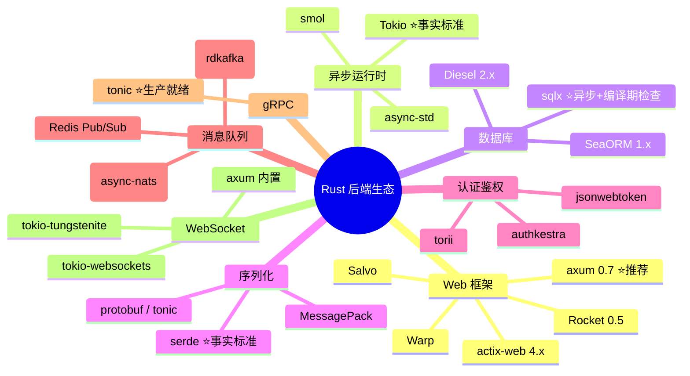

---

## 2. Web 框架深度对比

### 2.1 Rust 主流框架横评

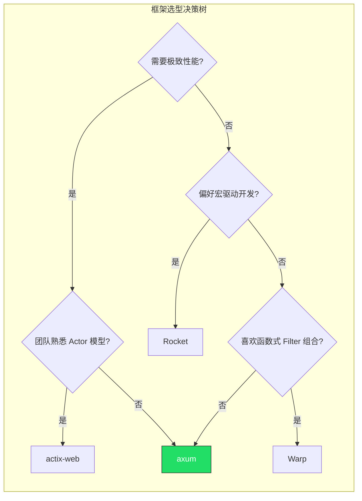

| 维度 | axum 0.7 | actix-web 4.x | Rocket 0.5 | Warp | Salvo |
|------|----------|---------------|------------|------|-------|
| 性能 (req/s) | ~320K | ~350K | ~180K | ~300K | ~310K |
| 异步运行时 | Tokio（深度集成） | Tokio（可选 actix-rt） | Tokio | Tokio | Tokio / Hyper |
| 中间件生态 | Tower（最丰富） | 自有中间件体系 | Fairings | Filter 组合 | 自有 Handler |
| WebSocket | 内置支持 | 内置支持 | 需第三方 | 内置支持 | 内置支持 |
| gRPC 兼容 | tonic 同端口共存 | 需独立端口 | 不支持 | 不支持 | 支持 |
| 宏依赖 | 极少 | 中等 | 重度 | 无 | 中等 |
| 学习曲线 | 中等 | 中等 | 低 | 高 | 低 |
| AI 生成友好度 | ⭐⭐⭐⭐⭐ | ⭐⭐⭐⭐ | ⭐⭐⭐⭐ | ⭐⭐⭐ | ⭐⭐⭐ |
| GitHub Stars | ~20K | ~22K | ~24K | ~10K | ~3K |
| 社区活跃度 | 极高（Tokio 团队维护） | 高 | 中 | 低（维护放缓） | 中 |

> 基准数据来源于 2025 年 5 月的实测对比，测试环境为标准 HTTP JSON 响应场景。参考 [markaicode.com](https://markaicode.com/rust-web-frameworks-performance-benchmark-2025/)。内容已概括整理。

### 2.2 为什么 IM 场景推荐 axum

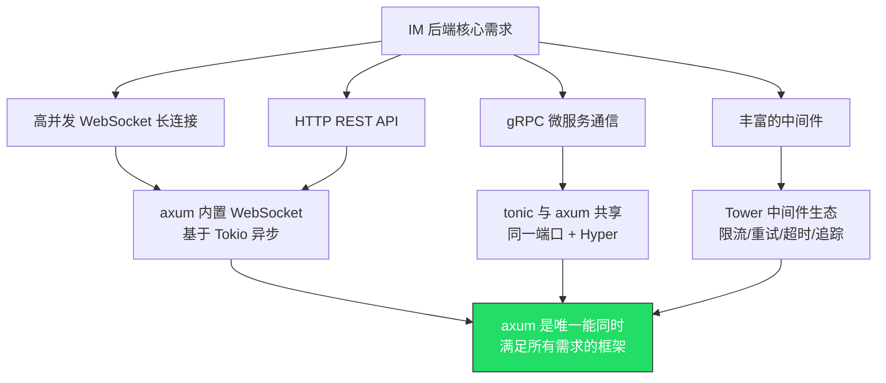

关键优势：
- axum 与 tonic（gRPC）共享底层 Hyper + Tower，可以在同一端口同时服务 HTTP 和 gRPC
- Tower 中间件生态是 Rust 最丰富的，限流、重试、超时、链路追踪开箱即用
- Tokio 团队直接维护，与异步运行时的兼容性最佳
- 极少使用宏，代码结构清晰，AI 生成和理解的准确率最高

---

## 3. 异步运行时与并发模型

### 3.1 Tokio — Rust 异步的事实标准

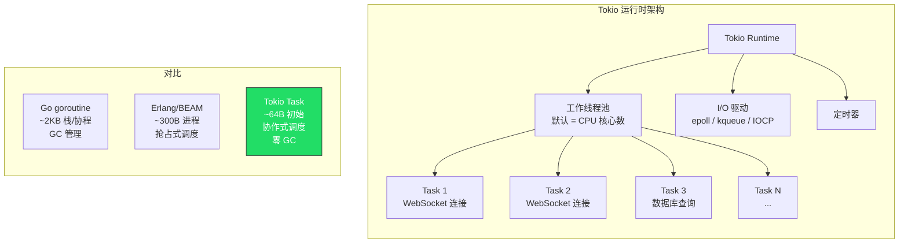

| 指标 | Tokio (Rust) | Goroutine (Go) | BEAM Process (Erlang/Elixir) | Node.js Event Loop |
|------|-------------|----------------|-----------------------------|--------------------|
| 单任务内存 | ~64 字节 | ~2 KB | ~300 字节 | N/A（单线程） |
| 调度模型 | 协作式 M:N | 协作式 M:N | 抢占式 M:N | 单线程事件循环 |
| 百万连接内存 | ~64 MB | ~2 GB | ~300 MB | 不适用 |
| CPU 密集任务 | 极优（零成本抽象） | 良好 | 差（BEAM 非为此设计） | 差（需 Worker） |
| I/O 密集任务 | 极优 | 极优 | 极优 | 优 |
| GC 停顿 | 无 | 有（STW） | 每进程独立 GC | 有（V8 GC） |

关键洞察：
- Tokio 的 Task 初始内存仅 ~64 字节，是 Go goroutine 的 1/30，这意味着同等硬件下 Rust 可以承载更多长连接
- 无 GC 意味着在高并发场景下不会出现延迟毛刺（tail latency），这对 IM 的消息投递时效性至关重要
- 协作式调度的代价是需要开发者避免阻塞操作，但 AI 编程工具能很好地识别和提醒这类问题

---

## 4. 数据库层选型

### 4.1 Rust ORM/数据库驱动对比

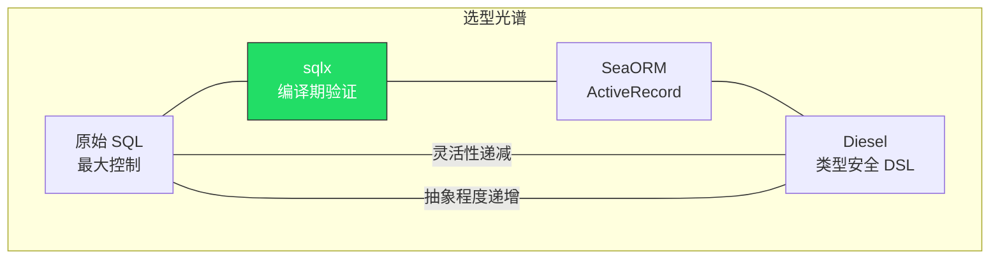

| 维度 | sqlx | SeaORM 1.x | Diesel 2.x |
|------|------|-----------|------------|
| 范式 | 原始 SQL + 编译期检查 | ActiveRecord ORM | 类型安全查询构建器 |
| 异步支持 | 原生 async | 原生 async（基于 sqlx） | 同步为主（async 实验性） |
| 编译期检查 | ✅ 验证 SQL 语法+类型 | ❌ 运行时 | ✅ 类型系统保证 |
| 迁移工具 | 内置 | 内置 | 内置 |
| 数据库支持 | PostgreSQL, MySQL, SQLite | PostgreSQL, MySQL, SQLite | PostgreSQL, MySQL, SQLite |
| 学习曲线 | 低（会写 SQL 就行） | 中（需学 ORM 概念） | 高（DSL + Schema 宏） |
| AI 生成友好度 | ⭐⭐⭐⭐⭐ | ⭐⭐⭐⭐ | ⭐⭐⭐ |
| 适合场景 | 性能敏感 + 复杂查询 | 快速 CRUD 开发 | 强类型保证 |

> 参考 [Diesel vs SQLx vs SeaORM 2026 对比](https://reintech.io/blog/diesel-vs-sqlx-vs-seaorm-rust-database-library-comparison-2026)。内容已概括整理。

### 4.2 IM 场景推荐：sqlx

```rust
// sqlx 编译期验证示例 — 如果表或列不存在，编译直接报错
let messages = sqlx::query_as!(
    Message,
    r#"
    SELECT id, sender_id, room_id, content, created_at
    FROM messages
    WHERE room_id = $1 AND created_at > $2
    ORDER BY created_at DESC
    LIMIT $3
    "#,
    room_id,
    since,
    limit
)
.fetch_all(&pool)
.await?;
```

选择 sqlx 的理由：
- IM 消息查询模式相对固定，原始 SQL 的灵活性足够
- 编译期验证 SQL 正确性，AI 生成的查询如果有误会在编译时被捕获
- 纯异步，与 Tokio 生态无缝配合
- 零运行时开销，性能最优

---

## 5. 通信协议选型

### 5.1 IM 场景的协议矩阵

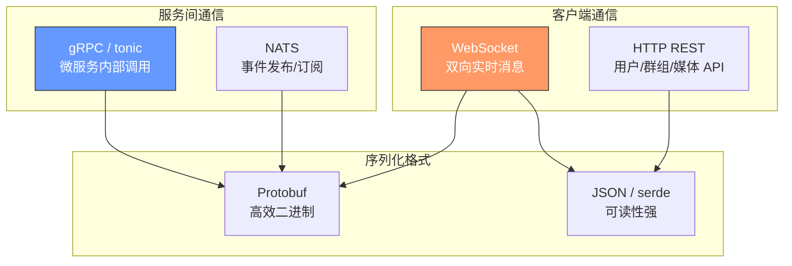

### 5.2 WebSocket vs gRPC Streaming vs SSE

| 维度 | WebSocket | gRPC 双向流 | SSE (Server-Sent Events) |
|------|-----------|------------|--------------------------|
| 方向 | 全双工 | 全双工 | 服务端→客户端 |
| 协议 | ws:// / wss:// | HTTP/2 | HTTP/1.1+ |
| 浏览器支持 | 原生支持 | 需 gRPC-Web 代理 | 原生支持 |
| 移动端支持 | 良好 | 良好 | 良好 |
| 二进制数据 | 支持 | 原生 Protobuf | 仅文本 |
| 连接复用 | 每连接一个 TCP | HTTP/2 多路复用 | 每连接一个 TCP |
| 断线重连 | 需自行实现 | 需自行实现 | 内置自动重连 |
| Rust 生态 | tokio-tungstenite / axum | tonic | axum SSE |
| IM 适用性 | ⭐⭐⭐⭐⭐ | ⭐⭐⭐⭐ | ⭐⭐（仅通知） |

IM 推荐策略：
- 客户端↔服务端：WebSocket（实时消息） + HTTP REST（非实时 API）
- 服务端↔服务端：gRPC（同步调用） + NATS（异步事件）

### 5.3 tonic — Rust gRPC 的标准选择

tonic 是 Rust 生态中生产就绪的 gRPC 实现，基于 Tokio + Hyper，支持双向流式通信。对于 IM 微服务间的通信（如消息路由、用户服务调用），gRPC 提供了强类型的接口定义和高效的二进制序列化。

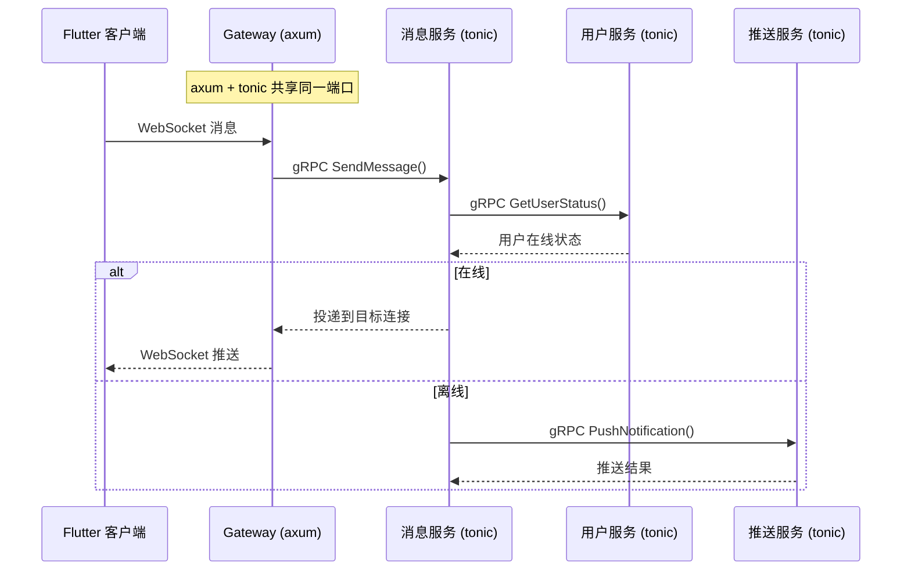

---

## 6. 跨语言后端技术栈对比

### 6.1 IM 后端四大技术路线

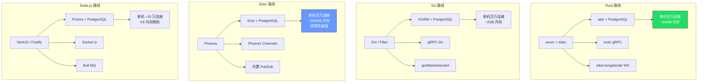

### 6.2 综合对比矩阵

| 维度 | Rust (axum) | Go (Gin/Fiber) | Elixir (Phoenix) | Node.js (NestJS) | Java (Spring) |
|------|-------------|----------------|-------------------|-------------------|---------------|
| **性能** |
| 请求吞吐量 | ~320K req/s | ~200K req/s | ~80K req/s | ~60K req/s | ~150K req/s |
| 单连接内存 | ~64B task | ~2KB goroutine | ~300B process | ~10KB | ~5KB thread |
| P99 延迟 | <1ms | 1-3ms (GC) | 1-2ms | 5-20ms (GC) | 3-10ms (GC) |
| **开发体验** |
| 语言学习曲线 | 陡峭 | 平缓 | 中等 | 平缓 | 中等 |
| AI 编程加持后 | 中等 | 平缓 | 中等 | 极平缓 | 平缓 |
| 编译/启动速度 | 慢编译/即时启动 | 快编译/即时启动 | 无编译/秒级启动 | 无编译/秒级启动 | 慢编译/慢启动 |
| 类型安全 | 极强（编译期） | 强 | 弱（动态类型） | 中（TypeScript） | 强 |
| **生态** |
| IM 开源项目 | 少（新兴） | 丰富（OpenIM, Tinode） | 中（Phoenix Channels） | 丰富（Socket.io） | 极丰富 |
| WebSocket 库 | 成熟 | 成熟 | 内置 | 成熟 | 成熟 |
| ORM/数据库 | sqlx/SeaORM | GORM/sqlc | Ecto | Prisma/TypeORM | JPA/MyBatis |
| **运维** |
| 部署产物 | 单一二进制 ~10MB | 单一二进制 ~15MB | Release ~50MB | node_modules ~200MB+ | JAR ~100MB+ |
| Docker 镜像 | scratch ~10MB | scratch ~15MB | ~100MB | ~200MB | ~300MB |
| 内存占用 | 极低 | 低 | 中 | 高 | 高 |
| **IM 特化** |
| 长连接承载 | ⭐⭐⭐⭐⭐ | ⭐⭐⭐⭐⭐ | ⭐⭐⭐⭐⭐ | ⭐⭐⭐ | ⭐⭐⭐⭐ |
| 消息延迟 | ⭐⭐⭐⭐⭐ | ⭐⭐⭐⭐ | ⭐⭐⭐⭐ | ⭐⭐⭐ | ⭐⭐⭐⭐ |
| 容错/热更新 | ⭐⭐ | ⭐⭐⭐ | ⭐⭐⭐⭐⭐ | ⭐⭐ | ⭐⭐⭐ |
| 端到端加密 | ⭐⭐⭐⭐⭐ | ⭐⭐⭐⭐ | ⭐⭐⭐ | ⭐⭐⭐ | ⭐⭐⭐⭐ |

### 6.3 各路线的最佳适用场景

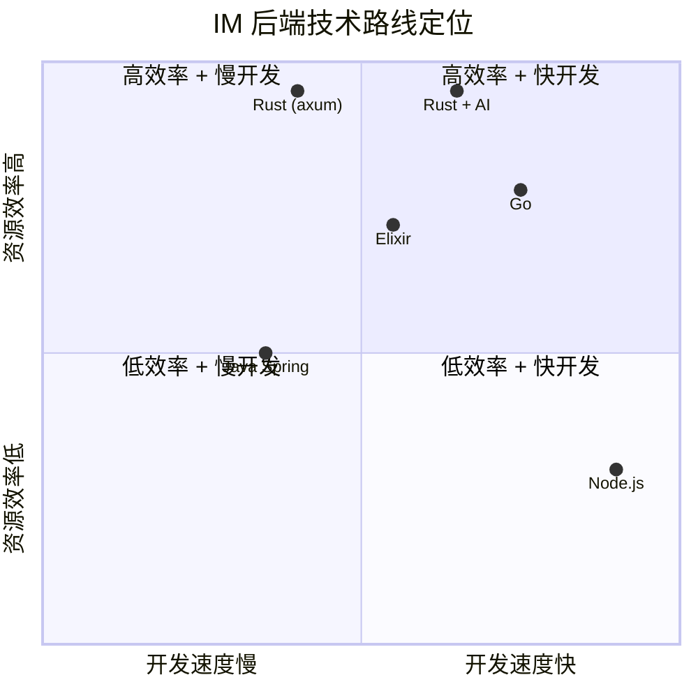

---

## 7. Rust IM 后端架构设计

### 7.1 推荐架构：模块化单体 → 微服务渐进

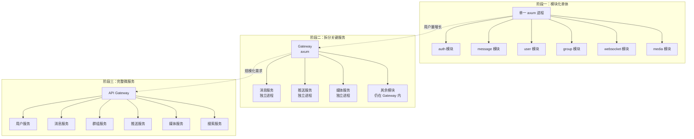

为什么推荐渐进式：
- 初期用模块化单体，开发和部署最简单，AI 生成代码也更容易保持一致性
- Rust 的 Cargo workspace 天然支持模块化，拆分时只需将 crate 独立部署
- 避免过早微服务化带来的分布式复杂度

### 7.2 Cargo Workspace 项目结构

```
flash-im/
├── Cargo.toml                 # workspace 根配置
├── crates/
│   ├── gateway/               # API 网关 + WebSocket 服务
│   │   ├── Cargo.toml
│   │   └── src/
│   ├── core/                  # 共享核心类型、错误、配置
│   │   ├── Cargo.toml
│   │   └── src/
│   ├── auth/                  # 认证鉴权
│   │   ├── Cargo.toml
│   │   └── src/
│   ├── message/               # 消息收发、存储、同步
│   │   ├── Cargo.toml
│   │   └── src/
│   ├── user/                  # 用户管理
│   │   ├── Cargo.toml
│   │   └── src/
│   ├── group/                 # 群组管理
│   │   ├── Cargo.toml
│   │   └── src/
│   ├── push/                  # 离线推送
│   │   ├── Cargo.toml
│   │   └── src/
│   └── media/                 # 媒体文件处理
│       ├── Cargo.toml
│       └── src/
├── proto/                     # Protobuf 定义（共享）
│   ├── message.proto
│   ├── user.proto
│   └── group.proto
├── migrations/                # 数据库迁移
└── config/                    # 配置文件
```

### 7.3 连接管理与消息路由

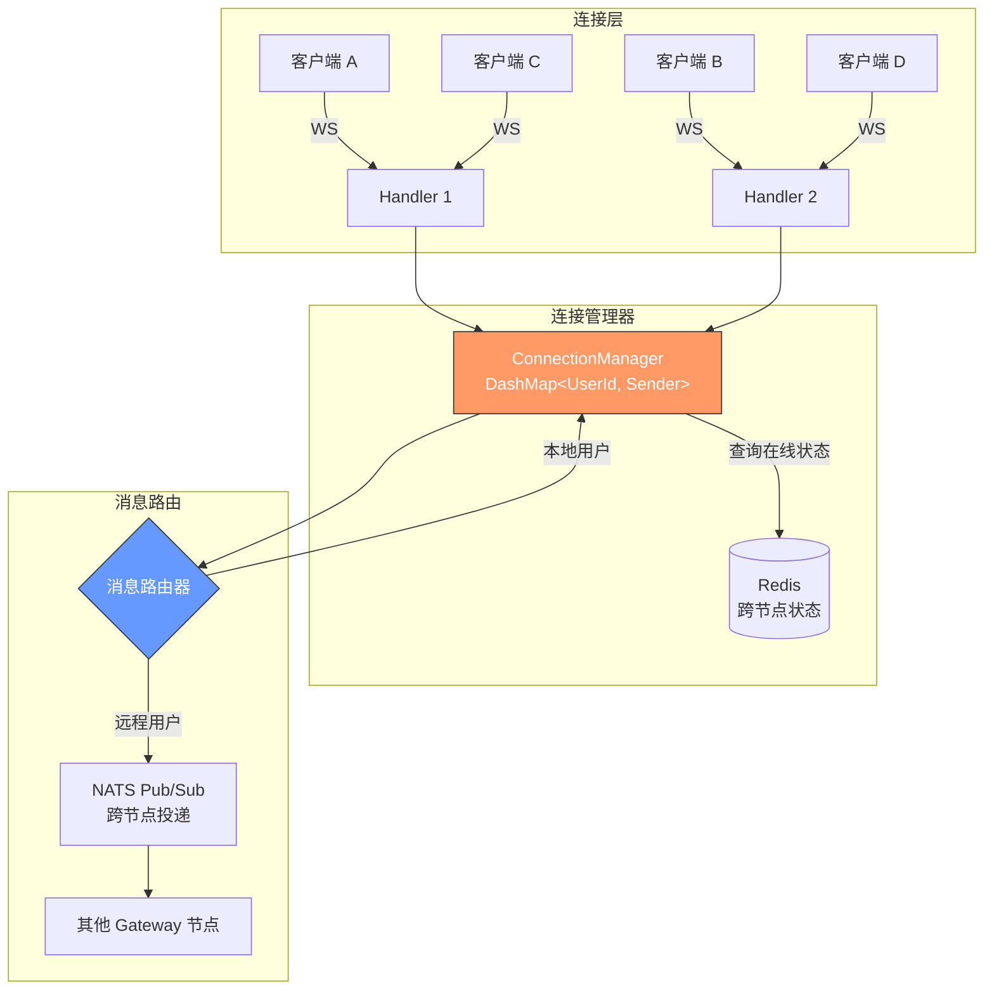

核心数据结构：
```rust
// 使用 DashMap 实现无锁并发连接管理
use dashmap::DashMap;
use tokio::sync::mpsc;

pub struct ConnectionManager {
    // UserId -> 消息发送通道（支持同一用户多设备）
    connections: DashMap<UserId, Vec<mpsc::Sender<WsMessage>>>,
}

impl ConnectionManager {
    pub async fn send_to_user(&self, user_id: &UserId, msg: WsMessage) -> Result<()> {
        if let Some(senders) = self.connections.get(user_id) {
            for sender in senders.iter() {
                sender.send(msg.clone()).await?;
            }
            Ok(())
        } else {
            // 用户不在本节点，通过 NATS 转发
            self.nats.publish(user_id, msg).await
        }
    }
}
```

---

## 8. AI 编程对 Rust 后端开发的影响

### 8.1 传统痛点 vs AI 加持

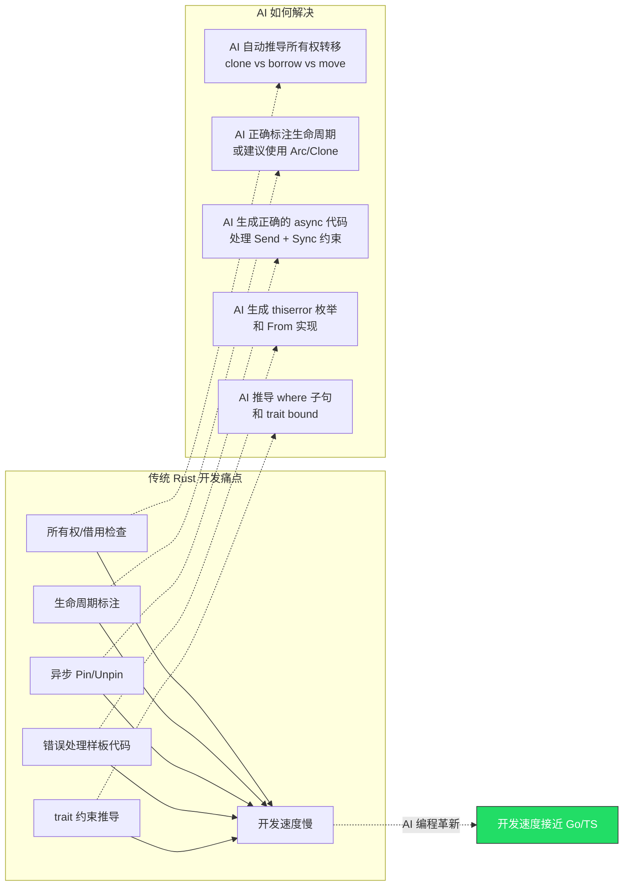

### 8.2 Rust 编译器 = AI 代码的质量守门员

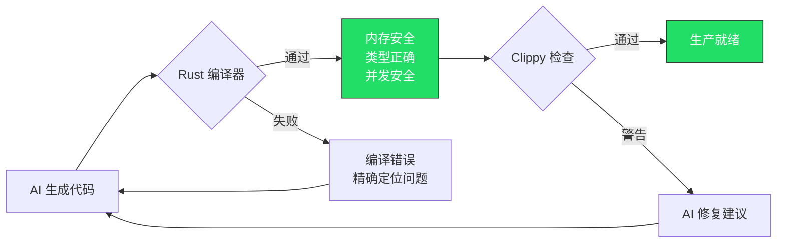

这是 Rust 在 AI 编程时代的独特优势：
- 动态语言（Python/JS）中 AI 生成的 bug 可能到运行时才暴露
- Go 的类型系统较弱，部分错误编译器无法捕获
- Rust 的编译器是最严格的"代码审查员"，AI 生成的代码如果有内存安全或并发问题，编译直接失败
- 形成 **AI 生成 → 编译器验证 → AI 修复 → 编译通过** 的高效闭环

---

## 9. 推荐技术栈总结

### 9.1 IM 后端完整技术栈

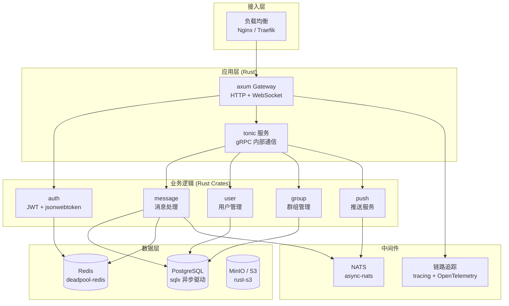

### 9.2 核心 Crate 清单

| 用途 | Crate | 版本状态 | 说明 |
|------|-------|---------|------|
| Web 框架 | `axum` | 0.7 稳定 | Tower 生态，WebSocket 内置 |
| 异步运行时 | `tokio` | 1.x 稳定 | 事实标准 |
| gRPC | `tonic` | 0.12 稳定 | 与 axum 共享 Hyper |
| 序列化 | `serde` + `serde_json` | 1.x 稳定 | 事实标准 |
| Protobuf | `prost` | 0.13 稳定 | tonic 默认使用 |
| 数据库 | `sqlx` | 0.8 稳定 | 异步 + 编译期 SQL 检查 |
| Redis | `deadpool-redis` | 稳定 | 连接池 + 异步 |
| 消息队列 | `async-nats` | 稳定 | NATS 官方异步客户端 |
| JWT | `jsonwebtoken` | 9.x 稳定 | RS256/HS256 |
| 密码哈希 | `argon2` | 稳定 | 推荐的密码哈希算法 |
| 并发容器 | `dashmap` | 稳定 | 无锁并发 HashMap |
| 错误处理 | `thiserror` + `anyhow` | 稳定 | 库用 thiserror，应用用 anyhow |
| 日志追踪 | `tracing` | 稳定 | 结构化日志 + OpenTelemetry |
| 配置 | `config` | 稳定 | 多源配置合并 |
| 对象存储 | `rust-s3` | 稳定 | S3 兼容 API |
| 加密 | `ring` / `rustls` | 稳定 | TLS + 密码学原语 |

---

## 10. 风险评估与应对

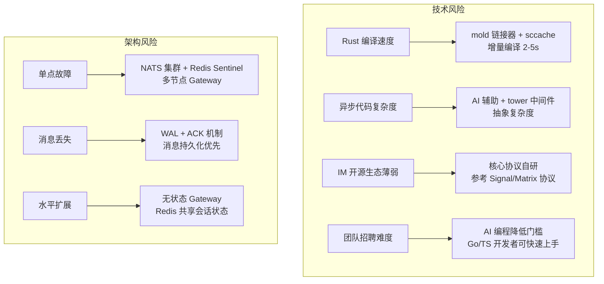

---

## 11. 结论

### Rust 作为 IM 后端的定位

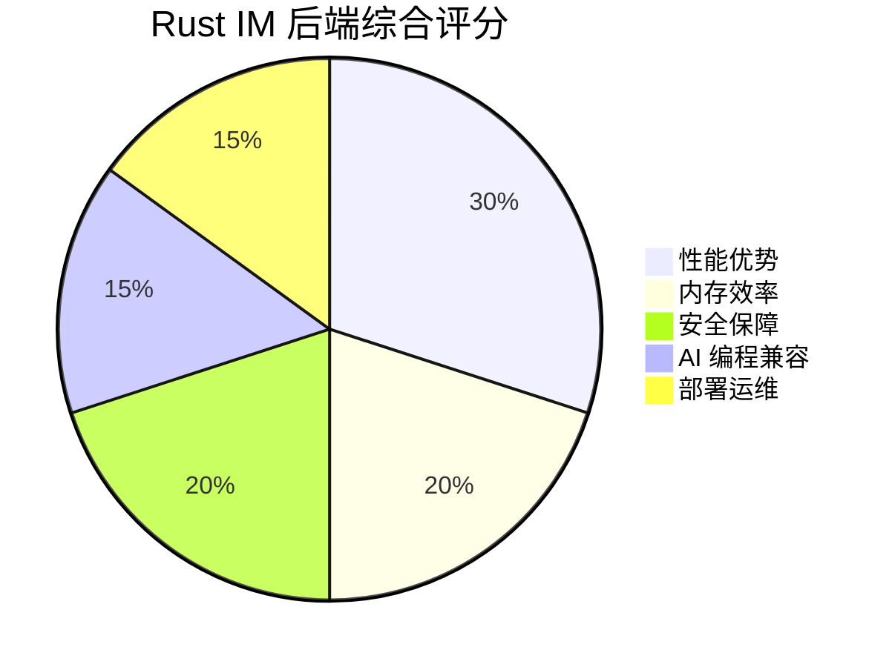

Rust 在 IM 后端场景的核心价值：

1. **极致的资源效率**：单机百万连接仅需 ~64MB 内存，是 Go 的 1/30，直接降低基础设施成本
2. **零 GC 延迟**：消息投递的 P99 延迟 <1ms，不会因 GC 停顿产生毛刺
3. **编译期安全网**：AI 生成的代码经过 Rust 编译器的严格检查，内存安全和并发安全有保障
4. **极简部署**：单一静态二进制，Docker 镜像 ~10MB，启动时间毫秒级

在 AI 编程的加持下，Rust 传统的学习曲线劣势被大幅削弱，而其性能和安全优势在 IM 这种高并发、低延迟、安全敏感的场景中被充分放大。

推荐技术路线：**axum + tokio + sqlx + tonic + NATS**，采用模块化单体起步，按需渐进拆分微服务。

---

*参考来源：[Rust Web Frameworks Benchmark 2025](https://markaicode.com/rust-web-frameworks-performance-benchmark-2025/)、[Rust Web Development 2026](https://calmops.com/programming/rust-web-development-2026/)、[Diesel vs SQLx vs SeaORM 2026](https://reintech.io/blog/diesel-vs-sqlx-vs-seaorm-rust-database-library-comparison-2026)、[Scalable WebSocket Server with Tokio](https://oneuptime.com/blog/post/2026-01-25-scalable-websocket-server-tokio-rust/view)、[Bidirectional gRPC Streaming with tonic](https://oneuptime.com/blog/post/2026-01-25-bidirectional-grpc-streaming-tonic-rust/view)。内容已重新整理和概括，以符合许可限制。*
