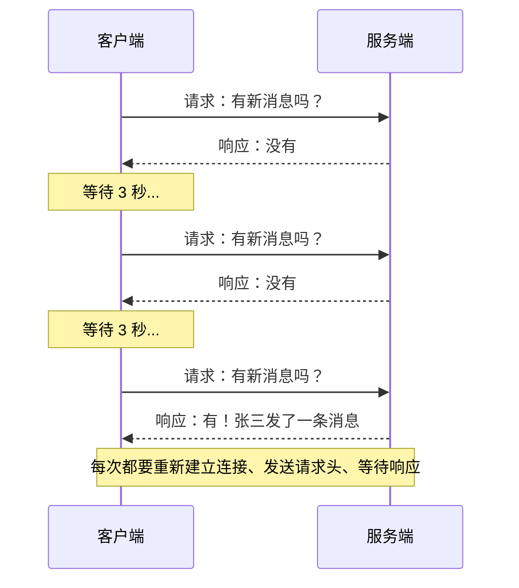
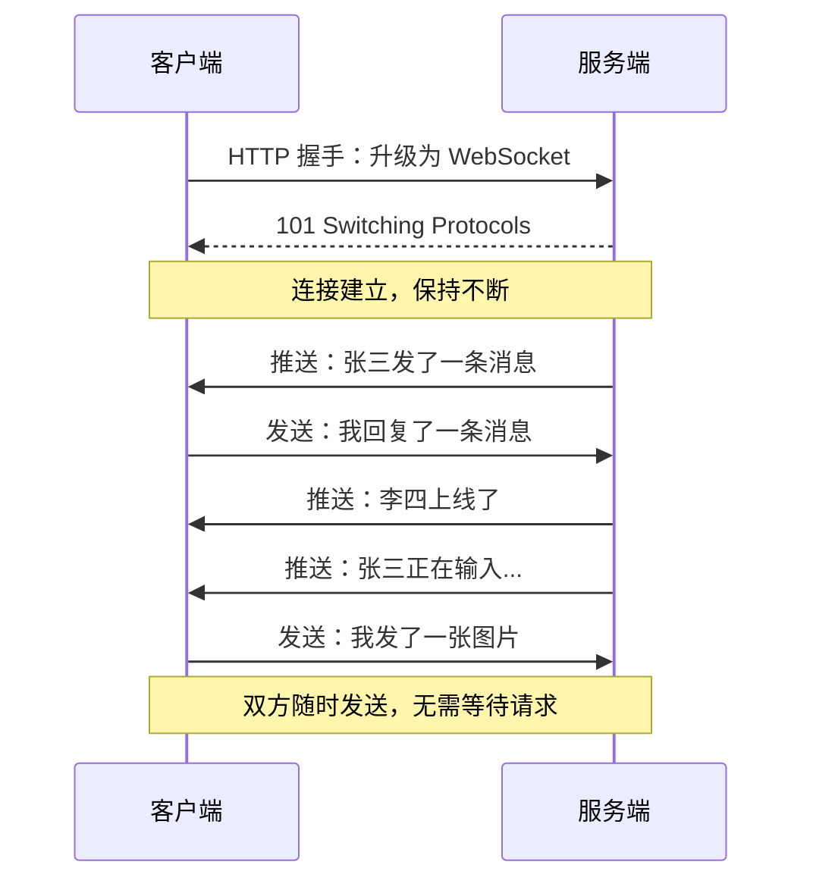
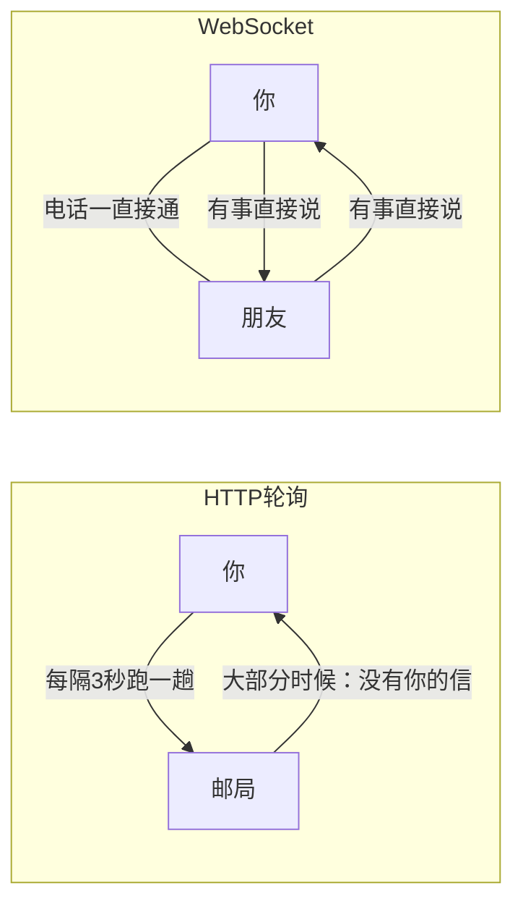
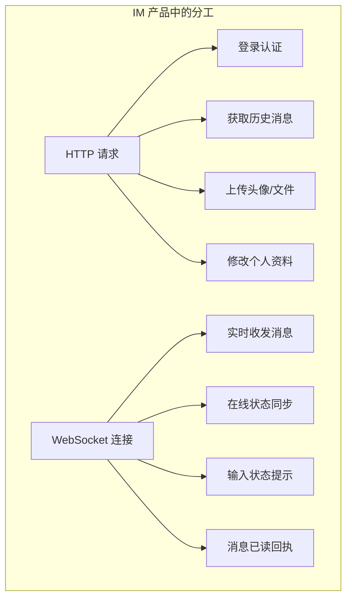

# HTTP vs WebSocket：为什么 IM 必须用 WebSocket

## 一、一句话理解区别

- **HTTP**：你问一句，我答一句。你不问，我永远不会主动说话。
- **WebSocket**：咱俩打个电话，谁有话随时说，不用挂断重拨。

---

## 二、通信流程对比

### HTTP：请求-响应模式

HTTP 是**单向的、一次性的**。客户端发起请求，服务端返回响应，连接就断了。想知道有没有新消息？只能不停地问——这就是所谓的**轮询（Polling）**。

问题很明显：
- 大部分请求都是"没有新消息"，白白浪费带宽和服务器资源
- 消息延迟取决于轮询间隔——3 秒轮询一次，最坏情况下消息要等 3 秒才能收到
- 轮询越频繁越实时，但服务器压力越大；轮询越稀疏越省资源，但用户体验越差

### WebSocket：全双工持久连接

WebSocket 是**双向的、持久的**。连接建立后一直保持，服务端可以**主动推送**消息给客户端，客户端也可以随时发送数据。没有多余的请求头开销，没有轮询的浪费。

---

## 三、核心差异对比

| 维度 | HTTP | WebSocket |
|------|------|-----------|
| 通信方向 | 单向（客户端→服务端） | 双向（任意一方主动发送） |
| 连接方式 | 短连接（请求完即断） | 长连接（建立后持续保持） |
| 服务端推送 | 不支持（只能客户端轮询） | 原生支持 |
| 数据开销 | 每次请求携带完整 HTTP 头（几百字节） | 数据帧头仅 2-10 字节 |
| 实时性 | 取决于轮询频率（秒级延迟） | 毫秒级（消息即时到达） |
| 服务器压力 | 高（大量无效轮询请求） | 低（只在有消息时传输） |
| 适用场景 | 网页浏览、API 调用、表单提交 | IM 聊天、实时协作、游戏、股票行情 |

---

## 四、用生活场景理解

- **HTTP 轮询**像是你每隔几分钟就跑一趟邮局问"有没有我的信"。大部分时候白跑一趟，偶尔才有信。
- **WebSocket**像是你和朋友打了一个电话，电话一直不挂。有事直接说，没事就安静待着，不浪费任何精力。

---

## 五、为什么 IM 产品必须用 WebSocket

即时通信的核心需求是**"即时"**——消息要在发出的瞬间到达对方。这个需求决定了 HTTP 轮询方案在 IM 场景下是不可接受的：

### 1. 实时性要求

IM 用户期望消息在毫秒级送达。HTTP 轮询的延迟取决于轮询间隔，即使 1 秒轮询一次，平均延迟也有 500ms，且服务器要承受巨大的无效请求压力。WebSocket 的消息推送是即时的——服务端收到消息的瞬间就能转发给接收方。

### 2. 多种实时事件

IM 不只是收发消息。还有：
- 对方"正在输入..."的状态提示
- 好友上线/下线通知
- 消息已读回执
- 群成员变动通知

这些都需要服务端**主动推送**给客户端。HTTP 做不到主动推送，只能靠客户端不停地问。

### 3. 资源效率

假设一个 IM 应用有 10 万在线用户，每人每秒轮询一次：
- HTTP 轮询：每秒 10 万次请求，绝大部分返回"无新消息"
- WebSocket：10 万条持久连接，只在有消息时才传输数据

WebSocket 的资源利用率远高于 HTTP 轮询。

### 4. 移动端电量与流量

手机上频繁的 HTTP 请求意味着频繁的网络唤醒，直接影响电池续航和流量消耗。WebSocket 的长连接在空闲时几乎不消耗资源，配合心跳机制保活即可。

---

## 六、它们不是替代关系

需要强调的是：WebSocket 不是用来替代 HTTP 的，它们各有所长。

在一个完整的 IM 产品中：
- **HTTP** 负责"一问一答"的场景：登录、获取历史记录、上传文件、修改设置
- **WebSocket** 负责"实时推送"的场景：消息收发、状态同步、通知推送

两者配合，才是完整的通信架构。

---

## 七、总结

> HTTP 是写信，WebSocket 是打电话。IM 产品需要的是随时能说话的电话，而不是等回信的邮局。

对于即时通信产品来说，WebSocket 不是"更好的选择"，而是**唯一合理的选择**。它提供了 IM 最核心的能力：服务端主动推送、毫秒级实时性、低资源开销的持久连接。

---

## 角色设定

### 🐱 闪闪（Flash）— 主角，一只橘色小猫
- 身份：闪讯 App 的化身，正在"成长"的小生命
- 性格：好奇、活泼、偶尔犯迷糊
- 口头禅："喵？这是什么原理？"
- 视觉特征：头顶一个小闪电⚡标志，大眼睛，尾巴会随情绪变化

### 🦉 智叔（Wise）— 导师，一只戴眼镜的猫头鹰
- 身份：技术世界的老前辈，什么都懂
- 性格：沉稳、爱用比喻讲道理、偶尔毒舌
- 口头禅："年轻人，让我给你讲个故事……"
- 视觉特征：圆眼镜、学者帽、翅膀下夹着一本书

### 🐛 小虫（Bug）— 反派/搞笑担当，一只绿色小虫子
- 身份：代码世界里的 Bug，专门捣乱
- 性格：贱萌、总在关键时刻出现搞破坏
- 口头禅："嘿嘿，你忘了处理我吧～"
- 视觉特征：绿色毛毛虫，坏笑表情，头顶两根触角像天线

---

## 第 08 章漫画：心脏开始跳动（WebSocket）

### 漫画 1：HTTP vs WebSocket（放在"二、问问 AI"之后）

**主题：为什么 HTTP 不够用**

#### 分镜 1-1「跑腿的闪闪」
- 画面：闪闪满头大汗地在"服务端邮局"和"家"之间来回跑
- 闪闪（气喘吁吁）："有我的信吗？！"
- 邮局柜台的智叔（淡定）："没有。"
- 旁白：`HTTP 轮询：每隔几秒跑一趟邮局问有没有新消息`
- 画风：闪闪跑了 5 趟，地上画出来回的虚线脚印

#### 分镜 1-2「第六趟」
- 画面：闪闪趴在柜台上，舌头伸出来，快累瘫了
- 闪闪："有……有我的信吗……"
- 智叔（终于拿出一封信）："有了，张三给你的。"
- 闪闪内心 OS：`为了这一封信，我跑了六趟……`

#### 分镜 1-3「智叔的提议」
- 画面：智叔推了推眼镜，掏出一部电话
- 智叔："年轻人，为什么不直接打电话呢？有信我直接告诉你。"
- 闪闪（眼睛亮了）："喵！这就是 WebSocket？！"
- 旁白：`WebSocket：打个电话不挂断，有消息随时说`

#### 分镜 1-4「电话接通」
- 画面：闪闪舒服地躺在沙发上，耳朵贴着电话
- 电话那头智叔："张三发了条消息～" "李四上线了～" "王五正在输入……"
- 闪闪（惬意地摇尾巴）："这才是生活喵～"
- 小虫（角落里嘀咕）："哼，等电话断了有你好看的……"
- 旁白：`全双工通信：双方随时发送，不用等待请求`
