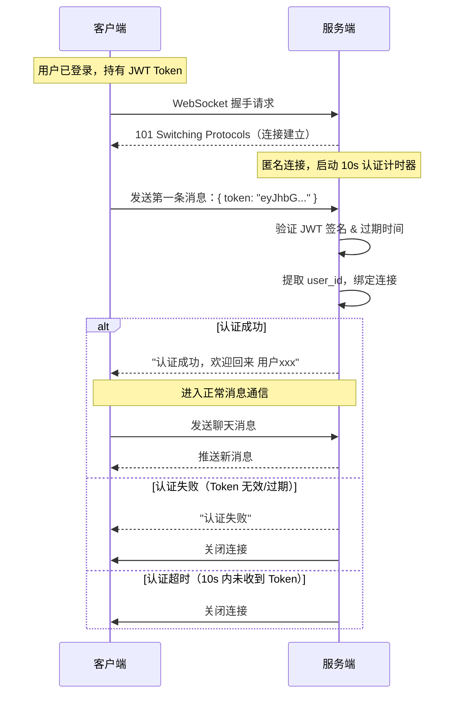

# WebSocket + JWT 认证流程

## 整体流程

在正式的 IM 产品中，WebSocket 连接建立后的身份认证分为三个阶段：

### 1. 前置：用户已通过 HTTP 登录，持有有效的 JWT Token

用户在 WebSocket 连接之前，已经通过 HTTP 接口（如 `/auth/login`）完成了登录，客户端本地保存了 JWT Token。

### 2. 连接建立：WebSocket 握手

客户端发起 WebSocket 连接请求。此时连接已建立，但服务端还不知道对方是谁——这是一个"匿名连接"。

### 3. 首消息认证：客户端发送 Token

连接建立后，客户端必须在第一条消息中发送 JWT Token。服务端收到后：
- 验证 Token 签名是否合法
- 检查 Token 是否过期
- 提取 `user_id`，将此连接与用户身份绑定

如果验证失败或超时（通常设置 10 秒），服务端主动关闭连接。

### 4. 认证通过：进入正常通信

认证通过后，服务端将 `user_id` 与该 WebSocket 连接绑定。后续所有消息都带有身份上下文，服务端知道每条消息来自谁、应该发给谁。

---

## 时序图

---

## 为什么不在握手阶段传 Token？

一种常见的替代方案是在 WebSocket 握手时通过 URL 参数传递 Token：`ws://host/ws?token=xxx`。这种方式更简单，但有安全隐患：

- URL 会被记录在服务器日志、代理日志、浏览器历史中
- Token 暴露在传输链路的明文部分

首消息认证的方式更安全：Token 在 WebSocket 的数据帧中传输，不会出现在 URL 里。

---

## 关键设计要点

| 要点 | 说明 |
|------|------|
| 超时机制 | 连接建立后 10 秒内必须完成认证，防止空连接占用资源 |
| Token 来源 | 复用 HTTP 登录时获取的 JWT，不需要额外的认证流程 |
| 连接绑定 | 认证通过后，`user_id` 与连接绑定，后续消息自动携带身份 |
| 断线重连 | 重连后需要重新发送 Token 认证，不能假设之前的身份仍然有效 |
| Token 刷新 | 如果 Token 即将过期，客户端应在 HTTP 层刷新后，在下次重连时使用新 Token |
