# Mermaid：用写字的方式画图

> 献给每一个被"画图"折磨过的朋友

---

## 你有没有遇到过这些场景？

- 想画个流程图，打开 Visio / Draw.io，拖了半天方块，对齐对到怀疑人生
- 写完文档想配张架构图，结果截图糊了、版本对不上
- 团队协作时，别人的 `.pptx` 里的图你改不动
- 用 Git 管理项目，但图片是二进制文件，diff 看不出改了啥

如果你中了任何一条，Mermaid 就是来拯救你的。

---

## 一句话解释 Mermaid

**Mermaid 是一种用纯文本语法来画图的工具。** 你写几行代码，它帮你渲染成好看的图。

就像 Markdown 让你用 `# 标题` 写出漂亮文档一样，Mermaid 让你用简单的文字描述画出专业的图表。

---

## 来，30 秒上手

### 画一个流程图

你只需要写这些文字：

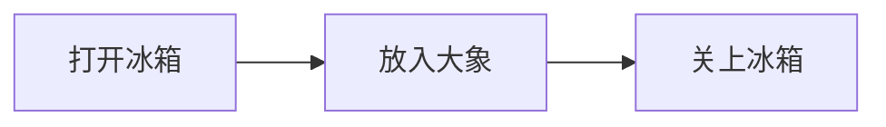

就这样，三行文字，一张流程图就出来了。没有拖拽，没有对齐，没有导出。

### 再来一个时序图

描述两个人聊天的过程：

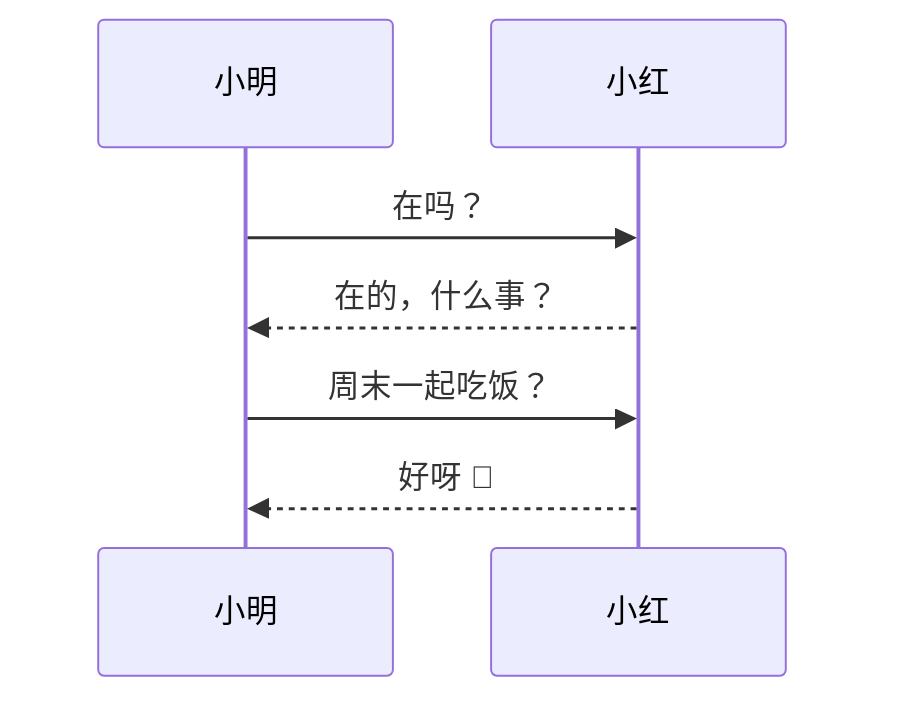

是不是很直观？你写的就是你想表达的，Mermaid 负责把它变好看。

---

## Mermaid 能画什么？

| 图表类型 | 语法关键词 | 适用场景 |
|---------|-----------|---------|
| 流程图 | `graph` / `flowchart` | 业务流程、决策逻辑、操作步骤 |
| 时序图 | `sequenceDiagram` | API 调用、系统交互、消息传递 |
| 类图 | `classDiagram` | 面向对象设计、数据模型 |
| 状态图 | `stateDiagram-v2` | 订单状态、生命周期 |
| ER 图 | `erDiagram` | 数据库表关系 |
| 甘特图 | `gantt` | 项目排期、里程碑 |
| 饼图 | `pie` | 数据占比 |
| 象限图 | `quadrantChart` | 多维度对比分析 |
| Git 图 | `gitgraph` | 分支策略可视化 |
| 思维导图 | `mindmap` | 头脑风暴、知识梳理 |

---

## 每种图表速览

### 流程图 — 最常用的万能选手

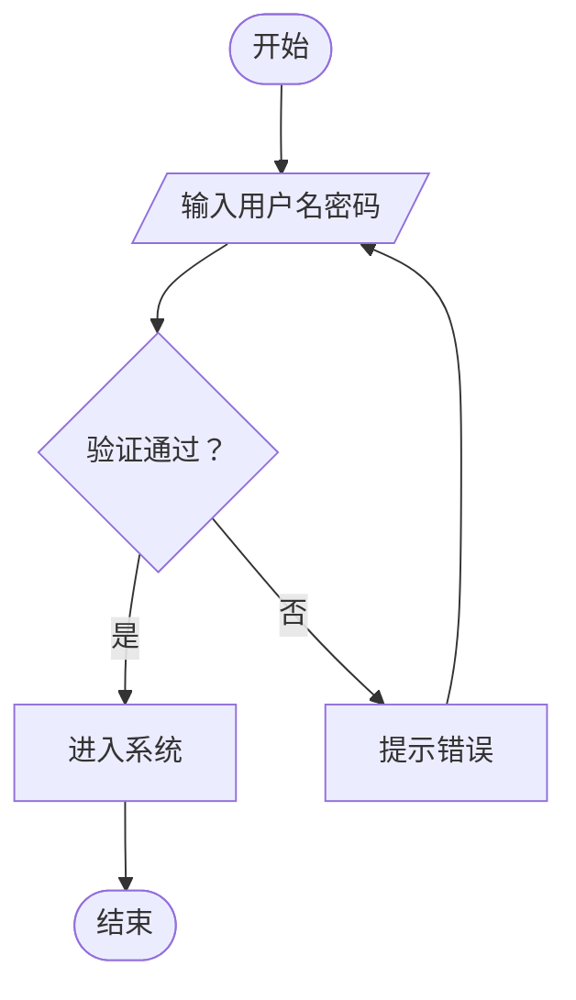

小贴士：
- `TD` 表示从上到下（Top-Down），`LR` 表示从左到右
- `[]` 方框、`{}` 菱形（判断）、`([])` 圆角（起止）、`[//]` 平行四边形（输入输出）
- `-->` 实线箭头、`-.->` 虚线箭头、`==>` 粗线箭头
- `-->|文字|` 在箭头上加标注

### 时序图 — 系统交互的最佳表达

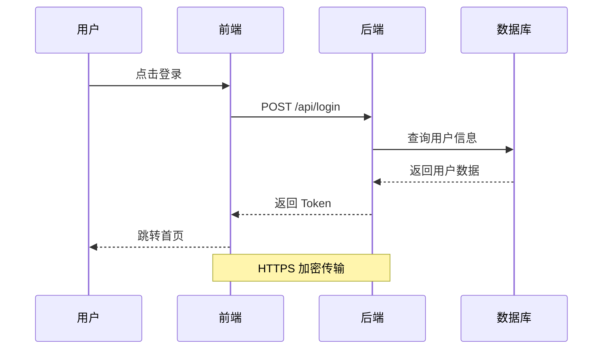

小贴士：
- `->>` 实线箭头（请求）、`-->>` 虚线箭头（响应）
- `participant` 定义参与者，`as` 起别名
- `Note over` 添加注释说明
- `alt` / `opt` / `loop` 表示条件和循环

### 类图 — 程序员的老朋友

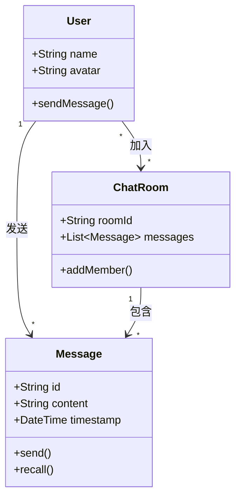

### 状态图 — 描述事物的生命周期

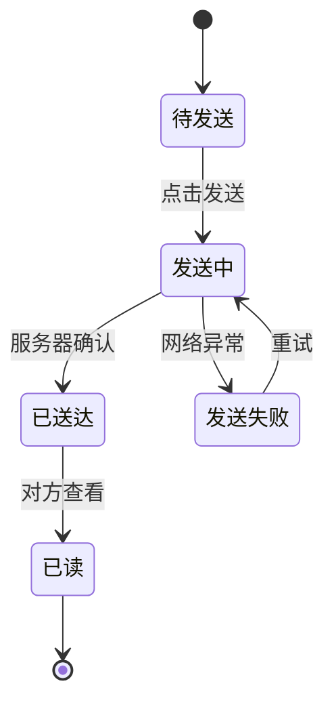

### ER 图 — 数据库设计利器

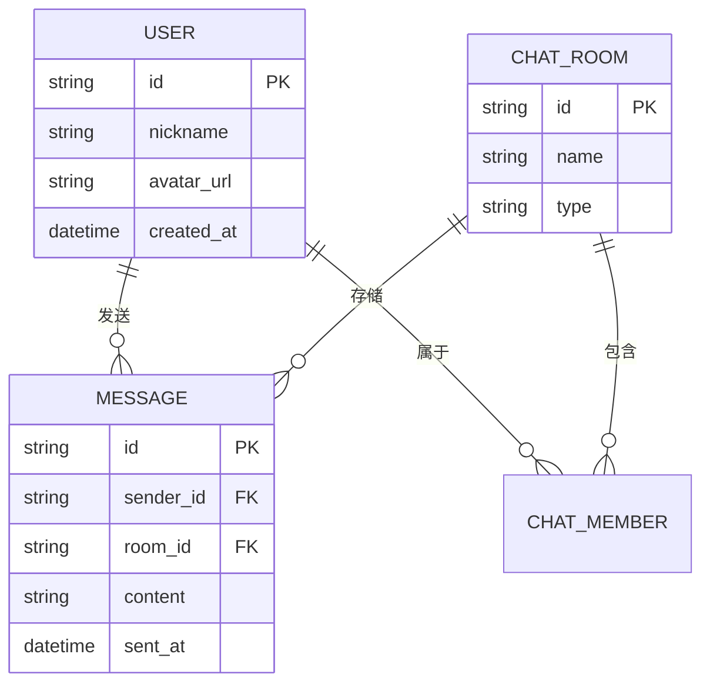

### 甘特图 — 项目管理好帮手

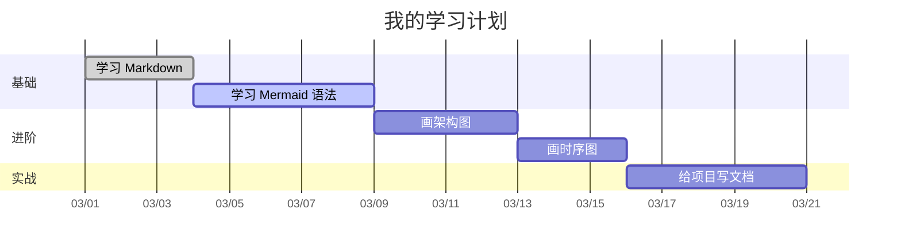

### 饼图 — 简单直观

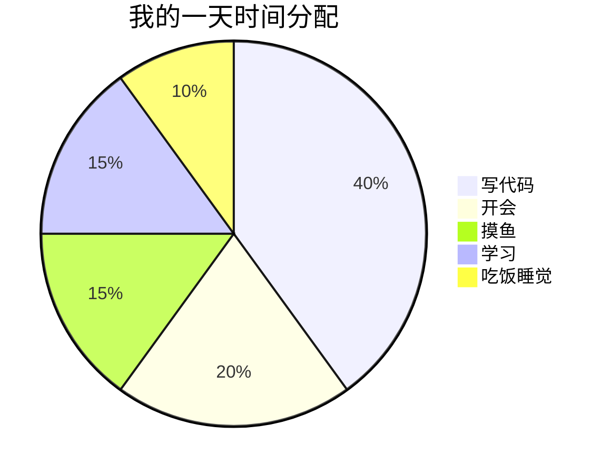

### 思维导图 — 发散思维

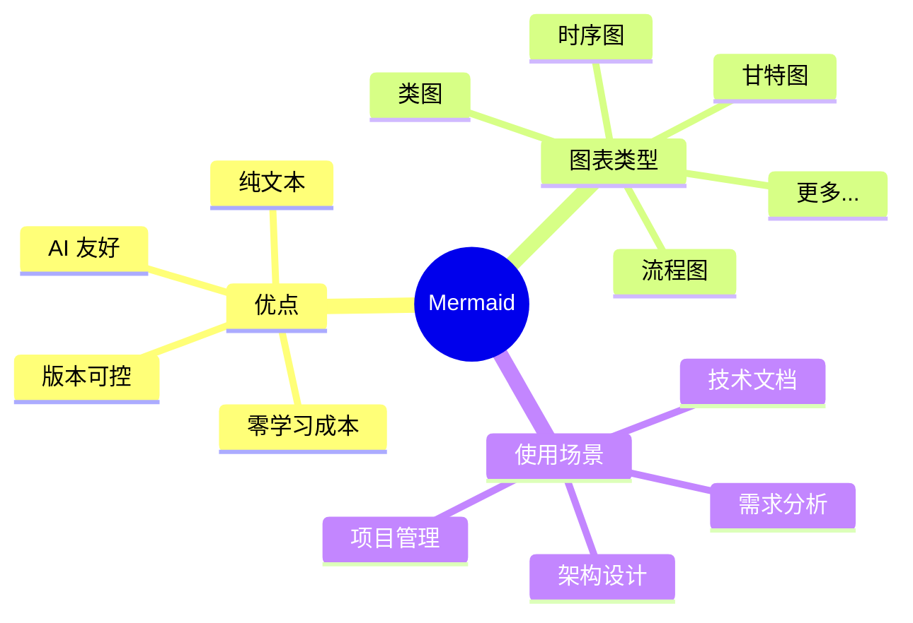

---

## 在哪里用 Mermaid？

Mermaid 几乎无处不在：

- **GitHub / GitLab**：Markdown 文件中直接写 ```` ```mermaid ```` 代码块就能渲染
- **VS Code / Kiro**：安装 Mermaid 预览插件即可实时预览
- **Notion / Typora / Obsidian**：原生支持
- **在线编辑器**：[mermaid.live](https://mermaid.live) 即开即用
- **文档工具**：VitePress、Docusaurus、MkDocs 等均支持

---

## 🌟 AI 时代，Mermaid 为什么变得更重要了？

这是我最想和你聊的部分。

### 1. AI 天生就会写 Mermaid

大语言模型（ChatGPT、Claude、Kiro 等）对 Mermaid 语法的掌握非常好。你只需要说：

> "帮我画一个用户下单的流程图"

AI 就能直接输出可渲染的 Mermaid 代码。**这意味着"画图"这件事的成本趋近于零。**

而传统的图片格式（PNG、Visio 文件），AI 既不容易生成，也不容易修改。

### 2. 文本 = 可协作 + 可版本控制

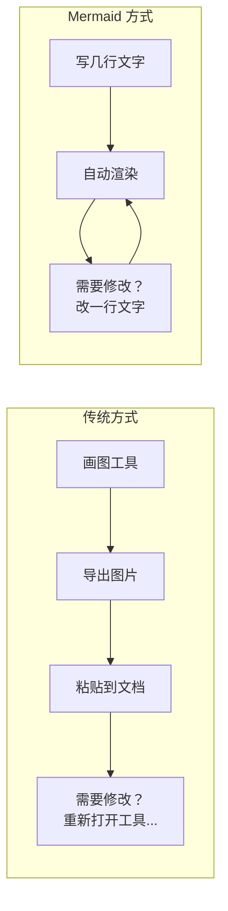

Mermaid 图表就是代码，可以：
- 用 Git 追踪每一次修改
- 在 Pull Request 中 review 图表变更
- 多人协作不会出现"谁的版本是最新的"问题

### 3. AI + Mermaid = 思维的加速器

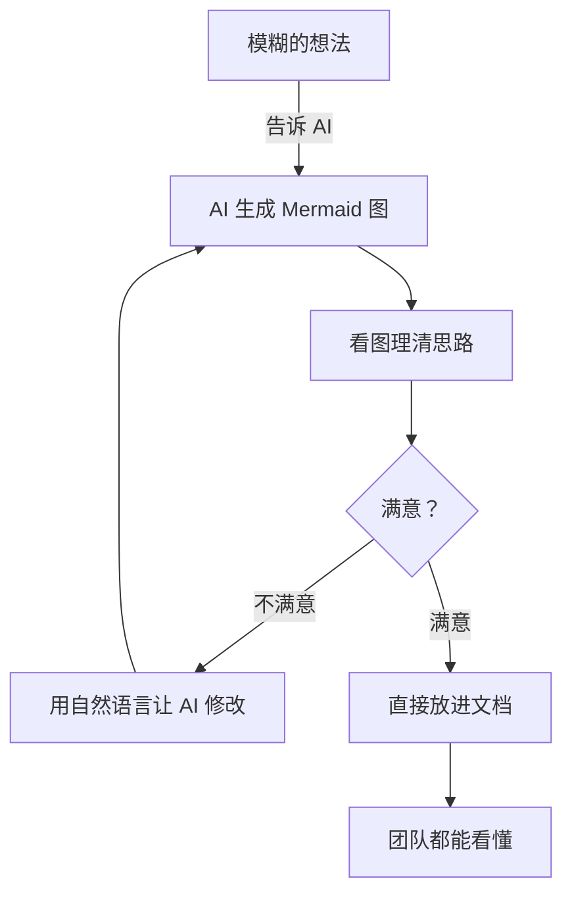

在 AI 时代，Mermaid 成为了**人与 AI 之间的"图形语言"**：
- 你用自然语言描述需求，AI 用 Mermaid 画出来
- 你看图发现问题，用自然语言让 AI 调整
- 最终产出的图表直接嵌入文档，无需任何额外工具

### 4. 文档即代码（Docs as Code）

在现代软件工程中，越来越多的团队践行"文档即代码"理念。Mermaid 完美契合这一趋势：

| 传统图表 | Mermaid 图表 |
|---------|-------------|
| 二进制文件，无法 diff | 纯文本，Git diff 友好 |
| 需要专门工具打开 | 任何文本编辑器可编辑 |
| AI 无法直接生成/修改 | AI 可以流畅地读写 |
| 容易和文档脱节 | 和文档在同一个文件里 |
| 团队成员需要学习工具 | 语法 5 分钟上手 |

---

## 快速参考卡片

```
流程图:     graph TD / LR / BT / RL
时序图:     sequenceDiagram
类图:       classDiagram
状态图:     stateDiagram-v2
ER图:       erDiagram
甘特图:     gantt
饼图:       pie
象限图:     quadrantChart
Git图:      gitgraph
思维导图:   mindmap

箭头:  --> 实线  -.-> 虚线  ==> 粗线
节点:  [] 方框  {} 菱形  () 圆角  [()] 圆柱  (()) 圆形
```

---

## 最后

Mermaid 不是什么高深的技术，它就是一个让你**用最低成本把脑子里的东西可视化**的工具。

在 AI 时代，它的价值被放大了无数倍——因为 AI 能写文字，而 Mermaid 让文字变成图。这个组合打通了从"想法"到"可视化文档"的最后一公里。

学它不需要一天，用它可能会用一辈子。

开始试试吧 🚀
