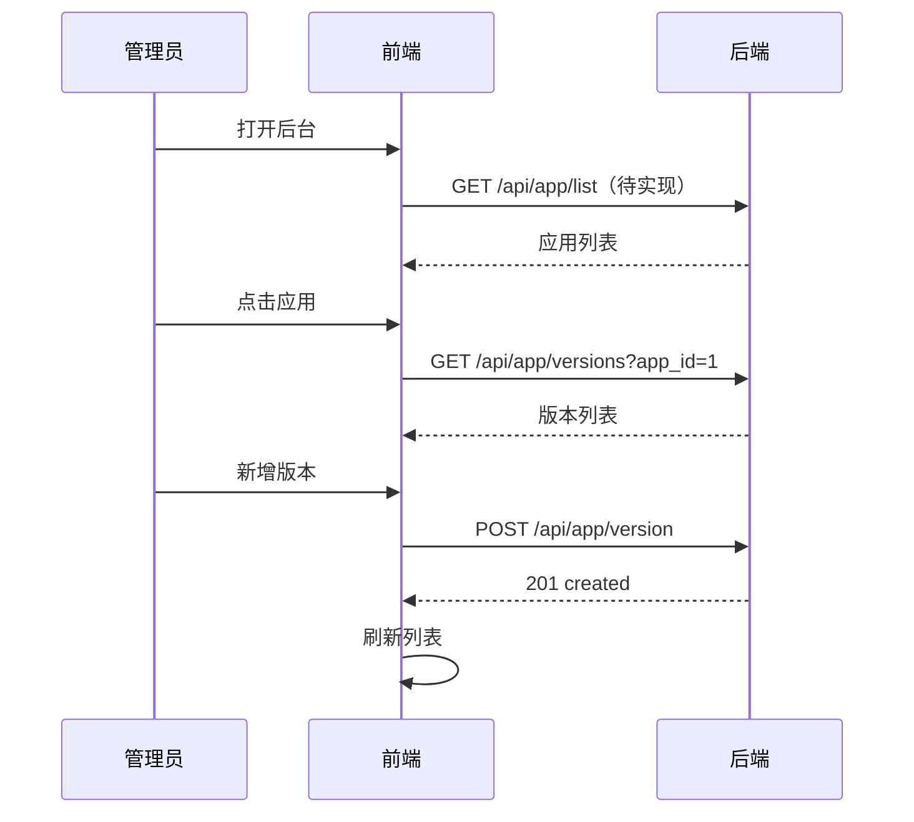
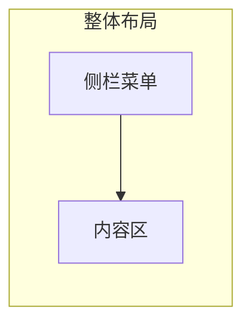

# App 管理后台 — 功能分析

## 概述

为闪讯后端的 app-center 模块提供一个 Web 管理界面。管理员可以在浏览器中查看、新增、编辑应用和版本信息，替代手动执行 SQL。本版本不做鉴权，直接访问即可操作。

---

## 一、交互链

### 场景 1：查看应用列表

**用户故事**：作为管理员，我打开后台想看到当前管理的所有应用。

打开后台首页 → 看到应用列表（id、名称、描述、创建时间）→ 点击某个应用 → 进入该应用的版本管理页。

### 场景 2：新增应用

**用户故事**：作为管理员，我想注册一个新的应用，以便后续为它管理版本。

在应用列表页 → 点击"新增应用" → 填写 ID、名称、描述 → 点击保存 → 列表刷新，新应用出现。

### 场景 3：查看版本列表

**用户故事**：作为管理员，我想看到某个应用在各平台的所有版本记录。

进入版本管理页 → 看到该应用的版本列表（平台、版本号、下载地址、大小、是否强制更新、发布时间）→ 支持按平台筛选。

### 场景 4：新增版本

**用户故事**：作为管理员，我发布了新版本后，想在后台录入版本信息，以便客户端检测到更新。

在版本列表页 → 点击"新增版本" → 填写平台、版本号、下载地址、文件大小、SHA256、更新日志、是否强制更新 → 保存 → 列表刷新。

### 场景 5：编辑版本

**用户故事**：作为管理员，我想修改已发布版本的信息（如修正下载地址、开启强制更新）。

在版本列表 → 点击某条记录的"编辑" → 修改字段 → 保存 → 列表刷新。

---

## 二、逻辑树

### 事件流

| 时刻 | 事件 | 处理 | 产生的新事件 |
|------|------|------|-------------|
| T1 | 打开后台 | 前端请求应用列表（暂无接口，后续加；或直接从 app_versions 聚合） | 渲染列表 |
| T2 | 点击应用 | 路由跳转到版本管理页，携带 app_id | 请求版本列表 |
| T3 | 请求版本列表 | GET /api/app/version?app_id=xxx&platform=all（需后端支持） | 渲染列表 |
| T4 | 新增版本 | POST /api/app/version | 刷新列表 |
| T5 | 编辑版本 | PUT /api/app/version?app_id=xxx&platform=xxx&version=xxx | 刷新列表 |

### 需要后端补充的接口

| 接口 | 说明 | 当前状态 |
|------|------|---------|
| GET /api/app/list | 获取所有应用列表 | ❌ 待实现 |
| POST /api/app | 新增应用 | ❌ 待实现 |
| GET /api/app/versions?app_id=xxx | 获取某应用全部版本（所有平台） | ❌ 待实现 |
| GET /api/app/version?app_id=xxx&platform=xxx | 查询单平台最新版本 | ✅ 已有 |
| POST /api/app/version | 新增版本 | ✅ 已有 |
| PUT /api/app/version | 更新版本 | ✅ 已有 |

---

## 三、技术栈

| 技术 | 版本 | 用途 |
|------|------|------|
| React | 19 | UI 框架 |
| TypeScript | 5.x | 类型安全 |
| Vite | 6+ | 构建工具 |
| shadcn/ui | latest | UI 组件库 |
| Tailwind CSS | 4 | 样式 |
| TanStack Query | 5 | 数据请求 |
| React Router | 7 | 路由 |
| React Hook Form + Zod | latest | 表单 + 验证 |

---

## 四、页面规划

### 布局结构

固定布局：左侧为导航菜单（可收起），右侧为内容区域。顶部可放标题/面包屑。

### 侧栏菜单

| 菜单项 | 图标 | 路由 | 说明 |
|--------|------|------|------|
| 应用管理 | AppWindow | /apps | 应用列表 CRUD |
| 版本管理 | Package | /apps/:appId/versions | 从应用列表进入 |

后续可扩展：用户管理、数据统计、系统设置等。

### 路由

| 路由 | 页面 | 功能 |
|------|------|------|
| / | 重定向到 /apps | — |
| /apps | 应用列表 | 展示所有应用，新增/编辑应用 |
| /apps/:appId/versions | 版本列表 | 展示某应用的所有版本，支持筛选/新增/编辑 |

---

## 五、结论

- **开发顺序**：后端补接口（app 列表 + versions 列表）→ 初始化 React 项目 → 应用列表页 → 版本管理页
- **复杂度**：低，纯 CRUD
- **暂不实现**：
  - 鉴权（直接访问）
  - 删除应用/删除版本（避免误操作）
  - 文件上传（安装包地址手动填写）
  - 数据统计/图表
